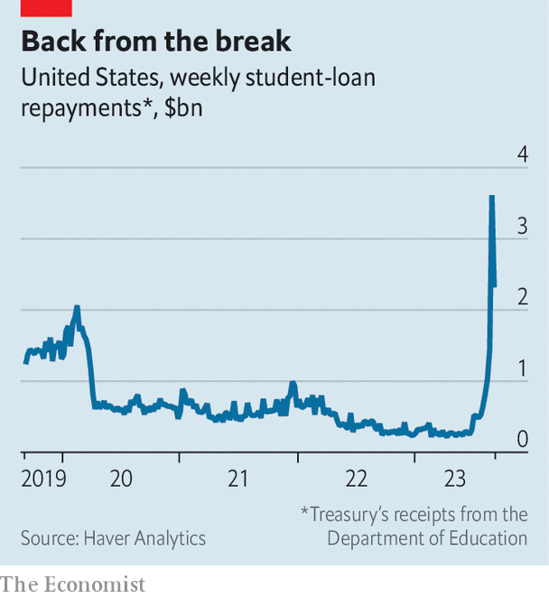

###### Tuition drag

# The resumption of student-loan payments will hit American growth 

##### It is not just borrowers who face a return to reality 

 

> Sep 14th 2023 

People are mostly pleased by the return of normal life after covid-19. In America, though, borrowers of student loans will miss one aspect of the pandemic. Sitting on $1.6trn of debt owed to the government, they have enjoyed a break from both repayments and interest since March 2020. The holiday is now over. Interest on student loans started to accrue again this month; repayments will resume in October. Given that there are about 43m borrowers, this will drag on the American economy.

 


Exactly how big the drag will be is a matter of debate. In 2017 the Federal Reserve calculated that the average monthly payment on student debt was $393; other estimates put it closer to $250. Cash has already started flooding into the Treasury as some rush to pay off their debts (see chart). Multiplied by all borrowers, the higher average would add up to a total monthly repayment of $17bn, or about 1% of household consumption. Assuming that only part of the repayments comes from savings, that would imply a cut to America’s quarterly annualised growth rate of 0.7 percentage points—or a third of its annualised pace in the first half of this year.

Yet such a drag should be viewed as an upper bound. Students in university need not repay loans, reducing the number of borrowers facing an imminent crunch. Other deferrals are also available—such as for those in the armed forces. In 2019 the Fed calculated that three in ten borrowers did not need to make monthly payments.

Moreover, the Biden administration has introduced a new repayment plan that expands a previously existing programme for reducing the debt burden on poor Americans. Borrowers making $32,800 a year or less will be exempted from payments. Totted up, analysts at Capital Economics, a consultancy, reckon that the bill to households will work out at $6bn or so a month—closer to shaving off about 0.3 percentage points from America’s growth.

Even this drag will be felt when coupled with other looming hits to consumers. At long last Americans are running down savings from the pandemic. The federal government may be on the brink of a temporary shutdown because of political gridlock. And high interest rates are heaping pressure on borrowers: the delinquency rate on credit cards has reached its highest in a decade. For now, America is on track for a robust third quarter, with some indicators even pointing to annualised growth of above 5%. But the resumption of student-loan payments, combined with the other headwinds, may make for a weaker fourth quarter. The median forecast of economists is just 0.6% annualised growth, according to Blue Chip, a survey of estimates.

By next year, student-loan payments will drop out of growth calculations, because monthly bills will be part of the baseline. Yet for folk struggling to make payments, the holiday will be difficult to forget. According to Dan Collier of the University of Memphis, who studies the impact of student debt, many borrowers saved money to buy a first home or decided that they could afford to have more children.

Although some still cling to hope that the Biden administration may revive a plan to forgive up to $20,000 per borrower after it was blocked by the Supreme Court in June, the political and legal obstacles are formidable. The more likely scenario is that student-debt payments will proceed much as they did before the pandemic: month after month, for years, until graduates have paid down their tuition costs. Normal life is such a drag. ■


