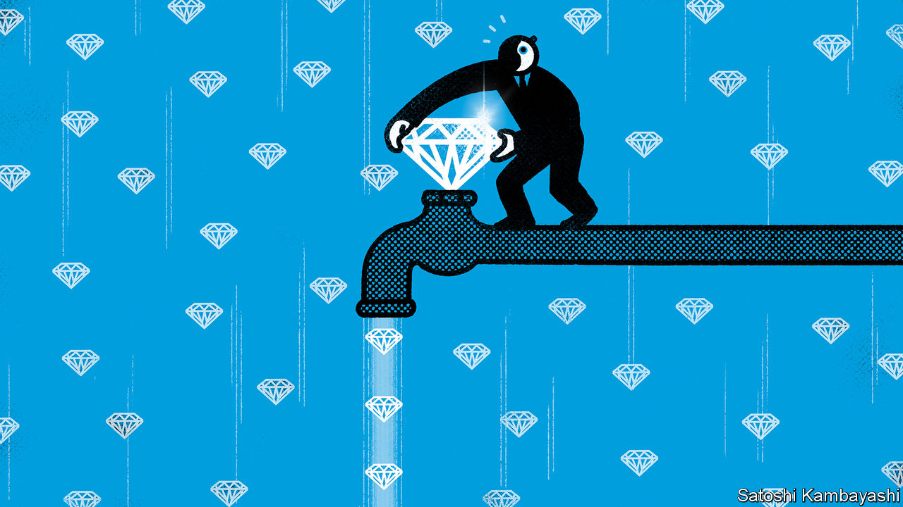

###### Buttonwood

# Why diamonds are losing their allure 

##### As an investment category, at least 

 

> Sep 13th 2023 

The appeal of a diamond, for a ring on a finger or to string on a necklace, rests on its sparkle. Its precise value is determined by how well the stone is cut, its colour, its size (also called its “carat”) and whether it contains flaws. The clearer, heavier, closer to colourless and more perfectly cut the rock, the better. 

The appeal of a diamond for an investor is that, in addition to being nice to look at, it has historically offered a steady return on investment. Given the opacity of the market, and the broad variety of gems that are available, long-run price data are scarce. But a paper by Luc Renneboog of Tilburg University, which was published in 2015, analysed thousands of auctions each year, finding that the average return between 1999 and 2012 rivalled those of stocks and property. Holders of diamonds would have earned a handsome 8% or so a year. 

Recently, though, these steady returns have given way to enormous volatility. De Beers, a consortium that has long monopolised the supply of diamonds, has reduced the price of two-to-four carat uncut stones—a popular category because they can be made into one-to-two carat engagement rings—by 40%, according to Bloomberg, a news service. On September 13th the company announced that it would re-run its iconic “a diamond is forever” advertising campaign in an attempt to boost demand.

Stable returns in the past were partly brought about by steady demand. Just as with the investment case for gold, another rare and precious commodity, the logic for holding diamonds tends to be strongest during periods of economic uncertainty. At the same time, the main use of diamonds is in jewellery, which means that prices have tended to do well during periods of prosperity, too. 

But the most important factor was monopolistic supply. For more than a century De Beers managed to dominate the production of gems. This market structure facilitated steady price increases in two ways, as Mr Renneboog has noted. First, by stockpiling supplies De Beers created scarcity. Second, the firm curbed speculation, and the volatility it brings. Although De Beers controlled some 80% of the global supply of diamonds in the 1980s, since then its share has been eaten into by competitors, which include Alrosa, a Russian rival. The company now produces just a third of supply. 

Another problem is emerging from laboratories. They are producing artificial gems, which are made by applying pressure to carbon, rather than digging stones from the ground, and are identical to the naked eye. Such stones have been available since the 1980s, but even as recently as 2018 made up a tiny fraction of the market, at just a few percentage points. In the years since, more lab-grown jewels have entered the market—and their market share has risen to around a tenth. 

De Beers may have inadvertently hastened this transition. The company began to sell lab-grown diamonds at rock-bottom prices in 2018, when such stones fetched about 80% of the price of mined ones. The goal was to differentiate between the two types of gems, in order to diminish the appeal of lab-grown stones. The Clear Cut, a New York-based purveyor of engagement rings, has adopted guerrilla marketing tactics to make the same point. It offers customers who buy a ring worth $10,000 or more a free lab-grown alternative, which can be used as a “travel ring” when visiting dubious places. Many lab-grown stones now fetch just 20-30% of the price of similar mined stones. 

De Beers argues that, as the supply of lab-grown gems accelerates, the price gap between the two types of stone will continue to widen, making the newcomers unappealing for engagements. If recent price movements are anything to go by, though, the tactic appears likely to backfire—after all, mined prices are plunging in the wake of lab-grown ones. 

Admittedly, this may not be entirely the result of a structural shift in the market. American couples date for about three years before getting engaged, and thanks to covid-19 very few people were out and about meeting potential husbands or wives in 2020. An unusually small number of people are probably getting engaged this year. 

But this is the sort of fluctuation an all-powerful diamond cartel would have been able to smooth out by reducing supply. Slashing prices instead is a clear indication of diminished market power. That is good news for those looking to pop the question or acquire a new trinket. It is rather less appealing for those considering investing in the gems. ■


