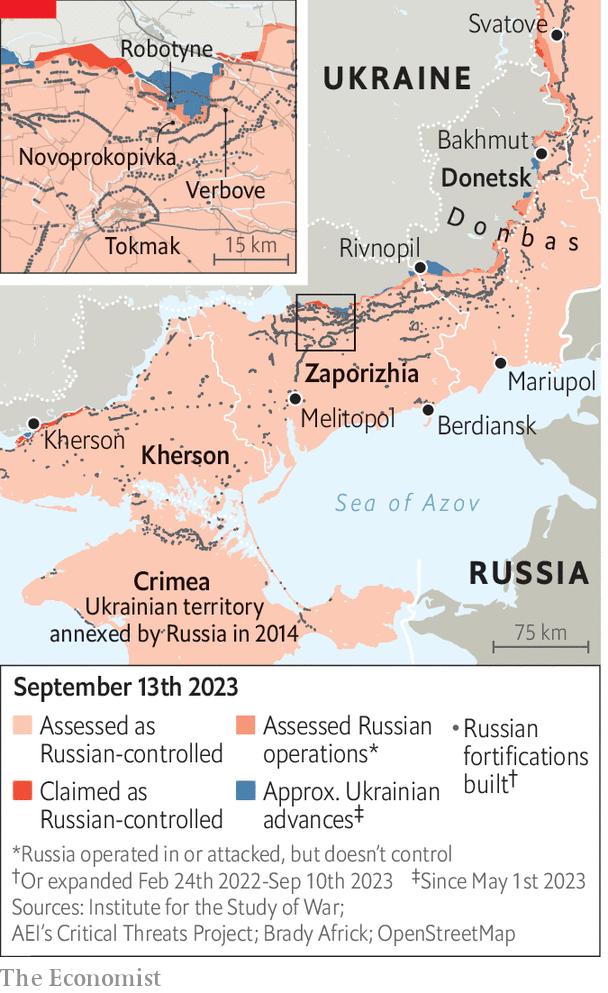

###### Counsels of war

# Are Ukraine’s tactics working? 

##### Slow progress on the battlefield prompts quarrels over strategy 

 

> Sep 12th 2023 


DMYTRO KULEBA, Ukraine’s foreign minister, is a smooth and affable diplomat, unruffled by the trickiest questions. But on August 31st his patience snapped. “Criticising the slow pace of the counter-offensive equals…spitting into the face of the Ukrainian soldier who sacrifices his life every day,” he told journalists. “I would recommend all critics to shut up, come to Ukraine and try to liberate one square centimetre by themselves.” That outburst was prompted by weeks of stories in the American press, in which anonymous officials took issue with Ukraine’s  on the battlefield and questioned its military tactics. The row is unseemly. But is Ukraine’s approach working?

Allied debates over strategy are hardly unusual. American and British officials worked closely with Ukraine in the months before it launched its counter-offensive in June. They gave intelligence and advice, conducted detailed war games to simulate how different attacks might play out, and helped design and train the brigades that received the lion’s share of Western equipment. Even so, Ukraine—stung by a big leak of American intelligence documents unearthed in April—kept its own counsel. It delayed the start of the offensive and held plans close to its chest. 

One big point of contention was Ukraine’s earlier decision, over the first half of the year, to keep fighting for , a town in the eastern Donbas region that has limited strategic significance but became a symbol of resistance. Ukraine’s decision to defend the town at all costs had a “big influence” on the subsequent counter-offensive, argues Konrad Muzyka of Rochan Consulting, a firm that tracks the war. Ukraine burned through its stockpile of shells while Russia gained time to build up its formidable defences in the south—the so-called Surovikin line, named after a now-fired Russian general. 

Quarrels persisted even after the counter-offensive began. American officials had encouraged Ukraine to concentrate its forces on the main axis of attack in the south, towards the Sea of Azov. Instead Ukraine split its forces with the aim of stretching the Russians over a longer front. The most experienced brigades, armed mostly with older gear, were kept in Bakhmut, where they are making modest progress on the town’s flanks. One source says that politics is playing an unhelpful role in military strategy, with well-connected brigades around Bakhmut getting a larger share of scarce ammunition than military considerations alone might warrant. 

Meanwhile Ukraine deployed less experienced brigades on the more important southern axis, armed with newer kit. They quickly became bogged down in dense minefields covered by Russian artillery, drones and helicopters. Untested commanders made a series of mistakes, such as running into friendly mines and mistiming attacks. “If more experienced Ukrainian brigades were given the new equipment, they may not have committed many of the errors the new brigades made,” write Michael Kofman and Rob Lee, both experts on Russia’s armed forces, in an essay for War on the Rocks, an online journal. 

Some blame for early missteps lies with those who helped plan the counter-offensive. In a recent paper Jack Watling and Nick Reynolds at the Royal United Services Institute (RUSI), a think-tank in London, argue that the assault relied in part on outdated assumptions that did not take into account the threat from new sorts of sensors and drones. They conclude: “Much of the data supporting the tactics that Ukraine’s international partners sought to train Ukrainian forces to adopt was based on operational analysis from the 20th century that did not contend with a range of technologies employed in Ukraine.” Russian fortifications were also  than Western planners assumed. 

Wherever the fault lies, it is clear that something went wrong. “It seems that Kyiv had no contingency plans that could be quickly implemented in case the attack stalled,” notes Mr Muzyka. Eventually Ukrainian commanders decided to hold back their heavy armour and switch to a simpler approach. , often crawling on their bellies, now clear minefields by hand. Platoons and companies, rather than brigades, fight tree line to tree line, advancing on foot so as to present a smaller target. This has helped limit losses of men and equipment, but allows only 700 to 1,200 metres of progress every five days, notes the RUSI paper, giving Russian troops time to “reset” their defences (the rate may have picked up a little of late).

That leads to two debates. One is whether Ukrainian commanders have been too risk-averse. Some Western officials argue that if Ukraine had stuck with bolder and larger-scale attacks, as planned, they would have taken higher casualties at first but had more luck breaking through Russian lines, shortening the offensive and reducing the overall toll. Ukrainian officials retort that this would only have led to more bloodshed, and that officers could not expect a heavily depleted citizen army to mimic Russian human-wave attacks. 

A second debate is whether Ukraine should emulate a Western way of war or carve out its own path. Western armed forces prize the idea of combined-arms manoeuvre, in which armoured forces synchronise their movement with infantry, artillery, air defence and (increasingly) electronic and cyber-attacks. The five weeks of pre-offensive training given to Ukrainian troops in Germany was not nearly enough to make them proficient in this sort of warfare.

“The Ukrainians are still tied to Soviet doctrine,” complains an American official. Heavy artillery barrages, in place of more judicious and precise attacks, are one source of tension, not least because America is playing the lead role in sourcing ammunition for Ukrainian guns. “It’s going to take time for their mindset…and tactics to change,” says the official. 

In fact the Ukrainian approach is fit for purpose, says B.A. Friedman, a retired artillery officer in the US Marine Corps and author of a book on military tactics. In the spring of 1918, after years of stalemate on the western front of the first world war, the German army realised that large units were too vulnerable to artillery fire. Their solution was smaller, nimbler and well-drilled “storm troopers” who could cross enemy lines and grab territory, with heavier units moving up later. “Since Ukraine doesn’t have the ability to use  on any kind of relevant scale, it makes total sense to solve the problem the way it was solved before air power matured,” says Mr Friedman. Many European officers acknowledge that their own better trained and equipped armies would struggle to break the Surovikin line.

Fighting about fighting

American officials are not well placed to offer lessons on tactical best practice, says Mr Friedman. The bulk of their recent experience of combat has been in mountainous or desert areas where small units cannot take advantage of cover to advance in this way. The two main training centres for America’s ground forces, the army’s site at Fort Irwin and the marines’ location at Twentynine Palms, are both in Californian desert environments, he points out. “US forces have very little experience facing anything like what Ukraine is facing, whether in combat or in training.”

The problem is: nor does Ukraine. Mr Watling and Mr Reynolds argue that attrition of officers and the dramatic expansion of Ukraine’s army over the past 18 months mean that it lacks sufficient junior leaders with expertise in offensive operations. The result, they say, is that decisions are thrown up to more senior officers, overwhelming brigade headquarters that already have a lot on their plate. 

 


They give the example of a Ukrainian attack on the village of Rivnopil in Donetsk province earlier in the summer. Attackers are supposed to release smoke to cover their movement and confuse the enemy. But only 3% of Ukraine’s artillery-fire missions involved smoke—in part because senior commanders did not want to obscure their own view of the battle from drones circling overhead. The lesson is that Ukraine needs more junior officers who can be trusted to take the initiative even when their bosses cannot watch from afar. 

The quality of training is important, too. Western training facilities are hobbled by a “safety culture in NATO”, argue Mr Watling and Mr Reynolds. Drones are central to Ukraine’s tactics, allowing artillery units to spot targets and infantry to perform reconnaissance. Yet most NATO training areas impose tight restrictions on when and how drones may be flown, for fear they will veer off course. Safety rules also mean that artillery skills are typically taught later in courses. But in Ukraine “troops who are not prepared to deal with artillery are not prepared for the fight,” write the RUSI analysts. Europe’s health and safety rules are not a good fit for a war of national survival.

Most of these issues will not be resolved during the current counter-offensive. Ukraine will eventually need to reintroduce mechanised and armoured forces if it is to exploit any breakthroughs. That could get easier: minefields are less dense beyond the first line of defence. It is thought to have enough ammunition to fight through the autumn. But on September 10th Mark Milley, America’s top general, said that Ukraine probably had 30 to 45 days of combat left before  would make it too difficult for vehicles to advance. 

In recent weeks Ukraine has made faster progress in the south by piercing the  in Zaporizhia around the village of Robotyne, widening the resulting salient by pressing east to Verbove and then attacking towards the village of Novoprokopivka (see map). On September 13th it struck with missiles a shipyard in Crimea used by Russia’s Black Sea fleet, setting vessels ablaze. Russia has had to commit reserves from its 76th air assault division; but it has been able to because Ukraine threw in its own in August.

It is not clear how much fresh manpower either side has left. Rates of attrition appear to favour Ukraine over Russia, but sources suggest that Russia can probably still scrape together enough reserves to plug holes. “Unless there is a collapse of Russian lines, the battles we have seen for the past three months are the ones we will likely continue to see over the next few months,” concludes Mr Muzyka, who argues that only the deployment of larger formations, beyond Ukraine’s capacity, would speed things up. Dozens of Western officials consulted by  are also sceptical that a major breakthrough will come before winter. “We’ve got to extend our timeline,” says one of them. “This could be a very long struggle.” ■

