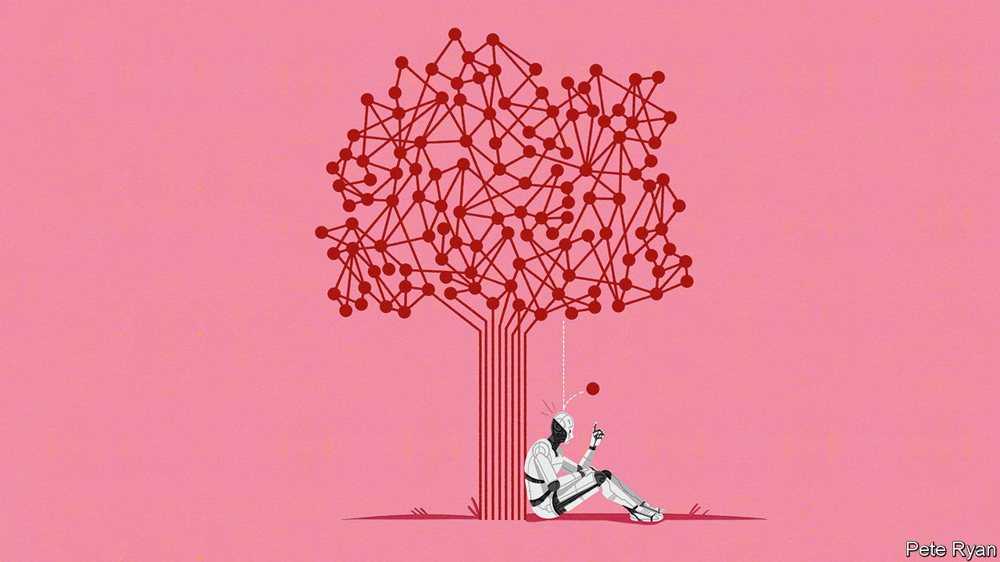

###### When robots do research

# How artificial intelligence can revolutionise science 

##### Consider the historical precedents 

 

> Sep 14th 2023 

DEBATE about artificial intelligence (AI) tends to focus on its potential dangers: algorithmic bias and discrimination, the mass destruction of jobs and even, some say, the extinction of humanity. As some observers fret about these dystopian scenarios, however, others are focusing on the potential rewards. ai could, they claim, help humanity solve some of its biggest and thorniest problems. And, they say, ai will do this in a very specific way: by radically accelerating the pace of scientific discovery, especially in areas such as medicine, climate science and green technology. Luminaries in the field such as Demis Hassabis and Yann LeCun believe that AI can turbocharge scientific progress and lead to a golden age of discovery. Could they be right?

Such claims are worth examining, and may provide a useful counterbalance to fears about large-scale unemployment and killer robots. Many previous technologies have, of course, been falsely hailed as panaceas. The electric telegraph was lauded in the 1850s as a herald of world peace, as were aircraft in the 1900s; pundits in the 1990s said the internet would reduce inequality and eradicate nationalism. But the mechanism by which AI will supposedly solve the world’s problems has a stronger historical basis, because there have been several periods in history when new approaches and new tools did indeed help bring about bursts of world-changing scientific discovery and innovation.

In the 17th century microscopes and telescopes opened up new vistas of discovery and encouraged researchers to favour their own observations over the received wisdom of antiquity, while the introduction of scientific journals gave them new ways to share and publicise their findings. The result was rapid progress in astronomy, physics and other fields, and new inventions from the pendulum clock to the steam engine—the prime mover of the Industrial Revolution. 

Then, starting in the late 19th century, the establishment of research laboratories, which brought together ideas, people and materials on an industrial scale, gave rise to further innovations such as artificial fertiliser, pharmaceuticals and the transistor, the building block of the computer. From the mid-20th century, computers in turn enabled new forms of science based on simulation and modelling, from the design of weapons and aircraft to more accurate weather forecasting.

And the computer revolution may not be finished yet. As we report in a , AI tools and techniques are now being applied in almost every field of science, though the degree of adoption varies widely: 7.2% of physics and astronomy papers published in 2022 involved AI, for example, compared with 1.4% in veterinary science. AI is being employed in many ways. It can identify promising candidates for analysis, such as molecules with particular properties in drug discovery, or materials with the characteristics needed in batteries or solar cells. It can sift through piles of data such as those produced by particle colliders or robotic telescopes, looking for patterns. And AI can model and analyse even more complex systems, such as the folding of proteins and the formation of galaxies. AI tools have been used to identify new antibiotics, reveal the Higgs boson and , among other things.

All this is to be welcomed. But the journal and the laboratory went further still: they altered scientific practice itself and unlocked more powerful means of making discoveries, by allowing people and ideas to mingle in new ways and on a larger scale. AI, too, has the potential to set off such a transformation. 

Two areas in particular look promising. The first is “literature-based discovery” (LBD), which involves analysing existing scientific literature, using ChatGPT-style language analysis, to look for new hypotheses, connections or ideas that humans may have missed. LBD is showing promise in identifying new experiments to try—and even suggesting potential research collaborators. This could stimulate interdisciplinary work and foster innovation at the boundaries between fields. LBD systems can also identify “blind spots” in a given field, and even predict future discoveries and who will make them. 

The second area is “robot scientists”, also known as “self-driving labs”. These are robotic systems that use AI to form new hypotheses, based on analysis of existing data and literature, and then test those hypotheses by performing hundreds or thousands of experiments, in fields including systems biology and materials science. Unlike human scientists, robots are less attached to previous results, less driven by bias—and, crucially, easy to replicate. They could scale up experimental research, develop unexpected theories and explore avenues that human investigators might not have considered.

The idea that AI might transform scientific practice is therefore feasible. But the main barrier is sociological: it can happen only if human scientists are willing and able to use such tools. Many lack skills and training; some worry about being put out of a job. Fortunately, there are hopeful signs. AI tools are now moving from being pushed by AI researchers to being embraced by specialists in other fields. 

Governments and funding bodies could help by pressing for greater use of common standards to allow AI systems to exchange and interpret laboratory results and other data. They could also fund more research into the integration of AI smarts with laboratory robotics, and into forms of AI beyond those being pursued in the private sector, which has bet nearly all its chips on language-based systems like ChatGPT. Less fashionable forms of AI, such as model-based machine learning, may be better suited to scientific tasks such as forming hypotheses. 

The adding of the artificial

In 1665, during a period of rapid scientific progress, Robert Hooke, an English polymath, described the advent of new scientific instruments such as the microscope and telescope as “the adding of artificial organs to the natural”. They let researchers explore previously inaccessible realms and discover things in new ways, “with prodigious benefit to all sorts of useful knowledge”. For Hooke’s modern-day successors, the adding of artificial intelligence to the scientific toolkit is poised to do the same in the coming years—with similarly world-changing results. ■


