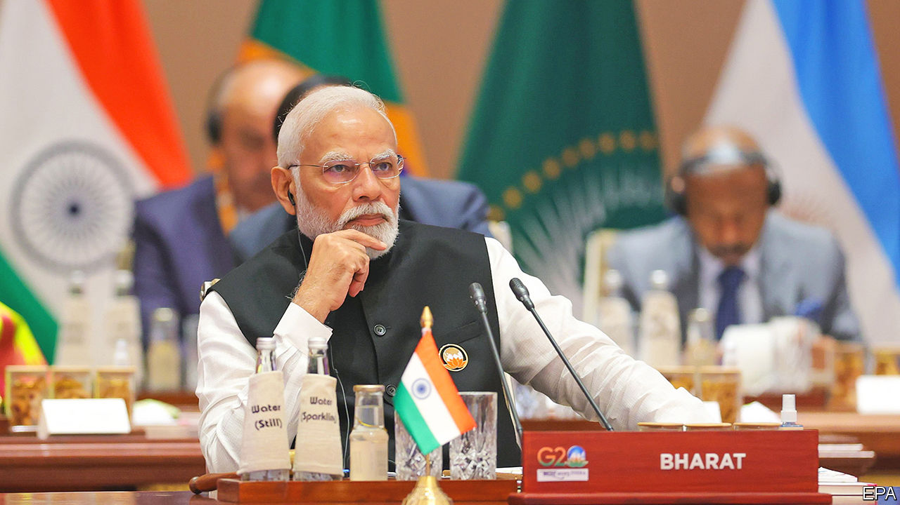

###### One country, 28 systems

# Modi’s “one India” goal is good for the economy, but not for politics 

##### In the next decade regional tensions will build in India 

 

> Sep 14th 2023 

The world has been seeing the bright side of India. In August it landed a spacecraft on the Moon. In the latest quarter gdp grew at an annual rate of 7.8%, making it the world’s perkiest big economy. Narendra Modi, the prime minister, has just hosted a g20 summit where other leaders, including Joe Biden, courted Asia’s rising behemoth. Yet inside India the talk has turned to whether Mr Modi’s hunger for power and dreams of national renewal could lead him to bend the constitution. There are signs he wants to increase the clout of national politics and the central government, and dilute the influence of India’s 28 states—many of which .

The constitution grants autonomy to the states in many areas, reflecting India’s size and diversity. The reform under consideration is obscure but sensitive: synchronising state elections with national polls, potentially creating a single event every five years when India votes (a general election is due in spring next year). Next week Mr Modi is convening an unusual special session of parliament. It could be used to advance this idea. On September 1st he formed a committee to examine the feasibility of unitary elections.

His critics say this is a power grab that will upset a delicate regional balance. Although Mr Modi dominates national politics, his Hindu-nationalist Bharatiya Janata Party (bjp) does not control any states in the more prosperous and dynamic south: in May it lost control of Karnataka, India’s tech hub. Synchronised polls could help Mr Modi exploit his personal popularity in regional elections, enabling the bjp to expand its reach. 

In many ways the goal of “one India” is sensible. For too long the economy was balkanised, with myriad local markets and taxes (try looking up “octroi”). Mr Modi has simplified this since he won power in 2014, replacing many local levies with a national goods-and-services tax (gst). Along with better infrastructure this has created a deeper single market which is boosting growth. He has also promoted national digital-payment and welfare schemes. Strengthening central government, which doles out less than half of public spending, can be wise.

A simpler electoral calendar is also a legitimate goal. Non-stop campaigning for state elections disrupts the business of government. Other democracies hold polls simultaneously. But if Mr Modi goes ahead, risks loom. He may be tempted to circumvent the rules (on paper, constitutional amendments are needed, which may require a supermajority of parliament and the approval of most states). And if foiled he might weaponise regional tensions to stoke resentment in the bjp’s northern heartlands. The bjp has form: it has weakened the courts and incited anti-Muslim chauvinism.

Such divisiveness is always dangerous in India, with its many languages and at least six major religions. It poses a particular threat in the next decade as the regional balance shifts. Economically the south is pulling far ahead, leading to rows about why its taxes subsidise the backward north. In political terms a long-delayed redrawing of constituencies after 2026 will cause northern states to gain parliamentary seats, and the south, with its lower birth rates, to lose out.

Handled badly, such tensions could disrupt the single market and trigger unrest. To manage them India needs to safeguard the federal system, which creates flexibility and facilitates co-operation. Mr Modi’s landmark reform, the gst, came after painstaking negotiations with the states to achieve unanimity. That spirit should govern other constitutional reforms, including of election sequencing. Political federalism is not an impediment to India becoming a superpower; it is a condition for it.■

