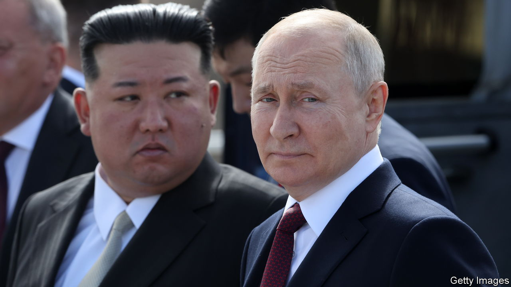

###### When Kim met Putin

# The dangers posed by a deal between Russia and North Korea 

##### It would make life harder for Ukraine—and heighten nuclear risks in Asia 

 

> Sep 13th 2023 


IT WAS LIKE a scene from the cold war. Kim Jong Un, North Korea’s leader, stepped off his luxurious bulletproof train this week having crossed into Russia’s Far East, to be greeted by a military brass band and whisked off to meet Vladimir Putin. Over a meal of duck salad and crab dumplings, washed down with Russian wines, the two dictators toasted what Mr Kim called the  against Western imperialism. 

Both men are throwbacks. Mr Kim is the grandson of a tyrant imposed on North Korea by Stalin. Mr Putin waxes nostalgic about Russia’s imperial past. Yet the threat they pose today is clear and present. An alliance between them could alter the course of the war in Ukraine by granting Russia a new supply of weapons. It could also escalate a nuclear-arms race in Asia.

North Korea is like an extreme version of what Russia is becoming under Mr Putin: a militarised society, cut off from the West, run by a despot who is heedless of human life. Yet despite its poverty and isolation, it suddenly has something that Russia badly needs: more artillery shells. Russia is estimated to have fired over 10m of them last year and, like Ukraine, is running low. North Korea, with its Soviet-style armed forces, has millions in storage and the primitive industrial brawn to manufacture more. The failure rate of its shells is high: in one barrage aimed at South Korea in 2010, 20% did not detonate. But for Russia that is much better than nothing. And North Korea could also offer other weapons, such as rockets or howitzers.

Any deal over munitions would come at a delicate moment in , the painfully slow pace of which has raised new questions about its tactics and Western resolve (see International section). For now Ukraine has at least achieved parity with Russia in the artillery war, with both sides facing constrained supplies. But were Russia to receive an influx of ammunition, it would be able to pin down Ukrainian forces more effectively, slowing their advances even further and increasing the level of attrition in the coming winter months.

North Korea wants something in return. In the 2000s Russia was a signatory of the international sanctions regime that was placed on North Korea for its unlawful nuclear-weapons programme. Yet the location of this week’s meeting—the Vostochny Cosmodrome spaceport—gave a not-too-subtle clue as to what may be coming next. Mr Kim may demand access to Russian missile technology that could improve the range, reliability and flexibility of North Korea’s delivery system for nuclear weapons. He may also be keen to get his hands on Russian satellite and submarine secrets.

So although the immediate effect of any deal could simply be to make life harder for Ukraine’s soldiers, it could also ultimately alter the nuclear balance in Asia. The North Korean regime is erratic as well as malign: it periodically threatens to incinerate South Korea and fired two short-range ballistic missiles just before the Kim-Putin summit. Other countries worry that its military capabilities are improving, and may respond by building up their own arsenals. A Kim dynasty that could launch missiles at will from submarines would terrify the neighbours. 

Korea advice

What to do? One unpredictable factor is China, which has some sway over both dictatorships. It has no problem with a prolonged and bloody 20th-century-style war in Ukraine, which it hopes will divide Europe and America, but says it is wary of . A deal between Russia and North Korea would test that claim. For the West, further sanctions on Russia or North Korea would have little effect. Instead it must ramp up supplies of munitions to Ukraine to help it defend itself from Russia. It should also publicise what it knows about arms deals between Moscow and Pyongyang, and reaffirm that America’s nuclear umbrella shields its allies in Asia. ■

