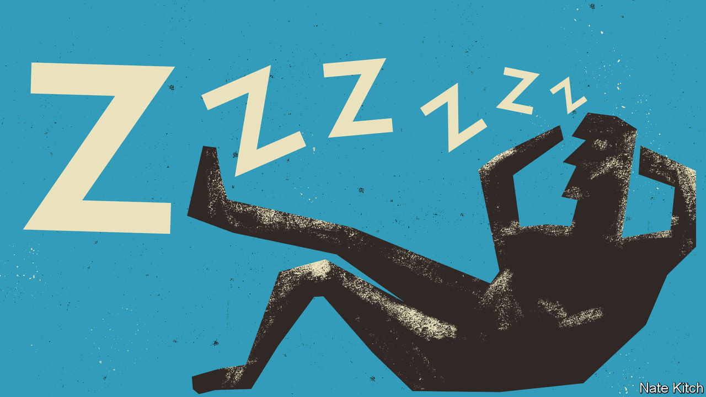

###### Incentives matter

# Why are so many Britons not working? 

##### Don’t blame covid or NHS waiting lists. The problem is the welfare system 

 

> Sep 14th 2023 

SLUGABED. Slowpoke. Idler. Loafer. The English language has many evocative terms for those seen as workshy. British politicians have made hearty use of them when debating economic inactivity. Economists, however, used to point out that Britain had a good record on this score. For two decades until 2019 its inactivity rate (the share of people of working age who are neither working nor looking for a job) was among the lowest of any rich country. Then something went awry. Pandemic lockdowns smothered economic activity everywhere. But whereas other economies bounced back—since 2020 the inactivity rate has fallen, on average, by 0.4 percentage points across the OECD, a club of rich countries—in Britain, uniquely, it continues to climb, and is up by 0.5 points. What’s going on?

The immediate cause is not disputed: more Britons than ever are classified as unwell. Data released this week showed a remarkable 2.6m people, a record, are economically inactive because of long-term sickness—an increase of 476,000 since early 2020. Inactivity helps explain why firms are struggling with labour shortages and, in part, stubbornly high inflation. And there is a hefty bill. The Office for Budget Responsibility, the fiscal watchdog, says more long-term sickness has added £15.7bn ($19.6bn), or 0.6% of GDP, to annual government borrowing because of lost tax receipts and higher welfare spending.

Diagnosing the cause of the swelling sick rolls is trickier. Could covid, its mystery cousin long covid, or shakier mental health post-pandemic be to blame? Hardly. These are not unique to Britain. Are the woes of the National Health Service the cause? Waiting lists for elective treatment have grown immensely: from 4.6m in February 2020 to 7.6m this summer. Yet look closely, and this is not the answer either. More than half of those waiting for care are not of working age. Nor do the biggest drivers of higher waiting lists by treatment type (for example, musculoskeletal issues) match the reported conditions of the long-term sick (which often relate to mental health).

Instead, the primary cause is in the . The previous Labour government, and Conservative-led ones since 2010, gradually made it harder for claimants to get incapacity benefits. That helped guard against fraud and kept rates of economic inactivity low. But some people with real needs were wrongly denied benefits. In 2019, after several high-profile cases of people being declared fit for work and then dying, the government reversed course and made it much easier to obtain benefits. Over 80% of the claims lodged in the fiscal year 2019-20 were successful, up from just 35% in the decade before. 

Meanwhile, perverse incentives have been added. The old system did a fair job of nudging those who were temporarily incapacitated back into work as soon as they were better. The new one has sharply raised the relative rewards of claiming to be permanently incapacitated. Those who are deemed unable ever to return to employment now get twice as much as those expected to go back to work one day. This gives people a strong incentive to exaggerate their ailments, and never look for a job again. 

Policymakers should find ways to tighten up. While taking care not to punish the truly ill, they should encourage those who can to go back to work, even part-time. This means bumping up benefits to the temporarily incapacitated, and regularly reassessing recipients to see if their health has improved, which rarely happens today. Politicians are no doubt loth to reopen the welfare debate as an election looms. But ignoring it comes with a large and growing cost. Calibrating the safety-net sensibly is their job. They must not shirk, dodge or duck-shove it. ■

