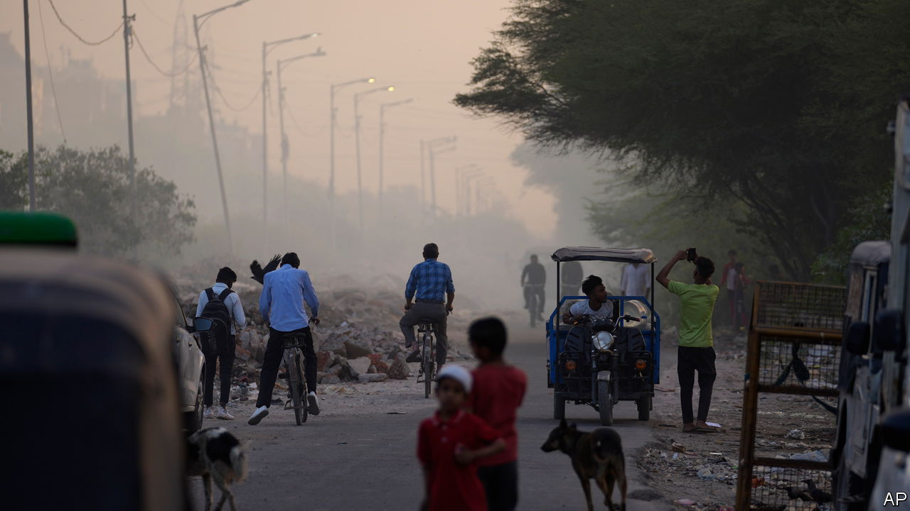

###### On Germany’s economy, Gandhi, the slave trade, attacking the Assad regime, the hobby lobby

# Letters to the editor 

##### A selection of correspondence 

 

> Sep 14th 2023 


Germany responds

Your recent analysis of the German economy concluded with the diagnosis that Germany might once again become the sick man of Europe (“”, August 19th). I argue that this is not the case. In the late 1990s, when  first described Germany this way (“The sick man of the euro”, June 5th 1999), the country was suffering from high unemployment, especially long-term unemployment, low productivity and hence anaemic growth. The labour market was dysfunctional and inefficient. In other words, the problems were endogenous. 

The situation today is completely different. With Russia’s war of aggression against Ukraine, Germany has faced a turning point and an exogenous terms-of-trade shock. The shock has hit Germany harder than any other major country in western Europe because of its greater exposure. Its gas imports from Russia fell from over 50% of total gas imports to zero. Energy prices have been rising dramatically for some time. Measured against this historically difficult situation, the German economy has coped well with the shock, thanks to widespread energy savings by businesses and households and thanks to decisive action by the federal government, for example building liquefied-natural-gas terminals in record time (“”). 

Moreover, as one of the world’s leading export nations, Germany’s economic performance is negatively affected by slow growth in some of its key trading partners. Even more importantly, the coming years will be crucial in the fight against climate change. Germany is mobilising hundreds of billions of euros of private and public investment to transform its economy into a carbon-neutral one. 

We are cutting red tape, speeding up permit procedures and creating a new, modern immigration system. We are strengthening our grids, building a hydrogen infrastructure and new hydrogen-ready power plants. 

Overall, the German government does not at all ignore “alarm bells”, especially regarding its industrial sector. It admits the enormous scale of the task and is fully committed to changing the ways we are doing things to be successful. It is quite normal that such an enormous transition comes with some turbulence. I am convinced that growth will soon return and that we will profit enormously from our action in the longer run. Don’t count out Germany just yet.

Steffen Meyer

Director-general

Federal Chancellery 


 


No urban/rural divide

To state that India’s neglect of its urban centres can be traced to Gandhian ideology is to misrepresent Gandhi’s views (“”, August 19th). While Gandhi was indeed concerned about India’s villages, he explicitly referred to the need for clean, healthy, liveable Indian cities in his writings. In 1938 Gandhi wrote that he did not want “penury, misery, dirt and dust in India”. Note that there is no reference to “rural” there. He meant all of India including urban centres. Perhaps Indian governments might have misinterpreted Gandhi, but that is not his fault.

Jaydeep Balakrishnan

Associate dean

College of Business

California State University, Sacramento

 


Britain and the slave trade

By all means reflect on the past, including Britain’s role in the slave trade and the suppression of the Demerara uprising (“”, August 19th). And it certainly should form part of the history curriculum in schools. But as Tom Holland would say in his studies of history, context is everything. To imply that Britain has never come to terms with aspects of its ignominious past is to disregard those moments and periods of history where Britain stood alone, not only in condemning and abolishing slavery, but sending out the Royal Navy on the high seas to stop it. William Gladstone, one of Britain’s greatest prime ministers, whose own family profited from slavery in Guyana, branded slavery the “foulest crime” in history in 1850. 

Gladstone’s descendants recently issued an apology for slavery. Since the end of slavery and after Caribbean and African nations became independent, Britain has provided billions in development aid to its former colonies. British students could learn more about, and take pride in, this history too.

Dale Doré


According to a poll you cited, 44% of Britons thought that the royal family, “whose ancestors monopolised the early slave trade through the Royal African Company”, should pay reparations. There were six members of the royal family among the initial 200 subscribers to shares of the company in 1672, with James, Duke of York (later King James II of England and VII of Scotland) as the largest shareholder. However, most of the shareholders were London merchants, including 15 past or future lord mayors of the City of London and 25 past or future sheriffs of London. 

John Locke, who expounded the principle of self- ownership and the corollary right to own property, invested £400 sterling in the initial share issue and another £200 three years later.

Robert Dimand

Professor of economics

Brock University


 


Let down by the British

You reassessed Barack Obama’s decision not to strike against the Assad regime in Syria when it used chemical weapons in Ghouta (“”, August 26th). It is worth remembering that the decision by President Obama not to hit the regime was very much a reaction to Britain’s lack of support. The British government, led by David Cameron, failed to get a motion through Parliament that would have authorised a joint strike with America. Ed Miliband, the leader of the opposition at the time, said there had to be “compelling” evidence that Bashar al-Assad was guilty before taking any military action and the motion was defeated. If it had passed, Mr Obama would definitely have followed through. 

Wiktor Moszczynski


 


Seeking to persuade

Reading Bagehot’s column on the rise of the hobby lobby () reminded me of “Miss Sloane”, a political thriller released in 2016. It is also related to the lobby issue. This quote from the movie clarifies the key points: “Lobbying is about foresight. About anticipating your opponent’s moves and devising counter measures. The winner plots one step ahead of the opposition.”

Louis Tsai


Swimming, grouse shooting and beer drinking may all be specific interests that benefit from the protection of the hobby lobby, but another slightly more important institution is under the same or even greater protection: the BBC. As one moderate backbench Tory MP was reportedly quoted as saying: “Conservatives will never abolish the BBC—the minute we mess with ‘The Archers’ we’re all done for.”

Ross Cathcart


