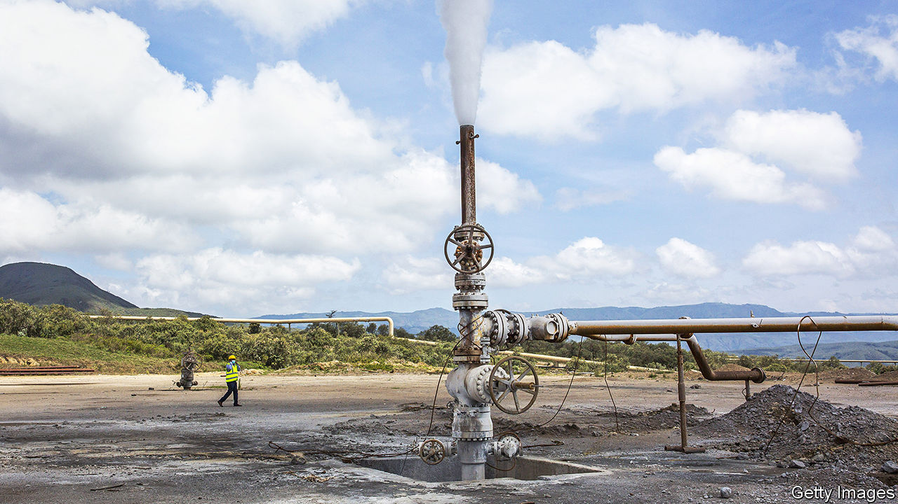

###### Kenya, Africa’s climate laboratory

# Kenya wants to pioneer a new African approach to global warming 

##### But not everyone agrees 

 

> Sep 14th 2023 

On September 3rd William Ruto drove himself to a curtain-raiser for the Africa Climate Summit in a small yellow electric car, flanked by bodyguards riding electric motorbikes. Mr Ruto, Kenya’s president, sees climate diplomacy as a way of  in the West. But during the summit—the first dedicated to Africa’s response to the warming planet—the motorcades of visiting presidents had a more familiar look. While the politicians talked green inside the venue in Nairobi, Kenya’s capital, outside were rows of petrol-guzzling SUVs. 

A gap between symbol and substance is common when it comes to Africa and climate change. Foreign politicians often nod to how the continent that has contributed least to warming the planet will be hurt the most. Africa, with 18% of the global population, is responsible for less than 4% of historic carbon-dioxide emissions, but has 16 of the 20 countries most vulnerable to climate change, according to the Notre Dame Global Adaptation Initiative, an American research project. Investors in carbon markets marvel at the Congo basin; renewable-energy types hail the potential of Africa’s sun, wind and rivers. Yet neither governments nor money men have matched rhetoric with resources. Meanwhile Africans worry that global efforts to combat climate change will come at the cost of their own economic development. 

The summit aimed to change that by looking at what the rest of the world should do for Africa, as well as what Africa can do for the world. African leaders called on rich countries to belatedly fulfil the pledge they made in 2009 to spend $100bn annually by 2020 to help developing countries with climate change, as well as a promise made at the COP summit last year for a fund for “loss and damage”. The declaration at the Nairobi summit noted that an “incipient debt crisis” made it hard for Africa to deal with climate change. Some 21 sub-Saharan African states are in debt distress or at high risk of it, according to the IMF. Inflation has led central banks to raise interest rates, raising the cost of capital.

It is not just a lack of cash that irks Africans; they fret about Western policies, too. The IMF reckons that sub-Saharan Africa is the region most at risk from the decoupling of the West from China, since it is relatively reliant on trade with both. African economists worry that American subsidies for renewable energy will make African firms less competitive and raise import costs. The EU’s Carbon Border Adjustment Mechanism, which in effect taxes carbon-intensive imports, is seen in some quarters as a brake on African industrialisation. A recent study said that it might reduce African exports to the EU by 6%. “The EU and US are seeking to destroy our export potential,” says Mohammed Amin Adam, Ghana’s minister of state for finance.

Some African leaders know they must do more than complain. “African countries have a choice,” argues William Asiko, a vice-president for Africa at the Rockefeller Foundation, an American philanthropic outfit. “They can focus on things that others are in charge of—or they can focus on the things they can control.” 

One such is the investment climate. Just $60bn, or 2%, of the $3trn globally invested in renewable energy in the past decade, went to Africa. “We cannot rightfully say there has been a success in attracting climate finance in the continent,” says Bogolo Kenewendo, a Botswanan former cabinet minister who is now at the UN. 

Clean, green and keen

Kenya hopes to change that, while using climate-related investments to industrialise. It has signed a deal with an Australian firm for a geothermal station that would power the making of “green” fertiliser. In July it amended its climate-change act, Africa’s first when it was passed in 2016, to regulate carbon markets. In February the government ended a moratorium on renewables deals and promised an auction system for new projects. In all, Kenya hopes that carbon credits can become a significant source of export earnings. 

Kenya’s embrace of the market and “green industrialisation” has its critics. African activists worry it takes attention away from calls for “climate justice”. Other African leaders mutter that Kenya is an unusually natural fit for green schemes. It generates nearly all its grid electricity from renewables, especially geothermal stations (pictured). Officials from Senegal and Mozambique, say, want to ensure they can develop both gas and renewable sources. Other countries have neither the capacity nor the inclination to overhaul their creaking power utilities. 

Yet African leaders ought to be able to have their geothermally heated cake and eat it. Private foreign investment in oil and gas is still flowing into Africa, as Namibia’s recent discoveries exemplify. At the same time countries with the right market-friendly policies—such as, notably, Namibia—can still attract investment in green-hydrogen and other projects. 

At the summit John Kerry, Joe Biden’s climate envoy, backed African efforts to develop carbon markets. Ursula von der Leyen, the president of the European Commission, pledged EU funds for a green hydrogen project in Kenya.

America and Europe hope that other African countries will copy Kenya’s efforts to use clean energy and climate finance for industrialisation. Yet Africa’s test bed for climate policies is not representative of the wider continent. Many of Mr Ruto’s peers still question why they cannot use fossil fuels to get rich—as many others have. The world still owes them an answer. ■


