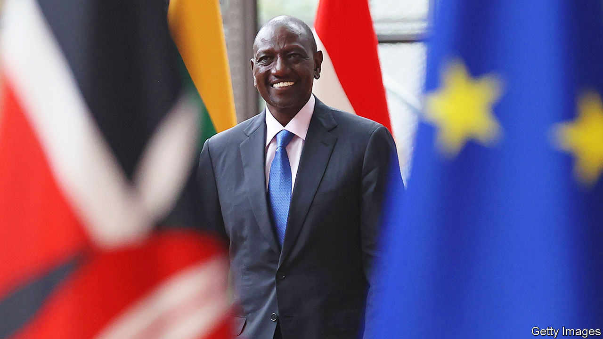

###### Snarling or smiling

# Kenya’s president, William Ruto, shows two sides 

##### He is making friends abroad and enemies at home 

 

> Sep 11th 2023 

He is a master of inscrutability. While his face often wears a smile, a glance at William Ruto’s eyes suggests it is rarely a warm one. A year after he came to power, working out whether Kenya’s president is grinning or snarling depends on where one is standing.

Seen from the West, Mr Ruto is a dependable ally. No other African government was as openly critical of Vladimir Putin’s withdrawal from a deal that let Ukrainian grain pass unmolested through the Black Sea, a move Mr Ruto’s foreign ministry called “a stab in the back”. While 17 other African heads of state hurried to a summit with Mr Putin in July, Mr Ruto hung back. 

Kenya’s president also sounds reassuringly solid to Western ears on China. Unlike his predecessor, Uhuru Kenyatta, who cosied up to it, Mr Ruto looks more comfortable in Western capitals. In a frenetic year he has visited European countries eight times, America twice, South Korea once and China not at all. He did not attend a recent summit convened by the BRICS grouping of Brazil, Russia, India, China and South Africa in Johannesburg. 

When America appealed for help to restore order in Haiti, Mr Ruto promptly offered to send 1,000 police officers. He has also emerged as a mediator in Sudan and the Democratic Republic of Congo. He has played a growing role in . Mr Ruto is proving “indispensable in pretty much every area”, gushes a Western diplomat.

Yet Mr Ruto’s apparent affection for the West is often contingent or transactional. After the International Criminal Court charged him with helping to instigate ethnic violence in which more than 1,000 people perished after a disputed election in 2007, he and his fellow accused, Mr Kenyatta, stirred up anti-Western rhetoric so effectively that it swept them into office. (Both men strongly denied the charges, and the cases against them collapsed.)

During his ten years as Mr Kenyatta’s deputy, Mr Ruto showed few pro-Western instincts. Since becoming president his language has occasionally echoed that of Beijing and Moscow more than Washington’s, as he called for the dethroning of the dollar and objected to Western dominance of global financial institutions. His pro-Western actions are based largely on economic necessity—Chinese largesse has dried up and Russia has little tempting to offer. Kenya’s heavily indebted economy relies on succour from the IMF. 

In any event, many Kenyans are loth to applaud him. Mr Ruto was elected on a promise to champion the poor. Annual inflation has indeed slowed to 6.7% from 9.2% when he was inaugurated a year ago, yet many are feeling the pinch. Maize meal, a staple, has gone up by almost 10% in the past year, while electricity prices have increased by 53%. A poll suggests that a mere 15% of Kenyans think their country is heading in the right direction.

Since taking office, Mr Ruto has faced desultory protests called by his beaten presidential challenger, Raila Odinga. However, a cost-of-living crisis and a slew of tax increases have given Mr Odinga’s campaign a boost, letting him claim to be the true advocate of the downtrodden. Having inherited a fiscal deficit of about 6% of GDP, Mr Ruto may have had little choice but to contain spending and increase revenue. Yet “he didn’t have a broad enough mandate for the reforms they are tying to push through,” says Kwame Owino of Kenya’s Institute of Economic Affairs.

In July violent protests erupted in more than a dozen of Kenya’s 47 counties. Denouncing the protesters as hooligans, Mr Ruto told the security forces to take a firm line. They fired tear gas into classrooms and live rounds at stone-throwers. At least 27 people were killed in July. 

Eric Theuri, the president of the Law Society of Kenya, says Mr Ruto’s recent tactics echo the “dark days of repression” under Daniel arap Moi, Kenya’s president from 1978 to 2002, especially after police locked up two MPs and charged them with subversion. A blogger, Pauline Njoroge, found herself in court accused of seeking to “discredit the reputation of the head of state” after a tweet asked Mr Ruto if “this is how low you want to stoop”. ■

