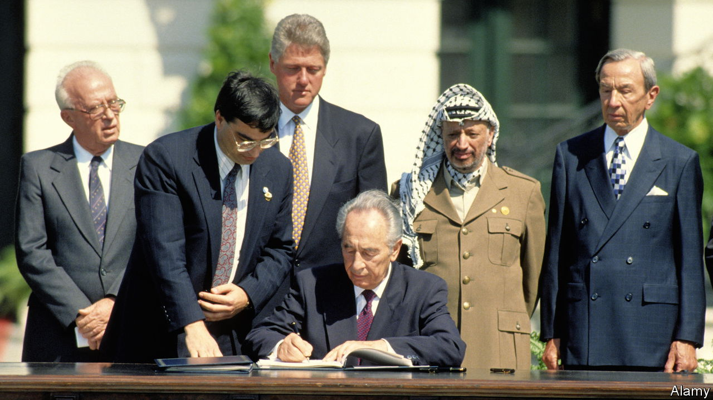

###### Long road to nowhere

# The Oslo accords were always doomed to fail 

##### Thirty years on, the promise of Israeli-Palestinian peace remains as elusive as ever 

 

> Sep 12th 2023 

They were never meant to live to adolescence, let alone adulthood. The Oslo accords, the peace agreement signed by Israel and the Palestinians in 1993, were meant to fade away. After five years both peoples would settle into sovereign states within fixed borders. The interim deal would become obsolete. But five years came and went, then five more, five more times. The interim became permanent.

On September 13th the accords turned 30. Their lasting achievements have been to create a limited Palestinian government loathed by most Palestinians, and to bring about a measure of mutual recognition between the two sides. The promise of peace is unfulfilled.

Israelis and Palestinians have spent decades arguing over what went wrong. If only their leaders—Binyamin Netanyahu or Ehud Barak, Yasser Arafat or Mahmoud Abbas—had accepted one of the deals put forward in later negotiations. If only Yitzhak Rabin had not been assassinated. If only Hamas and Islamic Jihad had not waged a campaign of suicide-bombings.

But perhaps nothing went wrong. The accords worked as they were designed to, which is to say, they did not work at all. The Oslo process was always flawed—yet it could not have happened any other way.

The accords emerged from a series of meetings in early 1993 in the Norwegian capital. At the start it was illegal for Israelis to talk to the Palestine Liberation Organisation (plo), which their government saw as a terrorist group. But Norwegian officials convinced Yossi Beilin, Israel’s deputy foreign minister, to pursue secret meetings with his longtime enemies.

The Palestinian team was led by Ahmed Qurei (known as Abu Alaa), a mild-mannered apparatchik who was close to Arafat, the Palestinian leader. At first his opposite number was Yair Hirschfeld, an Israeli academic, and then later Uri Savir, the director-general of the foreign ministry.

They lived together for days in Oslo, meeting late into the night, their talks lubricated by wine and fuelled by home cooking (the wife of Norway’s foreign minister prepared some of their meals). What emerged was not to be the end of the conflict, but the beginning of the end.

Negotiators could not agree on the thorniest issues, such as the status of Jerusalem, so they deferred them and agreed on interim steps. A new entity called the Palestinian Authority (pa) would assume limited control in the West Bank and Gaza. A string of addendums followed: the Paris protocol in 1994 defined economic ties between Israel and the PA; the 1995 Taba agreement set out security arrangements.

None of this was a final settlement, merely a relationship between occupier and occupied, intended to be short-lived. Both sides agreed to start talks about a final two-state deal which would begin by May 1996 and conclude by May 1999.

This was an exercise in gradualism. After a half-century of conflict, the thinking went, no one could expect Israelis and Palestinians to reach a comprehensive agreement. They needed to build trust.

But the gradual nature of the process left it open to spoilers. Joel Singer, an Israeli legal adviser in 1993, points to the decision to create a Palestinian police force responsible for security in parts of the West Bank. The Palestinians, though, were neither willing nor able to serve as an auxiliary of the Israeli army. More Israeli civilians were killed by Palestinians in the seven years after Oslo than the seven before it—and that was before the worst days of the second , or Palestinian uprising.

Qurei often pointed to another fault: the accords failed to stop Israel from building settlements. Rather, they created a sense of urgency. If Israel was to have defined borders by 1999, settlers had only a few years in which to grab more land. Between 1993 and 1999 they established 43 outposts: settlements built without government approval. Some were later authorised or folded into existing settlements.

The number of settlers in the occupied West Bank increased by 58% during those years, from 116,300 to 183,900, even as the country’s overall population rose by just 17%. Their numbers continue to grow. In 1993 settlers were 2% of Israel’s population and 3% of its Jewish population; today those figures are 5% and 7%, and their political power has grown too.

These developments helped spoil the process—and sour both peoples on the idea of peace. Just 28% of Palestinians support the two-state solution today, down from 53% a decade ago. Half of Palestinians want to dissolve the PA, the most enduring legacy of the accords. 

In Israel, too, support is at an all-time low, with only one-third of Israeli Jews in favour of the idea. Young Israelis grew up during a bloody ; young Palestinians came of age watching settlers gobble up the land meant for their future state. It is no surprise they have both lost faith.

Yet it is also no surprise the process turned out that way. Israelis and Palestinians sometimes liken the idea of a two-state solution to ending an unhappy marriage. Imagine filing for divorce but agreeing to live with your spouse for five more years while you decide how to divvy up the furniture. It is a recipe for deeper enmity.

Amid the optimism of the early 1990s, it perhaps seemed logical that a few brave people could chart a path to peace, and that their governments would follow it in good faith. But a genuine peace agreement needs wider support from both publics.

Such support did not exist in the 1990s, nor does it today—not with a far-right government ruling a bitterly divided Israel, nor with a superannuated Mr Abbas in charge of a feckless pa with no authority in big chunks of Palestine. Western powers have lost interest in playing mediator. Arab leaders want to forget the conflict.

For now, that leaves Oslo. Diplomats invoke the accords like the catechism of a dying faith, as if one more trust-building exercise or round of negotiations will be the one that unlocks a real peace. Inertia will keep them around until new generations of Israelis and Palestinians are ready to try something new—for better or for worse. ■

