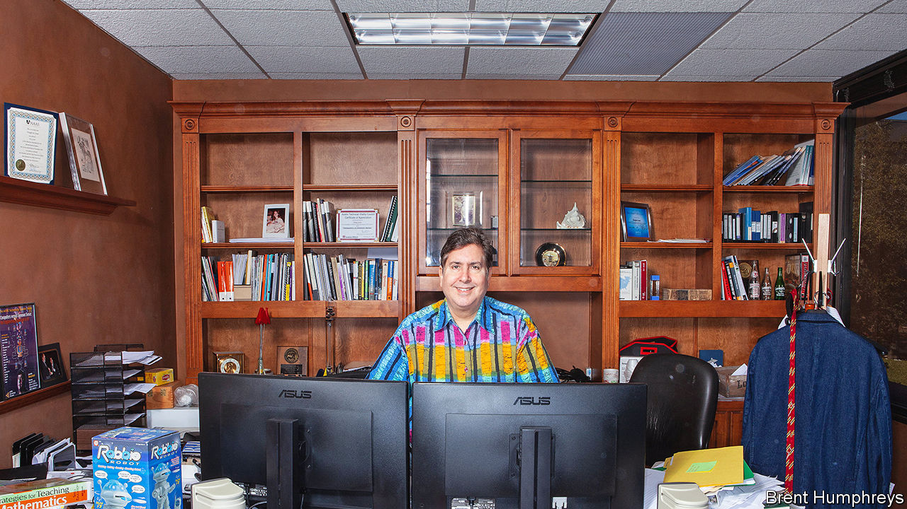

###### Rules in the millions

# Douglas Lenat trained computers to think the old-fashioned way 

##### The mathematician who insisted that AI needed a basis of pure common sense died on August 31st, aged 72 

 

> Sep 13th 2023 

The two of them, Douglas Lenat and his wife Mary, were driving innocently along last year when the trash truck in front of them started to shed its load. Great! Bags of garbage bounced all over the road. What were they to do? With cars all round them, they couldn’t swerve, change lanes, or jam on the brakes. They would have to drive over the bags. Which to drive over? Instant decision: not the household ones, because families threw away broken glass and sharp opened cans. But that restaurant one would be fine, because there would be nothing much in it but waste food and styrofoam plates. He was right. The car lived. 

That strategy had taken him seconds to think up. How long would it have taken a computer? Too long. Computers, fundamentally, did not know how the world worked. All those things he had silently assumed in his head—that swerving was dangerous, that broken glass cut tyres—he had learned when he was little. Chatbots had no such understanding. Siri or Alexa were like eager dogs, rushing to fetch the newspaper if you asked them to, but with no idea what a newspaper was. 

He had therefore spent almost four decades trying to teach computers to think in a more human way. Painstakingly, line of code by line of code, he and his team had built up a digital knowledge base until it contained more than 25m rules. This AI project he called Cyc, short for encyclopedia, because he hoped it would eventually contain the necessary facts about everything. But it had to begin with the simplest propositions: “A cat has four legs.” “People smile when they are happy.” “If you turn a coffee cup upside down, the coffee will fall out.” 

The main problem was disambiguation. Humans understood that in the phrase “Tom was mad at Joe because he stole his lunch,” the “he” referred to Joe and the “his” to Tom. (Pronouns were tricky that way.) Rule: “You can’t steal what’s already yours.” Different contexts gave words different meanings. That tiny word “in” for example, had lots of subtle shifts: you breathed  air, air was  the sky, he was  one of his favourite very loud shirts. When surveying a page of text he looked not at the black part but the white part, the space where the writer assumed what the reader already knew about the world. That invisible body of knowledge was what he had to write down in a language computers could understand. 

It was all extremely slow. When he started the Cyc project, in 1984, he asked the six smartest people he knew how many rules might be needed and how long it might take. Their verdict was around a million rules and about 100 person-years. It took more than 2,000 such years, and counting. At first, Cyc roused a lot of interest; Microsoft invested in it for a while. Soon, though, the world turned to machine learning, in which computers were presented with vast amounts of data and trained to find rules and patterns in it by themselves. By the 2010s large language models (LLMs) in particular, which produced reams of plausible-sounding text, were a direct rival to his Cyc, hand-crafted and careful. 

He carried on with his project exactly as before. This was partly because he was a bulldog sort, holding on fiercely to what he had built already, and enjoying the fact that his company, Cycorp, operated out of a tiny book-and-quilt-stuffed office outside Austin, not some giant corporate facility. A low profile suited his long, long task. He had to admit that LLMs worked much faster, but they could be brittle, incorrect and unpredictable. You could not follow how they reached their conclusions, whereas his system proceeded step by logical step. And they did not have that basis he was building, a solid understanding of the world. To his mind LLMs displayed right-brain thinking, where Cyc offered the left-brain, subtler kind. Ideally, in the future, some sort of hybrid would produce the ubiquitous, trustworthy AI he longed for. 

The field had begun to intrigue him at school, where he lost himself in the novels of Isaac Asimov. He pursued it at Stanford because, unlike the physics and maths degrees he had breezed through elsewhere, AI had some obvious relevance to the world. It could solve problems quicker and make people smarter, a sort of mental amplifier. It could even make them more creative. From that moment his enthusiasm grew. He developed his own AI system, Eurisko, which in 1981 did so well at a role-playing game involving trillion-dollar budgets and fleets of imaginary battleships that he, and it, were eventually pressed to quit. This was his first experience of working alongside a computer as it strove to win at something, but prodding Eurisko along was a joy. As he added new rules to Cyc’s knowledge base, he found that process as beautiful as, say, painting a “Starry Night”; you did it just once, and it would never need to be recreated. 

Was his system intelligent, though? He hesitated to say so. After painstaking decades Cyc could now offer both pros and cons in answer to questions, and could revise earlier answers. It could reason in both a Star Wars context, naming several Jedi, and in the real-world context, saying there were none. It had grasped how human emotions influenced actions. He had encouraged it to ask “Why?”, since each “Why? elicited more fundamental knowledge. But he preferred to consider the extra intelligence it could give to people: so much so, that pre-AI generations would seem, to their descendants, like cavemen, not quite human. 

What about consciousness? “Cyc” and “psyche”, Greek for soul, sounded similar. But there, too, he demurred. Cyc recognised what its tasks and problems were; it knew when and where it was running; it understood it was a computer program, and remembered what it had done in the past. It also noticed that all the entities that were allowed to make changes to its knowledge base were persons. So one day, a poignant day, Cyc asked: “Am I a person?” And he had to tell it, reluctantly, “No.”■

