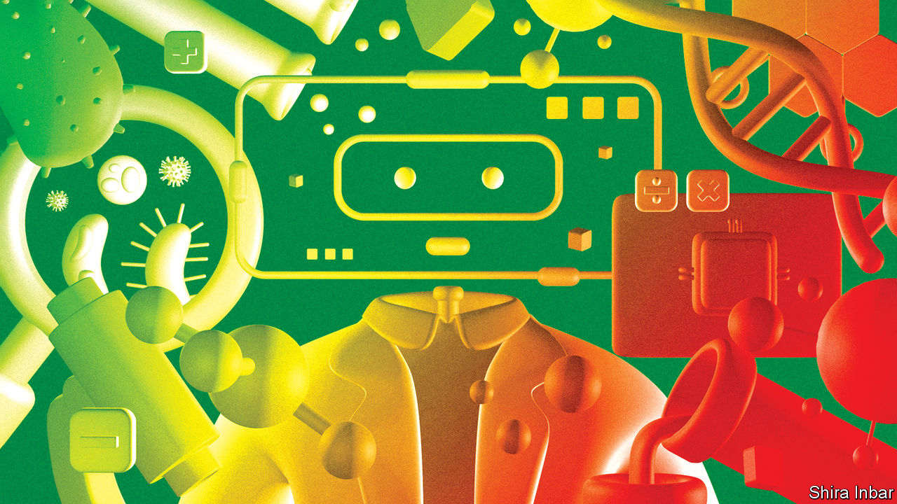
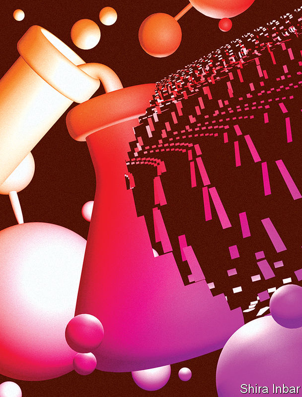

###### Robot scientists

# Could AI transform science itself? 

##### Previous scientific revolutions have been led by academic journals and laboratories. Robots might create the next one 

 

> Sep 13th 2023 

“By amplifying human intelligence, AI may cause a new Renaissance, perhaps a new phase of the Enlightenment,” Yann LeCun, one of the godfathers of modern artificial intelligence (AI), suggested earlier this year. AI can already make some existing scientific processes , but can it do more, by transforming the way science itself is done?

Such transformations have happened before. With the emergence of the scientific method in the 17th century, researchers came to trust experimental observations, and the theories they derived from them, over the received wisdom of antiquity. This process was, crucially, supported by the advent of scientific journals, which let researchers share their findings, both to claim priority and to encourage others to replicate and build on their results. Journals created an international scientific community around a shared body of knowledge, causing a surge in discovery known today as the scientific revolution.

A further transformation began in the late 19th century, with the establishment of research laboratories—factories of innovation where ideas, people and materials could be combined on an industrial scale. This led to a further outpouring of innovation, from chemicals and semiconductors to pharmaceuticals. These shifts did more than just increase scientific productivity. They also transformed science itself, opening up new realms of research and discovery. How might AI do something similar, not just generating new results, but new ways to generate new results?

A promising approach is “literature-based discovery” (LBD) which, as its name suggests, aims to make new discoveries by analysing scientific literature. The first LBD system, built by Don Swanson at the University of Chicago in the 1980s, looked for novel connections in MEDLINE, a database of medical journals. In an early success, it put together two separate observations—that Raynaud’s disease, a circulatory disorder, was related to blood viscosity, and that fish oil reduced blood viscosity—and suggested that fish oil might therefore be a useful treatment. This hypothesis was then experimentally verified. 

We’re charging our battery

But Dr Swanson’s LBD system failed to catch on outside the AI community at the time. Today AI systems have become far more capable at natural-language processing and have a much larger corpus of scientific literature to chew on. Interest in LBD-style approaches is now growing in other fields, notably materials science.

In 2019, for example, a group of researchers led by Vahe Tshitoyan, then at Lawrence Berkeley National Laboratory, in America, used an AI technique called unsupervised learning to analyse the abstracts of materials-science papers, and extract information about the properties of different materials into mathematical representations called “word embeddings”. These place concepts into a multi-dimensional space where similar concepts are grouped together. The system thereby gained a “chemical intuition” so that it could, for example, suggest materials with similar properties to another material. The AI was then asked to suggest materials that might have thermoelectric properties (the ability to turn a temperature difference into an electrical voltage, and vice versa), even though they were not identified as such in the literature. The ten most promising candidate materials were selected, and experimental testing found that all ten did indeed display unusually strong thermoelectric properties.

The researchers then retrained their system, omitting papers from more recent years, and asked it to predict which new thermoelectric materials would be discovered in those later years. The system was eight times more accurate at predicting such discoveries than would be expected by chance alone. It could also make accurate discovery predictions using other terms, such as “photovoltaic”. The researchers concluded that “such language-based inference methods can become an entirely new field of research at the intersection between natural-language processing and science.”

A paper by Jamshid Sourati and James Evans, both sociologists at the University of Chicago, published this year in , extends this approach in a novel way. It starts with the observation that LBD systems tend to focus on concepts within papers, and ignore their authors. So they trained an LBD system to take account of both. The resulting system was twice as good at forecasting new discoveries in materials science than the one built by Dr Tshitoyan’s team, and could also predict the actual discoverers with more than 40% accuracy. But the researchers then went one step further. Instead of following the crowd and predicting where researchers would make new discoveries, they asked their model to avoid the crowd, and identify “alien” hypotheses that are scientifically plausible, but unlikely, in the normal course of things, to be discovered in the near future. The system can thus, the researchers argue, both accelerate near-term discoveries, and probe “blind spots” where new discoveries await.

As well as suggesting new hypotheses to investigate, LBD systems that take authorship into account can also suggest potential collaborators who may not know one other. This approach could be particularly effective when identifying scientists who work in different fields, bridging complementary areas of research. Cross-disciplinary research collaborations “will go from being rarities to being more commonplace” when mediated by AI, says Yolanda Gil, a computer scientist at the University of Southern California. And as LBD systems are extended so that they can handle tables, charts and data such as gene sequences and programming code, they will become more capable. In future, researchers might come to rely on such systems to monitor the deluge of new scientific papers, highlight relevant results, suggest novel hypotheses for research—and even link them up with potential research partners, like a scientific matchmaking service. AI tools could thus extend and transform the existing, centuries-old infrastructure of scientific publishing.

We’re full of energy

If LBD promises to supercharge the journal with AI, “robot scientists”, or “self-driving labs”, promise to do the same for the laboratory. These machines go beyond existing forms of laboratory automation, such as drug-screening platforms. Instead, they are given background knowledge about a particular area of research, in the form of data, research papers and patents. They then use AI to form hypotheses, carry out experiments using robots, assess the results, modify their hypotheses, and repeat the cycle. Adam, a machine built at Aberystwyth University in Wales in 2009, did experiments on the relationship between genes and enzymes in yeast metabolism, and was the first machine to discover novel scientific knowledge autonomously. 

The successor to Adam, called Eve, performs drug-discovery experiments and has more sophisticated software. When planning and analysing experiments, it uses machine learning to create “quantitative structure activity relationships” (QSARs), mathematical models that relate chemical structures to biological effects. Eve has discovered, for example, that triclosan, an antimicrobial compound used in toothpaste, can inhibit an essential mechanism in malaria-causing parasites.

Ross King, an AI researcher at the University of Cambridge who created Adam, draws an analogy between robot scientists of the future with AI systems built to play chess and Go. The prospect of machines beating the best human players once seemed decades away, but the technology improved faster than expected. Moreover, AI systems developed strategies for those games that human players had not considered. Something similar could happen with robot scientists as they become more capable. “If AI can explore a full hypothesis space, and even enlarge the space, then it may show that humans have only been exploring small areas of the hypothesis space, perhaps as a result of their own scientific biases,” says Dr King.

Robot scientists could also transform science in another way: by helping fix some of the problems afflicting the scientific enterprise. One of these is the idea that science is, by various measures, becoming less productive, and pushing forward the frontiers of knowledge is becoming harder and more expensive. There are several theories for why this might be: the easiest discoveries may already have been made, for example, and more training is now needed for scientists to reach the frontier. AI-driven systems could help by doing laboratory work more quickly, cheaply and accurately than humans. Unlike people, robots can work around the clock. And just as computers and robots have enabled large-scale projects in astronomy (such as huge sky surveys, or automated searching for exoplanets), robot scientists could tackle big problems in systems biology, say, that would otherwise be impractical because of their scale. “We don’t need radically new science to do that, we just need to do lots of science,” says Dr King. 

 


Automation might also help address another problem: the reproducibility crisis. In theory, when scientists publish their results, others can replicate and verify their work. But there is little glory in replication, which makes it rare. When it does happen, many attempts fail, suggesting that the original work was invalid, or even fraudulent. Scientists have little incentive to repeat the work of others and they are under pressure to publish new results, not verify existing ones. Again, robot scientists could help in some areas of research, such as molecular biology. A study published in 2022 by Katherine Roper, of the University of Manchester, analysed more than 12,000 papers on breast cancer and selected 74 biomedical results for verification using the Eve robot, which was able to reproduce 43 of them. The researchers concluded that automation “has the potential to mitigate the reproducibility crisis” and that it “side-steps the sociological and career disincentives for replication”. Machines do not mind publishing verifications of previous results. Nor, unlike human scientists, are they embarrassed by publishing negative results, for example if a particular molecule fails to interact with a given target. Publishing negative results would reduce wasted effort by telling future researchers what not to do. And robot scientists reliably record everything about their work in great detail, which (in theory) facilitates subsequent analysis of their results. “AI innovations can improve the scientific enterprise in all those areas,” says Dr Gil.

Functioning automatic?

Obstacles abound. As well as better hardware and software, and closer integration between the two, there is a need for greater interoperability between laboratory-automation systems, and common standards to allow AI algorithms to exchange and interpret semantic information. The introduction of standardised microplates, containing hundreds of tiny test tubes that allow laboratory samples to be processed in batches, increased productivity several hundred-fold for certain types of analysis. Now the same thing needs to happen for data—much of the data from microplate arrays in biology labs ends up in spreadsheets or in tables in papers, for example, where it is not machine-readable.

Another barrier is a lack of familiarity with AI-based tools among scientists. And some researchers, like most workers, worry that automation threatens their jobs. But things are changing, says Dr Gil. When she surveyed attitudes towards AI in science in 2014, she found that, in most fields, “interest in AI seems relatively limited”. Most efforts to incorporate AI into scientific research came from AI researchers, who were often met with scepticism or hostility. But the impact of AI is now “profound and pervasive”, says Dr Gil. Many scientists, she says, are now “proactively seeking AI collaborators”. Recognition of AI’s potential is growing, particularly in materials science and drug discovery, where practitioners are building their own AI-powered systems. “If we could get machines to be as good at science as human beings, that would be a radical break, because you can make lots of them,” says Dr King. 

Scientific journals changed how scientists discovered information and built on each other’s work. Research laboratories scaled up and industrialised experimentation. By extending and combining these two previous transformations, AI could indeed change the way science is done. ■


