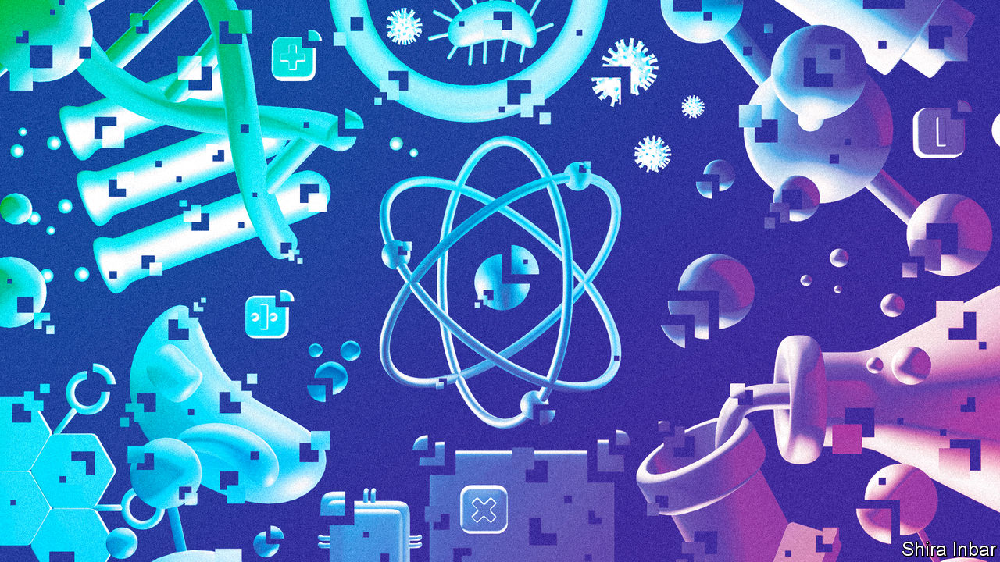
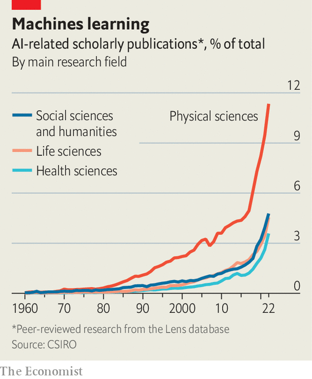
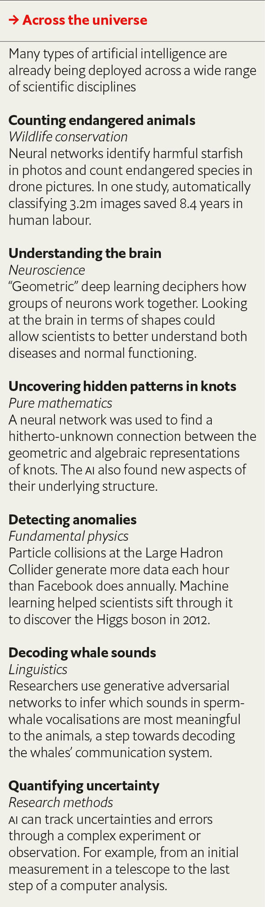
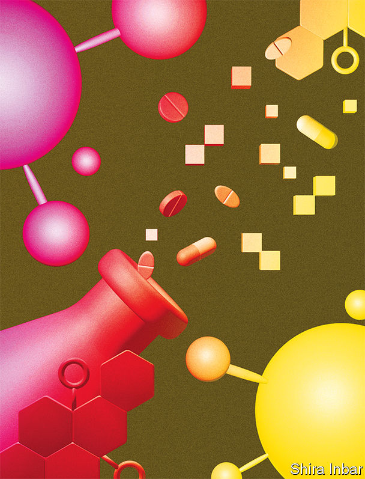

###### AI Science (1)

# How scientists are using artificial intelligence 

##### It is already making research faster, better, and more productive 

 

> Sep 13th 2023 

In 2019, scientists at the Massachusetts Institute of Technology (MIT) did something unusual in modern medicine—they found a new antibiotic, halicin. In May this year another team found a second antibiotic, abaucin. What marked these two compounds out was not only their potential for use against two of the most dangerous known antibiotic-resistant bacteria, but also how they were identified.

In both cases, the researchers had used an artificial-intelligence (AI) model to search through millions of candidate compounds to identify those that would work best against each “superbug”. The model had been trained on the chemical structures of a few thousand known antibiotics and how well (or not) they had worked against the bugs in the lab. During this training the model had worked out links between chemical structures and success at damaging bacteria. Once the AI spat out its shortlist, the scientists tested them in the lab and identified their antibiotics. If discovering new drugs is like searching for a needle in a haystack, says Regina Barzilay, a computer scientist at MIT who helped to find abaucin and halicin, AI acts like a metal detector. To get the candidate drugs from lab to clinic will take many years of medical trials. But there is no doubt that AI accelerated the initial trial-and-error part of the process. It changes what is possible, says Dr Barzilay. With AI, “the type of questions that we will be asking will be very different from what we’re asking today.”

Drug discovery is not alone in being jolted by the potential of AI. Researchers tackling many of the world’s most complicated and important problems—from forecasting weather to searching for new materials for batteries and solar panels and controlling nuclear-fusion reactions—are all turning to AI in order to augment or accelerate their progress. 

The potential is enormous. “AI could usher in a new renaissance of discovery,” argues Demis Hassabis, co-founder of Google DeepMind, an AI lab based in London, “acting as a multiplier for human ingenuity.” He has compared AI to the telescope, an essential technology that will let scientists see farther and understand more than with the naked eye alone.

Where have you been?

 


Though it has been part of the scientific toolkit since the 1960s, for most of its life AI has been stuck within disciplines where scientists were already well-versed in computer code—particle physics, for example, or mathematics. By 2023, however, with the rise of deep learning, more than 99% of research fields were producing AI-related results, according to CSIRO, Australia’s science agency (see chart). “Democratisation is the thing that is causing this explosion,” says Mark Girolami, chief scientist at the Alan Turing Institute in London. What used to require a computer-science degree and lines of arcane programming languages can now be done with user-friendly AI tools, often made to work after a query to ChatGPT, OpenAI’s chatbot. Thus scientists have easy access to what is essentially a dogged, superhuman research assistant that will solve equations and tirelessly sift through enormous piles of data to look for any patterns or correlations within.

In materials science, for example, the problem is similar to that in drug discovery—there are an unfathomable number of possible compounds. When researchers at the University of Liverpool were looking for materials that would have the very specific properties required to build better batteries, they used an AI model known as an “autoencoder” to search through all 200,000 of the known, stable crystalline compounds in the Inorganic Crystal Structure Database, the world’s largest such repository. The AI had previously learned the most important physical and chemical properties required for the new battery material to achieve its goals and applied those conditions to the search. It successfully reduced the pool of candidates for scientists to test in the lab from thousands to just five, saving time and money. 

The final candidate—a material combining lithium, tin, sulphur and chlorine—was novel, though it is too soon to tell whether or not it will work commercially. The AI method, however, is being used by researchers to discover other sorts of new materials.

What did you dream?

AI can also be used to predict. The shapes into which proteins twist themselves after they are made in a cell are vital to making them work. Scientists do not yet know how proteins fold. But in 2021, Google DeepMind developed AlphaFold, a model that had taught itself to predict the structure of a protein from its amino-acid sequence alone. Since it was released, AlphaFold has produced a database of more than 200m predicted protein structures, which has already been used by over 1.2m researchers. For example, Matthew Higgins, a biochemist at the University of Oxford, used AlphaFold to figure out the shape of a protein in mosquitoes that is important for the malaria parasite that the insects often carry. He was then able to combine the predictions from AlphaFold to work out which parts of the protein would be the easiest to target with a drug. Another team used AlphaFold to find—in just 30 days—the structure of a protein that influences how a type of liver cancer proliferates, thereby opening the door to designing a new targeted treatment.

AlphaFold has also contributed to the understanding of other bits of biology. The nucleus of a cell, for example, has gates to bring in material to produce proteins. A few years ago, scientists knew the gates existed, but knew little about their structure. Using AlphaFold, scientists predicted the structure and contributed to understanding about the internal mechanisms of the cell. “We don’t really completely understand how [the AI] came up with that structure,” says Pushmeet Kohli, one of AlphaFold’s inventors who now heads Google DeepMind’s “AI for Science” team. “But once it has made the structure, it is actually a foundation that now, the whole scientific community can build on top of.”

AI is also proving useful in speeding up complex computer simulations. Weather models, for example, are based on mathematical equations that describe the state of Earth’s atmosphere at any given time. The supercomputers that , however, are expensive, consume a lot of power and take a lot of time to carry out their calculations. And models must be run again and again to keep up with the constant inflow of data from weather stations around the world.

Climate scientists, and private companies, are therefore beginning to deploy machine learning to speed things up. Pangu-Weather, an AI built by Huawei, a Chinese company, can make predictions about weather a week in advance thousands of times faster and cheaper than the current standard, without any meaningful dip in accuracy. FourCastNet, a model built by Nvidia, an American chipmaker, can generate such forecasts in less than two seconds, and is the first AI model to accurately predict rain at a high spatial resolution, which is important information for predicting natural disasters such as flash floods. Both these AI models are trained to predict the weather by learning from observational data, or the outputs of supercomputer simulations. And they are just the start—Nvidia has already announced plans to build a digital twin of Earth, called “Earth-2”, a computer model that the company hopes will be able to predict climate change at a more regional level, several decades in advance.

Physicists trying to harness the power of nuclear fusion, meanwhile, have been using AI to control complex bits of kit. One approach to fusion research involves creating a plasma (a superheated, electrically charged gas) of hydrogen inside a doughnut-shaped vessel called a tokamak. When hot enough, around 100m°C, particles in the plasma start to fuse and release energy. But if the plasma touches the walls of the tokamak, it will cool down and stop working, so physicists contain the gas within a magnetic cage. Finding the right configuration of magnetic fields is fiendishly difficult (“a bit like trying to hold a lump of jelly with knitting wool”, according to one physicist) and controlling it manually requires devising mathematical equations to predict what the plasma will do and then making thousands of small adjustments every second to around ten different magnetic coils. By contrast, an AI control system built by scientists at Google DeepMind and EPFL in Lausanne, Switzerland, allowed scientists to try out different shapes for the plasma in a computer simulation—and the AI then worked out how best to get there.

Automating and speeding up physical experiments and laboratory work . “Self-driving laboratories” can plan an experiment, execute it using a robotic arm, and then analyse the results. Automation can make discovering new compounds, or finding better ways of making old compounds, up to a thousand times faster. 

You’ve been in the pipeline

Generative AI, which exploded into public consciousness with the arrival of ChatGPT in 2022 but which scientists have been playing with for much longer, has two main scientific uses. First, it can be used to generate data. “Super-resolution” AI models can enhance cheap, low-resolution electron-microscope images into high-resolution ones that would otherwise have been too expensive to record. The AI compares a small area of a material or a biological sample in high resolution with the same thing recorded at a lower resolution. The model learns the difference between the two resolutions and can then translate between them.

 


And just as a large language model (LLM) can generate fluent sentences by predicting the next best word in a sequence, generative molecular models are able to build molecules, atom by atom, bond by bond. LLMs use a mix of self-taught statistics and trillions of words of training text culled from the internet to write in ways that plausibly mimic a human. Trained on vast databases of known drugs and their properties, models for “de novo molecular design” can figure out which molecular structures are most likely to do which things, and they build accordingly. Verseon, a pharmaceutical company based in California, has created drug candidates in this way, several of which are now being tested on animals, and one—a precision anticoagulant—that is in the first phase of clinical trials. Like the new antibiotics and battery materials identified by AI, chemicals designed by algorithms will also need to undergo the usual trials in the real world before their effectiveness can be assessed.

A more futuristic use for LLMs comes from Igor Grossmann, a psychologist at the University of Waterloo. If an LLM could be prompted with real (or fabricated) back stories so as to mirror accurately what human participants might say, they could theoretically replace focus groups, or be used as agents in economics research. LLMs could be trained with various different personas, and their behaviour could then be used to simulate experiments, whose results, if interesting, could later be confirmed with human subjects.

LLMs are already making scientists themselves more efficient. According to GitHub, using tools like its “Copilot” can help coders write software 55% faster. For all scientists, reading the background research in a field before embarking on a project can be a daunting task—the sheer scale of the modern scientific literature is too vast for a person to manage. Elicit, a free online AI tool created by Ought, an American non-profit research lab, can help by using an LLM to comb through the mountains of research literature and summarise the important ones much faster than any human could. It is already used by students and younger scientists, many of whom find it useful to find papers to cite or to define a research direction in the face of a mountain of text. LLMs can even help to extract structured information—such as every experiment done using a specific drug—from millions of documents.

Widening access to knowledge within disciplines could also be achieved with AI. Each detector at the Large Hadron Collider at CERN in Geneva requires its own specialised teams of operators and analysts. Combining and comparing data from them is impossible without physicists from each detector coming together to share their expertise. This is not always feasible for theoretical physicists who want to quickly test new ideas. Miguel Arratia, a physicist at the University of California, Riverside, has therefore proposed using AI to integrate measurements from multiple fundamental physics experiments (and even cosmological observations) so that theoretical physicists can quickly explore, combine and re-use the data in their own work. 

AI models have demonstrated that they can process data, and automate calculations and some lab work (see table). But Dr Girolami warns that whereas AI might be useful to help scientists fill in gaps in knowledge, the models still struggle to push beyond the edges of what is already known. These systems are good at interpolation—connecting the dots—but less so at extrapolation, imagining where the next dot might go. 

And there are some hard problems that even the most successful of today’s AI systems cannot yet handle. AlphaFold, for example, does not get all proteins right all the time. Jane Dyson, a structural biologist at the Scripps Research Institute in La Jolla, California, says that for “disordered” proteins, which are particularly relevant to her research, the AI’s predictions are mostly garbage. “It’s not a revolution that puts all of our scientists out of business.” And AlphaFold does not yet explain why proteins fold in the ways they do. Though perhaps the AI “has a theory we just have not been able to grasp yet,” says Dr Kohli.

 


Despite those limitations, structural biologists still reckon that AlphaFold has made their work more efficient. The database filled with AlphaFold’s protein predictions allows scientists to work out the likely structure of a protein in a few seconds, as opposed to the years and tens of thousands of dollars it might have taken otherwise. According to Google DeepMind, scientists who use AlphaFold publish around 20% more papers than those in the same field who do not.

And speeding up the pace of scientific research and discovery, making efficiencies wherever possible, holds plenty of promise. In a recent report on AI in science the OECD, a club of rich countries, said that “while AI is penetrating all domains and stages of science, its full potential is far from realised.” The prize, it concluded, could be enormous: “Accelerating the productivity of research could be the most economically and socially valuable of all the uses of artificial intelligence.”

Welcome to the machine

If AI tools manage to boost the productivity of research, the world would no doubt get the “multiplier for human ingenuity” predicted by Dr Hassabis. But AI holds more potential still: just like telescopes and microscopes let scientists see more of the world, the probabilistic, data-driven models used in AI will increasingly allow scientists to better model and understand complex systems. Fields like climate science and structural biology are already at the point where scientists know that complicated processes are happening, but researchers so far have mainly tried to understand those subjects using top-down rules, equations and simulations. AI can help scientists approach problems from the bottom up instead—measure lots of data first, and use algorithms to come up with the rules, patterns, equations and scientific understanding later. 

If the past few years have seen scientists dip their toes into the shallow waters of AI, the next decade and beyond will be when they have to dive into its depths and swim towards the horizon. ■


