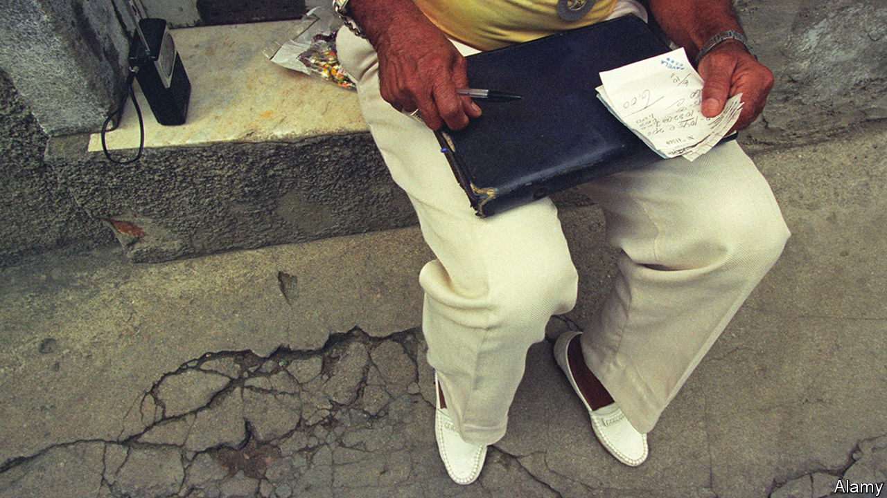

###### Rio roulette

# Short of cash, Brazil’s government may end its gambling prohibition 

##### The illegal sort takes in more than the drugs trade 

 

> Sep 14th 2023 

IN 1946 THE glitzy Copacabana Palace hotel in Rio de Janeiro spun its last roulette wheel. That April Eurico Dutra, Brazil’s president, banned games of chance, shutting casinos, betting shops and bingo halls. Soon such places may reopen. On July 24th the current president, Luiz Inácio Lula da Silva, issued a provisional decree to regulate sports-betting websites, which until now have operated in a legal grey area. This is the first step, perhaps, in a process that will allow all sorts of gambling. 

Congress has until November to amend and vote on Lula’s decree. The government wants to charge an 18% levy on the revenue of sports-betting websites and a 30m-real ($6m) fee for a five-year licence to operate one. It would create a regulator, the National Secretariat for Games and Betting. Opposition in Congress comes mainly from evangelical Christian lawmakers. There are too few to block the measure. 

The main goal is to raise cash. Lula wants to eliminate the federal government’s primary deficit, which is forecast to be 1.4% of GDP this year, by 2024. His promise not to increase income tax makes that harder. The quest for cash became more urgent this month, when the government published a budget for 2024 that contains expensive promises, like a big increase in the minimum wage. That has shaken investors’ confidence in Lula’s macroeconomic management, . Sports betting could eventually bring 15bn reais a year in revenue, said Fernando Haddad, the finance minister. That is a tenth of what would be needed to erase the deficit next year. 

Currently, Brazil allows “games of skill”, like poker and wagering on horse-racing. They constitute a big business, though most of the companies engaged in it operate from offshore. Legal betting companies’ turnover is expected to be 12bn reais this year, 70% higher than in 2020, according to BNLData, a Brazilian group that provides information about the industry. The country is thought to be the world’s eighth-biggest market for online gambling. Betting websites sponsor 19 of the 20 teams in the top domestic football division. Lula’s decree closes a loophole that lets offshore companies operate in Brazil without regulation or paying tax. 

It does not soften the hard line that Brazil has taken since Dutra’s day on “games of chance”, such as dice, bingo and roulette, most commonly played in casinos or other venues dedicated to gambling. But that prohibition may fall. A bill to legalise all gambling, languishing in Congress since 1984, has recently gained powerful supporters, including the presidents of both houses and, according to the tourism minister, “the majority of the government”. 

Such a step would itself be a gamble. In Brazil the betting business has been a spur to crime. The country’s first mafia arose in the early 20th century to operate the  (animal game), which involves punters guessing which animal’s image will be chosen in a draw and is especially popular in Rio. An estimated 27bn reais a year is spent on illegal gambling in Brazil, more than the drugs trade takes in. 

Even legal forms of gambling pose problems. Criminals use sports-betting websites as unwitting tools in money-laundering and match-fixing schemes. Brazil has a gambling-addiction problem, though it is not as big as in some other countries. A quarter of adult Brazilians who own smartphones wagered on a match last year. An estimated 0.5% of adults are addicted, a psychiatrist told Congress in 2021. That compares with 0.7% in Britain and more than 1% in the United States. 

A big question is whether such ills will get better or worse as Brazil opens up betting further. Lula’s sports-betting decree appeals to cautious supporters of liberalisation like Jorge Kajuru, a senator who chairs the committee considering it. But he draws the line at permitting “hard gambling”, which he says enriches organised crime. “ and sleazy politicians will mostly be the owners of the casinos,” Mr Kajuru says. 

If wider liberalisation happens despite such qualms, Brazil would join a global trend. Countries such as America, Japan and Thailand are in the process of liberalising gambling. Casino groups are queuing up to invest. Brazil, if it opens up, could “quickly become one of the world’s largest” gambling markets, says a spokesman for Playtech, a gambling-software company.

Advocates contend that, unlike gambling itself, liberalisation is a win-win proposition. It would curb criminality by introducing regulation and enrich the government. Some of the extra revenue could be spent on treating addiction. “By legalising gambling the state has more power to mitigate the negative effects,” says Ricardo de Paula Feijó, a legal consultant. That sort of argument is gaining adherents. Rio’s roulette wheels may spin once more. ■

