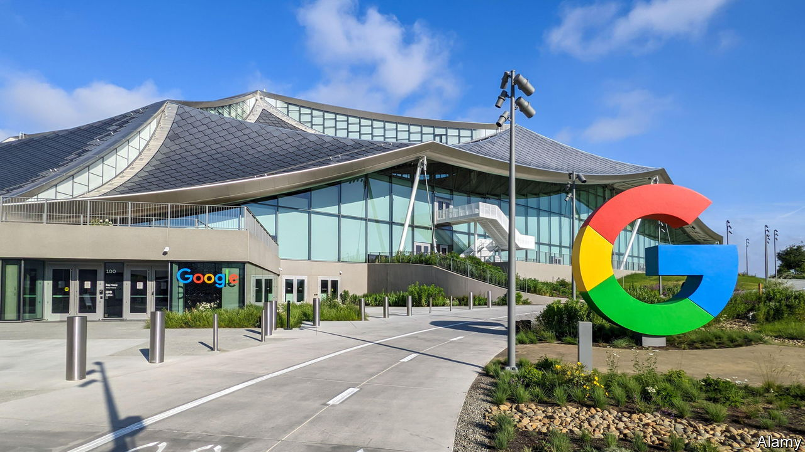
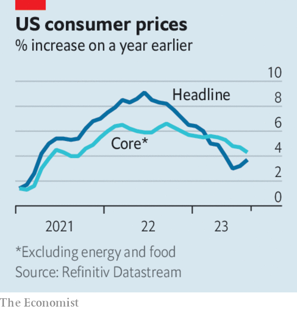

###### The world this week

# Business 

#####  

 

> Sep 14th 2023 

 went on trial in Washington, in the biggest antitrust case brought against a tech company since Microsoft’s trial in 1998. In its opening statement the Department of Justice said that Google had illegally sought to maintain its monopoly in internet search, giving it a 90% share of the market, and asked whether Google “will ever face meaningful competition”. It accused Google of striking deals with internet and phone companies to display its search engine prominently. Google denies wrongdoing, and argues that “forcing people to use inferior products” does not constitute competition. The trial is expected to last ten weeks.

Lightning changes

Apple launched the . The new device replaces Apple’s Lightning connector with USB-C, a change forced on Apple by the European Union, which has ruled that all phones must use the standard port. People who buy the 15 will have to ditch their Lightning accessories, such as speaker docks, but the new phone will be able to connect to a wider range of devices using USB-C. 

 priced its IPO at $51 a share, the top end of its price range, just ahead of its debut on the Nasdaq exchange. The eagerly awaited share offering of the British chip designer was heavily oversubscribed. Meanwhile  said it hoped to price its shares in another hotly anticipated tech IPO at a range of between $26 to $28. The online-groceries firm is aiming for a valuation of $9.3bn, far below the $39bn it was said to be worth in 2021. 

The  raised interest rates by a quarter of a percentage point, which lifts its deposit facility from 3.75% to 4%, the tenth consecutive increase. Before the announcement markets were evenly split on whether the ECB would pause rates instead, but the bank noted that “underlying price pressures remain high”, as it made a small upward revision to its forecast of average inflation in the euro area next year, to 3.2%. 

The president of the European Commission, Ursula von der Leyen, announced that the commission would investigate subsidies given to Chinese makers of , which have “flooded” global markets. European manufacturers of EVs were being undercut by state subsidies in China, she said. Chinese carmakers, such as BYD, have overtaken their American and European rivals in bringing cheaper EVs to market, and are expanding rapidly overseas as a consequence. 

 abruptly resigned as chief executive of BP. The energy giant said it was reviewing fresh claims of Mr Looney’s conduct in personal relationships with colleagues, and that he had not been fully transparent in previous disclosures. Mr Looney became CEO in 2020, boosting BP’s commitment to renewables with an aim to reach net-zero emissions by 2050. His departure comes amid mounting scepticism among green investors about BP’s pledges. 

The British government’s latest auction of contracts for  failed to win a single bid. Although the government increased the amount of subsidy available, contractors claimed it was not enough to offset their spiralling costs. 

Daniel Zhang unexpectedly quit as the head of  cloud-computing division, less than three months after the company said he would step down as chief executive to focus on the role. Eddie Wu, the new CEO, will now also control the cloud business. The news, ahead of the Chinese tech giant’s plan to split in six, rattled investors. 

 


America’s annual rate of  jumped in August, to 3.7%, the second month in a row the rate has risen following a year of consistent declines. Most of August’s increase is explained by costlier petrol, the result of the decision by Saudi Arabia and Russia to cut oil output. The Federal Reserve is more interested in the core rate of inflation, which strips out volatile food and energy prices. That dropped in August, to 4.3%. 

A judge in New York ordered  to pay $16bn to two former shareholders in , an oil company that the Argentine government renationalised in 2012. A ruling in March found the renationalisation to be unlawful. Argentina, which had argued that the case was outside the jurisdiction of American courts, is to appeal against the judge’s decision. 

Norway’s sovereign-wealth fund, the world’s biggest, has become the largest shareholder in , with a 5% stake. The Swiss bank is expected to resume share buybacks next year following its recent takeover of Credit Suisse. 

 is to shut up shop, six weeks after falling into administration. Various offers fell through for the household-goods chain, probably making 12,500 staff redundant. It is one of the biggest retail collapses in Britain over the past decade. The family firm, founded in 1930, struggled to compete with newer rivals. 

On the front foot

 took steps to list on the stockmarket. The German maker of hipster sandals filed papers for an IPO on the New York Stock Exchange which will probably take place in mid-October, a blow to European bourses that had hoped to attract the offering. Birkenstock is reportedly aiming for a valuation of $8bn. It will list under the tracker symbol BIRK. 

