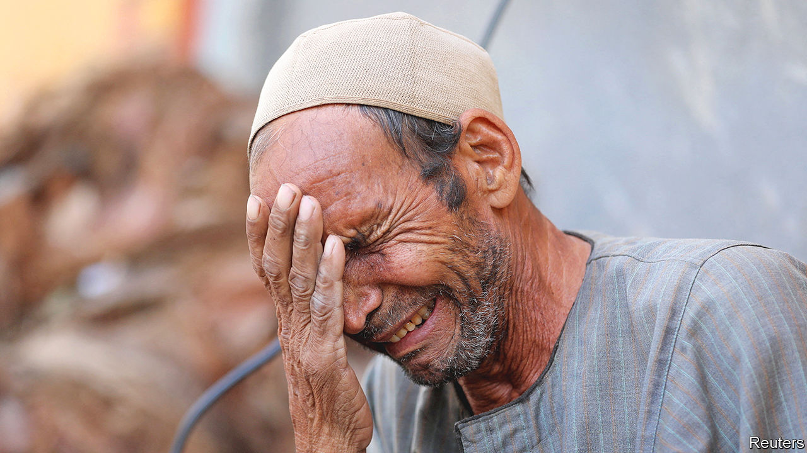
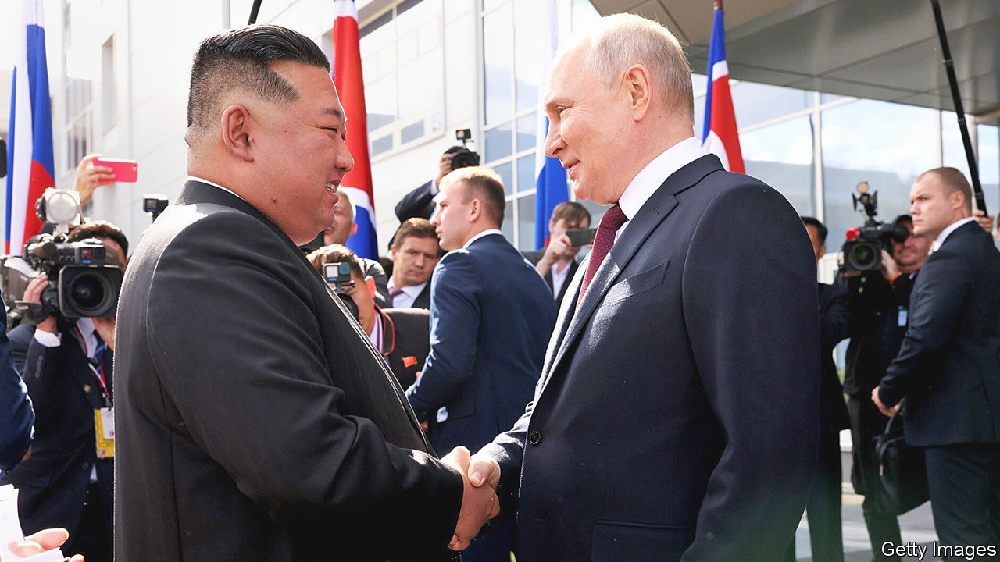

###### The world this week

# Politics 

#####  

 

> Sep 14th 2023 

More than 5,300 people died and many thousands more were missing after floods burst two dams and swept through the  port city of Derna. Entire neighbourhoods were wiped out. Earlier, another disaster struck north Africa when  was hit by its worst earthquake in more than a century near the city of Marrakesh. At least 2,900 have been killed. The government has  some international offers of aid.

For the first time in its history all 15 of  Supreme Court justices . They began hearing petitions against a law passed in July that dramatically limits the powers of the judiciary. 

America waived sanctions on certain banks to allow the transfer of $6bn in frozen funds to  from South Korea as part of a prisoner-exchange deal. Antony Blinken, America’s secretary of state, said that five Americans held by Iran would be released. Iran can only use the money for humanitarian purposes.

Armed secessionist groups in northern attacked posts controlled by the army and Wagner, a Russian mercenary group, leaving a peace deal signed in 2015 in tatters. The junta running Mali has ordered UN peacekeepers to leave the country by the end of the year and recently sent troops and mercenaries into the UN’s evacuated bases.

, a powerful and controversial figure in the years leading to the end of apartheid in South Africa, died at the age of 95. Mr Buthelezi, the great-grandson of King Cetshwayo, who inflicted a stinging military defeat on the British in the late 19th century, stoked up Zulu nationalism and ethnic conflict that led to thousands of deaths in the 1980s and 1990s. 

Bernardo Arévalo,  president-elect, suspended the transition to his inauguration in January, in protest at a raid on the electoral commission by agents of the attorney-general’s office, who photographed ballots. Mr Arévalo, an anti-establishment candidate, was the surprise winner of August’s election. 

 commemorated the 50th anniversary of a coup that overthrew the elected government of Salvador Allende, a socialist, and led to 17 years of rule by Augusto Pinochet, a right-wing dictator. The regime murdered several thousand people and tortured at least 30,000.

The area of  planted with coca bushes rose by 13% in 2022 to reach a record high, according to the UN Office on Drugs and Crime. Colombia’s left-wing president, Gustavo Petro, is a critic of the “war on drugs” led by America.

Last year more  were murdered in Latin America than in any other region, according to Global Witness, an NGO. Of the 177 activists known to have been killed globally, 156 were in Latin America. Colombia, with 60 murders, was the deadliest country.

Mexican legislators, holding Congress’s first hearing on UFOs and extraterrestrials, considered claims that what appeared to be two small bodies with three-fingered hands are  in origin. Jaime Maussan, a Mexican journalist, said they were found underground in the Nazca desert of Peru in 2017 and that a Mexican university had determined that they are 1,000 years old. The university said that it had given no opinion about the origin of the bodies.


Ukraine attacked a shipyard in the  port of Sevastopol, severely damaging two Russian vessels, one of them a submarine. Russian officials said Russia had destroyed most of the cruise missiles Ukraine fired in the attack. 

The final declaration of the   in Delhi omitted any censure of Russian aggression in Ukraine, deleting the condemnation that was included in last year’s statement. India’s external affairs minister said there were “multiple views” on the war. The African Union was admitted as a permanent member of the G20 in response to complaints by African countries that they are underrepresented in multilateral institutions. Joe Biden held talks with Li Qiang, China’s prime minister, after Xi Jinping decided not to attend. 

After the summit Mr Biden travelled to , where the government upgraded its formal relationship with America to the highest level. The two countries signed business deals, focusing on technology and artificial intelligence and involving firms such as Boeing, Microsoft and Nvidia. . 

Bessie mates

 


A meeting of very different minds took place at Russia’s Vostochny cosmodrome, where , North Korea’s dictator, and , his Russian counterpart, . It was Mr Kim’s first trip abroad in four years. The pair are thought to have discussed sending North Korean arms to Russia for its war on Ukraine. “We will be together in the fight against imperialism,” said Mr Kim, without a trace of irony. 

 prime minister, Kishida Fumio, reshuffled his cabinet, appointing Kamikawa Yoko as foreign minister, a rare appointment of a woman to a senior government post (a quarter of the jobs in the cabinet went to women). Kihara Minoru, who is pro-Taiwan and has visited the island, was made defence minister. 

 new prime minister, Srettha Thavisin, unveiled a raft of populist policies as he laid out his government’s agenda. The policies include a moratorium on farm debt and lower fuel prices. 

In the  Maria Ressa, an investigative journalist and winner of the Nobel peace prize, was acquitted of tax evasion. Ms Ressa has now been cleared of all tax charges laid against her by the administration of the former president, Rodrigo Duterte, though she is appealing against a cyber-libel conviction. 

A presidential election in the  produced a surprise when Mohamed Muizzu, the opposition candidate, took 46% of the vote against 39% for Ibrahim Mohamed Solih, the incumbent. Mr Muizzu is pro-China; Mr Solih is pro-India. A run-off will be held on September 30th. 

It emerged that a British parliamentary researcher had been arrested in March on suspicion of . Rishi Sunak, Britain’s prime minister, said that attempts to undermine British democracy were “completely unacceptable and will never be tolerated”, but stopped short of calling China a threat.

 governing Labour Party came second in local and regional elections to the centre-right Hoyre party, the first time Labour has failed to lead in nationwide municipal elections since 1924. It even lost in Oslo. The anti- immigration Progress Party came third, increasing its share of the vote. 

A former head of  intelligence warned that the hard-right Freedom Party still maintained close links with Russia and would be a risk if it returned to government. Speaking to the , Peter Gridling said Austria needed to be “vigilant about who is put in charge of which ministries”. The Freedom Party holds a steady lead in the polls ahead of elections due to take place a year from now. 

Sounding all too familiar

Kevin McCarthy, the Republican speaker of America’s House of Representatives, announced the start of an  into Joe Biden, claiming that the president lied about the activities of his son, Hunter Biden. Far-right Republicans wanted the investigation. 

 announced his retirement as a senator when his current term expires. The former Republican presidential candidate said that, at 76, he was getting too old. “Frankly, it’s time for a new generation of leaders,” he mused, a message that seems lost on Joe Biden (80) and Donald Trump (77). 

