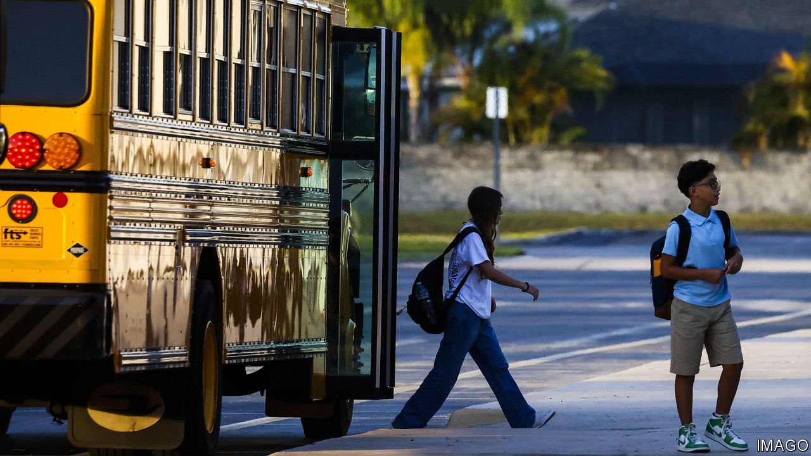
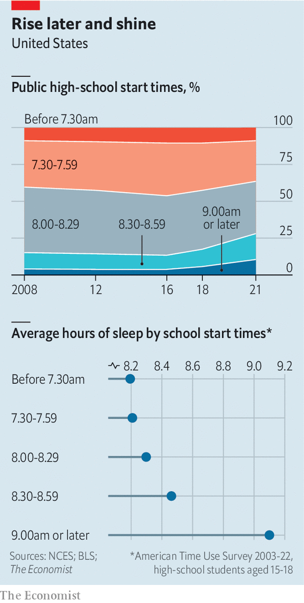

###### Raising the alarm-clock

# America’s school day starts too early. That’s beginning to change 

##### Help is on the way for sleep-deprived teenagers 

 

> Sep 7th 2023 

 


The back-to-school season can be hard—not least in Syracuse, New York. On September 6th and 7th high-school students there returned to classrooms at 7.25am, 25 minutes earlier than the year before. According to the National Centre for Education Statistics (nces), most American public schools start a little after 8am; more than a quarter start even earlier. Students in the South are the earliest risers. In Louisiana instruction typically begins at 7.45am.

Such schedules, health experts say, are inappropriate for teenagers, whose internal clocks are wired for an 11pm bedtime and an 8am wake-up. In 2014 the American Academy of Pediatrics recommended that middle and high schools start no earlier than 8.30am. The Centres for Disease Control has concluded that, of all the policies aimed at boosting adolescents’ sleep, delaying school start-times could have the greatest impact. Data from the annual American Time Use Survey show that between 2003 and 2022 high-school students who started class after 8.30am logged 33 more minutes of sleep, on average, than those who started sooner (see chart). 

A recent paper by Kevin Bastian and Sarah Fuller of the University of North Carolina at Chapel Hill finds that later start times lead to better attendance, fewer disciplinary problems and higher test scores. Some policymakers are getting the message. The nces’s latest data show that the share of American public schools starting after 8.30am rose in the 2020-21 school year. In 2019 California passed a law requiring public middle schools to start no earlier than 8am and high schools no earlier than 8.30am. In May Florida passed a similar law. 

Eight other states are mulling such laws. A bill in the New York state Assembly would require public schools to start no earlier than 8.30am. Relief may be on the way for Syracuse’s sleepy teens. ■


