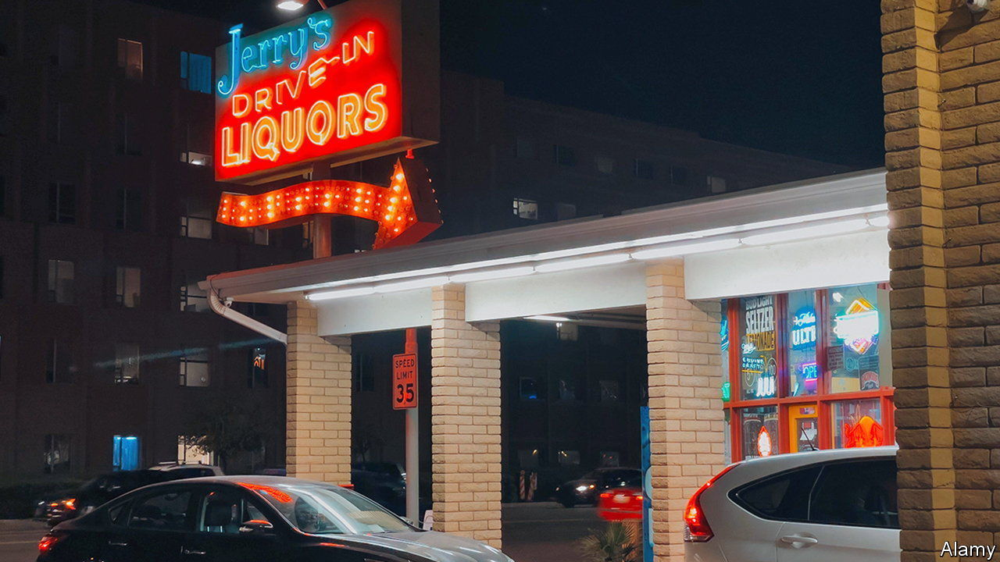

###### A Prozac moment?

# Drugs to treat alcohol addiction are underused 

##### Two popular new medications may change that 

 

> Sep 14th 2023 

Nearly 30m Americans suffer from alcohol-use disorder, meaning that alcohol has a significant and negative impact on their lives. Over 140,000 die from alcohol-related causes each year: alcohol is the fourth-highest cause of preventable death in America. These statistics are especially devastating because for many people the suffering could have been avoided. 

For decades drugs have existed to help with alcohol addiction. Disulfiram, also known as Antabuse, was approved by the Food and Drug Administration (FDA) in 1951. It deters alcohol use by causing patients to get ill when they drink. Naltrexone was approved in 1984, and acamprosate 20 years later. They help reduce alcohol cravings and make withdrawal more manageable. These drugs work “fairly well if not dramatically well in most patients”, says Joshua Lee, of New York University Grossman School of Medicine, who specialises in addiction medicine. Other drugs, such as topiramate, are used “off-label” for alcoholism: ie, doctors prescribe them for reasons beyond their approved use by the FDA.

These drugs are as effective for treating alcoholism as selective serotonin reuptake inhibitors (such as Prozac) are for depression. Yet they are rarely prescribed. Fewer than 2% of patients with alcohol-use disorder report using any medication. By comparison, 22% of patients with opioid problems and over half of patients with depression take prescription drugs.

Why the reluctance to use them? They are not covered deeply in medical school, says Dr Lee: “practitioners lack adequate knowledge, training and confidence.” Besides, other common ailments, such as depression, have more FDA-approved drugs, enabling clinicians to mix and match and deal with side effects. “You need as many medications as possible because some will work for some people but not others,” says Lorenzo Leggio, of the National Institute on Drug Abuse and the National Institute on Alcohol Abuse and Alcoholism.

And many sufferers are loth to seek help—only 7% get any treatment (be it counselling, support groups or drugs). “By the time folks seek treatment…it has been lingering for some time,” says Lara Ray, a clinical psychologist at the University of California, Los Angeles. Dr Ray estimates that many wait ten years to get help. Some may not know that drugs are available.

All this could soon change. Semaglutides, more commonly known as Ozempic and Wegovy, have recently become popular drugs to treat diabetes and obesity. (Ozempic is not FDA-approved for weight loss, but some doctors prescribe it off-label.) They may also work for curbing drinking. If approved for alcohol-use disorder, they could change how patients seek help and how doctors respond.

Patients have reported reduced alcohol cravings while on Ozempic and Wegovy, and preclinical trials on rats and monkeys suggest that semaglutide helps reduce such cravings. Of course, anecdotes and trials on animals are not enough to declare them safe and effective. The National Institutes of Health and Oklahoma State University (OSU) have started randomised clinical trials on humans to determine if semaglutide is effective for alcoholism.

“This drug could be a Prozac moment for addiction medication,” says Kyle Simmons, a pharmacology professor at OSU who is running the clinical trial. Before the FDA approved Prozac in 1987, depression drugs were usually reserved for the most serious cases due to their side effects. With Prozac, doctors became comfortable prescribing drugs for depression. Patients started to ask for the medication. Similarly, the popularity of Ozempic and Wegovy could change the way doctors and patients think about drugs for alcohol addiction, if the FDA approves them for that purpose.

Dr Simmons is optimistic about semaglutide’s potential, but he cautions patients and practitioners eager to use it for alcohol-use disorder now. “We don’t know for certain that it works,” he says, and his study’s results will not be available for about two years. Fortunately patients do not need to wait to get help: they can turn to the drugs for alcoholism that have been ignored by many for so long. ■


