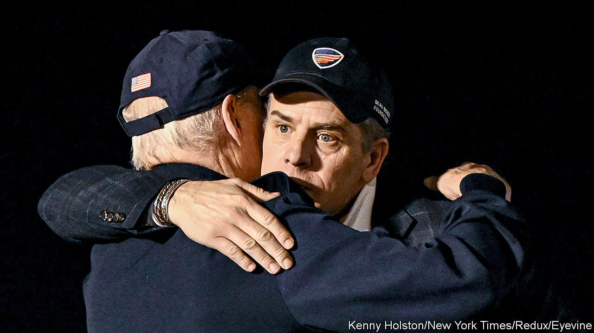

###### More smoke

# Hunter Biden’s woes, and a new impeachment saga, will go on and on 

##### Republican claims of bribery do not stack up, but uncomfortable details do 

 

> Sep 11th 2023 


What does it take to create a “culture of corruption”? In the case of , President Joe Biden’s wayward son, and his business dealings when his father was vice-president, many of the ingredients are there: large sums of money, questionable foreign companies, a powerful father with influence over those companies’ fate. After years of investigation, however, what is still missing, so far, is any proof that these really did mature into a scandal in the Petri dish. That did not deter Kevin McCarthy, the Republican speaker of the House, from announcing the start of impeachment inquiries into President Biden on September 12th. That “culture” of corruption, he said, warrants further investigation. The chance of a conviction of the president is almost nil. But the hearings will tie up Congress for months.

Mr McCarthy’s announcement came in response to pressure from right-wing members of his wafer-thin majority, who have long been pressing for impeachment. But it also builds on months of Republican noise about Hunter Biden. On August 28th the Southeastern Legal Foundation (SLF), a Republican-aligned legal charity based in Georgia, announced it is suing the National Archives to try to force it to release 5,138 emails the archivists have identified as having come from three email addresses Joe Biden used with pseudonyms, such as “Robin Ware” and “Robert L. Peters”. James Comer, the Republican chairman of the House Oversight Committee, who has been probing Hunter Biden’s activities since January, had already requested in mid-August that the emails be released to him.

Mr Comer’s case, in essence, is that the emails will prove that Mr Biden did in fact know in detail what his son was up to in his role between 2014 and 2019 on the board of Burisma, a Ukrainian oil-and-gas firm. According to Mr Comer, one email already found on Hunter’s laptop shows that: “Joe Biden was using a pseudonym and he copied his son about a shady, shady transaction.” The rest, he implied, would show the president tied into a scheme of “influence peddling”. In particular, it would show that, as vice-president, Mr Biden tried to help his son by pushing for the ouster of Viktor Shokin, a former chief prosecutor of Ukraine, who was investigating corruption at Burisma. This, he says, is backed up by the testimony of Devon Archer, one of Hunter’s business associates.

In reality, the evidence revealed by Mr Comer does not show that. The email he refers to, forwarded to Hunter from the “Robert L. Peters” account in May 2016, does indeed include details about the vice-president making a call with Petro Poroshenko, Ukraine’s president at the time. But it also gave details of Mr Biden’s schedule—and said he would be staying at a family home in Delaware that evening, where he would be hosting a memorial service for his other son, Beau. Hunter’s lawyers say that is why he was included. The email was sent two months after Mr Shokin was pushed out by Ukraine’s parliament. And, in his deposition, Mr Archer argued the opposite of what Mr Comer alleges. “Shokin being fired…was not good” for Burisma, he said. 

It is the latest in an investigation which so far has overpromised and underdelivered. Mr Comer has alleged that Joe Biden took bribes while serving as vice-president. In July, pressed by a Fox News anchor on whether he could prove that, he said, “I sure hope so.” Much of what he has turned up shows the younger Biden suggesting to his clients that he could influence his father. But nothing shows that it was much more than a bluff. Take an email Hunter sent to Mr Archer about a visit his father was paying to Ukraine. Mr Comer alleges this trip was taken to help Hunter. In the email, Hunter says about his father: “What he will say and do is out of our hands.” Mr Archer argued this was evidence of how Hunter tried to take credit for things his father did independently.

Yet although Mr Comer’s investigation is failing to prove the existence of what Donald Trump calls the “Biden crime family”, congressional inquiries will now multiply. Democrats say that Mr Biden has done nothing wrong. Ian Sams, a White House spokesman, argues that “government leaders for decades have used aliases to avoid spam and hacking.” Barack Obama, as well as several senior officials in both Democratic and Republican administrations, are known to have done so. But that does not explain why two of the email accounts Mr Biden apparently used were private Gmail accounts, rather than official government ones. It also does not explain the pair exchanging emails about the potential appointment of John McGrail, a friend of Hunter’s who is now a Treasury official, to Mr Biden’s staff. A job recommendation is not corrupt—but it does suggest that father and son did discuss work.

Meanwhile, the younger Mr Biden’s legal problems are intensifying. On September 6th prosecutors serving under David Weiss, the special counsel investigating him, announced that they expect an indictment by the end of the month. Hunter is likely to be charged with not paying taxes and lying on a form when buying a gun at a time when he was addicted to crack cocaine. A plea deal that would have kept him out of jail on those charges fell apart. Other, more damaging charges—such as lobbying for a foreign government without registering—have not been ruled out. 

None of that implicates the president. Yet he may suffer for it nonetheless. According to a CNN poll, three-fifths of Americans think Mr Biden was involved in his son’s business. Pump out enough smoke and you might create fire. ■


