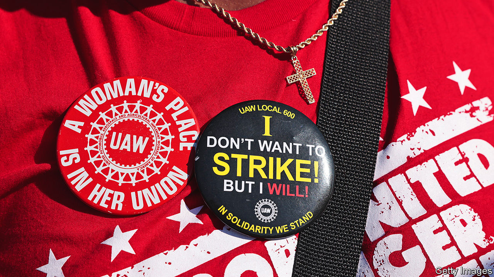

###### Striking times

# Joe Biden’s love of unions runs into a giant strike 

##### It is easier to support workers when they aren’t hurting the economy 

 

> Sep 13th 2023 

It is sometimes said that Americans are not class-conscious. A few minutes of listening to Shawn Fain, president of the United Auto Workers, one of the country’s biggest unions, ought to put that notion to rest. “The very existence of billionaires shows us that we have an economy that is working for the benefit of the few and not the many,” he told UAW members in a recent live-stream. His theme was that workers were losing out while companies were profiting. “Why is that?” he asked. “So another asshole can make enough money to shoot himself to the moon?”

Mr Fain was at his fiery best because he was rallying his troops ahead of a possible strike against the “Big Three” carmakers in Detroit, Ford, GM and Stellantis, when their contract ends on September 14th. (Stellantis’s biggest shareholder, Exor, also owns part of ’s parent company.) That would mark the culmination of a heated few months in American labour relations. The 146,000 UAW members who could walk out, starting with strikes at selected plants on Friday, would add to roughly 190,000 other workers, including actors, screenwriters and hotel staff, already on the picket line. Together, more American  would be on strike than at any point since the 1980s.

When strikes have been averted recently, the terms have been favourable for workers. UPS, a delivery company, agreed in July to lift pay and benefits for its drivers to $170,000. Some in the labour movement think they are just getting started. Or as Mr Fain says: “Our fight is not just for ourselves but for every worker.”

That could end up posing a conundrum for Joe Biden. A favourite boast is that he is the most pro-union president in American history. Academics would debate that, with many giving the nod to Franklin Roosevelt (in power when the right to collective bargaining was enshrined in law). Few, however, would object to calling Mr Biden the most pro-union president in the past 80 years. Not only has he repeatedly voiced staunch support for workers, he has overseen funding commitments, rule changes and personnel appointments that are handing more power to unions—a profound shift after decades in which they were regularly undermined. But a wave of strikes, with the potential to inflict damage on the economy, may test the depths of Mr Biden’s fondness for unions.

What makes the work stoppages so remarkable is that American unions have been in decline for decades, in effect reducing the pool of potential strikers. Just 6% of private-sector workers are in unions today, down from about 30% in 1970. Could the decline now be over? Flickers of a rebound in labour activism were first visible in 2018 and 2019, when the total numbers of American workers on strike hit three-decade highs. Most were public-sector employees, especially teachers.

Strikes this year have spanned a wider variety of sectors: entertainment, logistics, manufacturing, construction, cleaning services and more. “The discontent is comprehensive. You see workers in industries that have never been unionised,” says Kent Wong of the University of California, Los Angeles. Perhaps the biggest labour headlines since 2020 have come from the successes of workers at an Amazon warehouse in New York and at about 350 Starbucks cafés (and counting) in forming unions. Liz Shuler, head of AFL-CIO, America’s largest federation of unions, describes it as “the awakening happening in this country”.

But some observers see it as a fleeting moment for labour. The job market has been unusually tight for five years (with the exception of 2020 at the start of the covid-19 pandemic). The unemployment rate has consistently been below 4%, flirting with a five-decade low. Sensing that they have the upper hand, many workers have quit for better pay elsewhere: as a result Americans on low incomes have enjoyed much faster wage growth than their high-income compatriots since 2019. For those in unions or wanting to form unions, the same dynamic has given them leverage. 

But economic data in the past couple of months show that staff shortages are unwinding, with more people entering the labour force at the same time as companies cut back on hiring. “As labour demand comes more in line with labour supply, the balance of power will tilt back toward managers,” says Michael Strain of the American Enterprise Institute, a think-tank.

The counterargument, that increased labour activism will be more enduring, rests in large part on the actions of Mr Biden. His —roughly $1trn in subsidies for semiconductors, electric vehicles and renewable energy—has been crafted with workers in mind. Much of the funding is contingent on commitments to pay fair wages. Some of the tax breaks have also included wording that companies should remain neutral when their workers try to organise unions. That proved important at Blue Bird, a school-bus maker in Georgia, a state hostile to unions. In May a majority of workers there voted to join a union, a breakthrough for the labour movement in the South.

The regulatory landscape has also changed under Mr Biden. His appointees to the National Labour Relations Board (NLRB), which enforces labour law, have made it easier for workers to hold union elections and harder for companies to block them. Not only has the NLRB overturned company-friendly rules passed under Donald Trump; it also rejected a standard that had stood since 1971 allowing bosses to challenge whether unions truly command majority support. Jennifer Abruzzo, the NLRB’s general counsel, appointed by Mr Biden, is lauded by labour leaders as their fiercest champion in years.

Mr Biden’s support for unions appears to be genuine. He often looks more comfortable in the company of factory workers and labour organisers than with tech billionaires and Ivy League-trained lawyers. He has long proclaimed that union jobs are good jobs—for workers and for America.

Electoral calculations undoubtedly figure in his thinking, too. Surveys show that nearly 70% of Americans now approve of unions, close to a six-decade high (though unions’ loss of clout over the years may help to account for their popularity today, because few people have experienced the fallout from work stoppages). And unions mostly approve of Mr Biden: he has already received an endorsement from the AFL-CIO, its earliest endorsement ever for a presidential candidate. Many of their rank-and-file may still prefer Mr Trump, but Mr Biden carried a majority of union households in the 2020 election.

However, if Mr Biden likes unions, it is much less clear that he likes strikes. Unions have succeeded not because companies see win-win outcomes in dealing with them but because they fear the consequences of not doing so. “It’s a struggle. It’s a zero-sum game,” says Nelson Lichtenstein, a labour historian. An impasse at Starbucks supports his point. Although hundreds of cafés have unionised, workers say the company refuses to bargain with them. “It would require some kind of chaos, doing real damage to the Starbucks reputation, to change that,” he says.

Mr Biden has shown little stomach for chaos. In December he approved a bill to force rail workers to sign a contract and stay on the job, averting a strike that would have caused logistical problems throughout the country. He does not have the same legal authority to forestall a UAW work stoppage. But a strike at the Big Three would cause big losses for the carmakers that would, over time, cascade to other manufacturing firms in Michigan, a swing state in the 2024 election.

Mr Biden has told reporters that he does not think a strike will happen. Mr Fain, the UAW leader, professed shock at hearing such confidence, saying that a strike is “highly likely”. The UAW also happens to be one of the largest unions to refrain so far from endorsing Mr Biden, upset that his administration’s funding for electric vehicles is shifting production away from unionised facilities. Mr Fain says that a uaw strike will offer politicians a chance to pick sides between billionaires and the working class. It is an awkward ultimatum for a president who thinks his fidelity to unions should already be plain to see. ■


