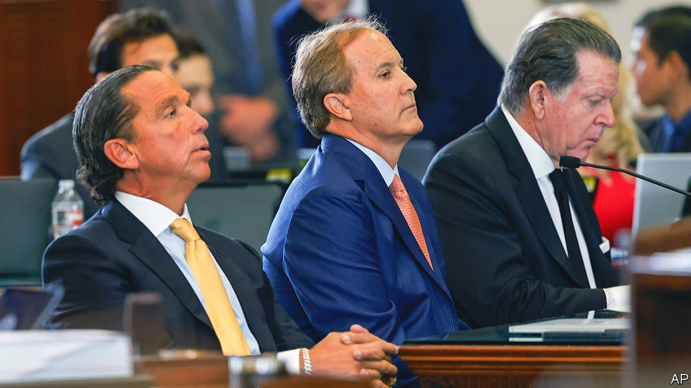

###### Before the firing squad

# Texas Republicans may oust Ken Paxton, one of their own 

##### The push to bring down the conservative warrior comes from his own side 

 

> Sep 14th 2023 

As everyone in the capitol chambers bowed their heads in prayer before opening statements, Ken Paxton looked straight ahead. It is a rare court that Texas’s attorney-general seeks justice before. After being impeached by the state’s House of Representatives in May for bribery, lying and dereliction of duty, Mr Paxton is now on trial before its Senate, with the lieutenant governor presiding as judge and the lawmakers as jurors. His wife, a senator who in 2016 dubbed herself “a pistol-packin’ mama” whose “husband sues Obama”, is barred from voting, but sits among her peers who will determine his fate.

On September 5th the senators rejected all 16 motions filed by Mr Paxton’s lawyers to dismiss the trial. If that is any indication of how they plan to vote on impeachment, Republicans in the country’s biggest conservative state seem poised to oust one of their own. An elected official has not been ejected in Texas in nearly 50 years (when a judge stole funds earmarked for groceries for the poor), and certainly not since the state’s legislature and governorship came under Republican control in 2003. “If you’re a one-party state,” says Jason Sabo, an Austin lobbyist, “eventually the arc of the firing squad comes full circle.” 

The case centres on an alleged quid pro quo between Mr Paxton and Nate Paul, a property developer. Mr Paul donated $25,000 to Mr Paxton’s 2018 campaign, and according to the House impeachment team, bankrolled his home renovations, gave the attorney-general’s mistress a job at his firm and made a secret Uber account to help facilitate the affair. In exchange Mr Paxton is accused of using his office to insulate Mr Paul from legal troubles and investigate his rivals.

Though he had 750 in-house lawyers, in September 2020 Mr Paxton hired a novice outsider to look into a complaint that the feds were after his donor-friend. When he ordered staffers to draft a rushed legal opinion to stop foreclosure sales due to covid-19, a position that contradicted the office’s opposition to pandemic rules, his second-in-command suspected his hands were tied by Mr Paul, who owned properties set to face foreclosure days later. Seven of the attorney-general’s senior deputies reported him to the FBI for bribery and abuse of office that month. By mid-November Mr Paxton had fired four of them; the other three resigned.

Texas Republicans stayed mum for years. As the FBI investigation simmered—he also faces unrelated securities-fraud charges from 2015—Mr Paxton made a name for himself by waging a legal war on Washington. Since 2021 he claims to have sued the Biden administration 50 times, mostly over immigration. In Texas, he has gone after big tech, cartels, election workers and vaccine-makers. This paid off in the polls: after he was endorsed by Donald Trump voters gave him a third term by a near ten-point margin in November 2022. 

In February of this year Mr Paxton asked lawmakers for $3.3m to settle a case brought against him by the whistle-blowers fired from his office, who claimed he illegally retaliated against them. The request hit a nerve. The House launched an investigation that culminated in a speedy vote to impeach Mr Paxton just before the session ended, with 60 Republicans joining the Democrats to support his ousting. 

No lone star

The attorney-general’s defence team argues that the allegations are wrong and blames the “frenzied press” for calling for Mr Paxton’s head. To those in the Senate gallery wearing “RINO hunting” T-shirts (short for Republican in name only), the trial epitomises the tussle between Trumpian, America First Republicans and the establishment “Bush mafia” camp of the party. Lauren Davis, an organiser in Dallas who sometimes cries when she sees an American flag, says Republicans ought to put more stock in their elected officials’ political wins and less in their morals. The pro-Paxton bloc reckons his behaviour was already litigated by the voters in 2022. They warn that a conviction could prompt more politically motivated removals, which strip voters of their right to elect leaders. 

Yet for the trial to be a rebellion against the populism Mr Paxton typifies, his accusers would have to come from the centre. They do not. Andrew Murr, the lead House impeachment manager, is a moustachioed rancher from a district where constituents want to criminalise “abortion trafficking”. In March Briscoe Cane, a member of the impeachment committee, helped a man file a wrongful-death lawsuit against women who allegedly helped his ex-wife get an abortion. And Jeff Mateer, the highest-ranking deputy to turn on his boss in 2020 and the first to testify against him, was nominated by Mr Trump to be a federal judge before his candidacy was withdrawn when it came out that he had called transgender children “Satan’s spawn” and believes that there is no separation between church and state in the constitution. 

Unlike Mr Trump, Mr Paxton himself is not central to the brand of politics he represents. Nor is he likely to be a threat to Texas Republicans—by running as an independent or turning voters against the party—if he is booted out. That may be what is allowing Republicans to deal with his corruption case less timidly. Greg Abbott, Texas’s governor, plans to call for a special legislative session on school vouchers, which lawmakers failed to pass earlier this year, once the trial concludes. Some see that as an opportunity for senators to reaffirm their conservative values to their base. Doing so makes it less politically risky to convict the state’s main MAGA warrior. ■


