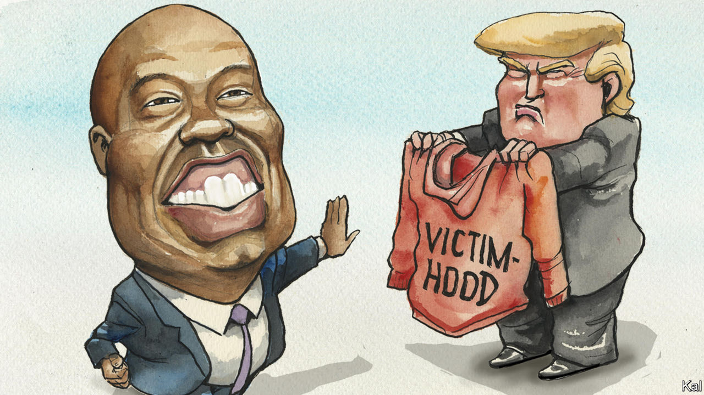

###### Lexington

# Why some GOP candidates don’t act as aggrieved as Donald Trump 

##### Spoiler: they’re not white 

 

> Sep 14th 2023 

One of Donald Trump’s signature political achievements, which like most of them owes to his genius for shamelessness, has been to convert self-pity from a Republican vice into a virtue. He has likewise turned claims of victimhood inside out, from confessions of weakness into boasts. “I am a victim,” Mr Trump declared twice in announcing his present bid for the presidency. He has called one source of his suffering “the greatest witch hunt in the history of our country”, and another, simply, “a lynching”. It may be the only Trump whine he has ever managed to sell, but, as he exhorts his supporters to feel sorry for themselves and to rage at their oppressors, and presents himself as their persecuted billionaire champion, they gulp it all down.

As effective as this Trumpian theme has been, one category of Republican politician seems particularly reluctant to adopt it: non-white ones. “No more whining,” Nikki Haley, a former governor of South Carolina and a daughter of immigrants from India, likes to instruct voters. “No more complaining. Now we get to work.” Vivek Ramaswamy, a former entrepreneur whose parents also immigrated from India, published a book called “Nation of Victims” in which he regrets that, for Americans of whatever race or ideology, thinking of themselves as victims is “one of the few things we’ve all got left in common”.

Tim Scott, a Republican senator from South Carolina, is campaigning for the Republican nomination on the most classic version of the party’s faith. His America has not become a shadowland in which a heartless, fanged establishment sucks the life out of everyone else. It remains, instead, a sunny upland welcoming anyone with the grit to haul themselves up to it by their bootstraps. “I am  to be an American,” Mr Scott said recently at a gathering of voters in Rye, New Hampshire, rendering the word “proud” in a hushed, reverent tone. “I am running for president because I America can do for what she’s done for me.”

Mr Scott, who is 57, is an effective evangelist for this vision because he can present himself as proof. He speaks of growing up the son of a single mother who worked 16 hours a day as a nurse’s assistant, changing bedpans. “It was not a glorious job,” he said in Rye. “But she took in helping people. She took in going to work.” He describes how his mother encouraged him in his studies—“shoot for the moon,” she would say, because “even if you miss you’ll be among the stars”—in order to tee up an emotional high point of his coming-of-age tale: the scene when, after he failed freshman year of high school, she had him choose a branch from a tree outside their home for her to beat him with. 

Hard work, stern discipline, overcoming obstacles: for his audiences, each theme of Mr Scott’s story derives more power from the fact that he is black. When Mr Scott gave the Republican response to a speech by President Joe Biden to Congress two years ago, “Uncle Tim” trended, repulsively, on Twitter. But Mr Scott does not deny the persistence of American bigotry. He has spoken of being pulled over repeatedly by police and even barred from entering the Capitol until white colleagues affirmed his credentials. 

Yet Mr Scott, an adherent of motivational speakers, tells voters that he has also “been the beneficiary of good people from every community” and has learned to treat racism as another obstacle to be overcome, even to turn it into a source of strength. “Today we are teaching kids how to be victims,” he warned in Rye. “You never escape victimhood. It comes with the drug of despair.”

White crowds in Iowa and New Hampshire hang on Mr Scott’s words. Donors have poured money into his campaign. As of mid-August, Mr Scott had outspent all other Republican candidates on advertising, according to the . A super PAC, Trust in the Mission, is spending tens of millions of dollars more on advertising to promote him. Yet as of mid-September Mr Scott was far back in the crowd, stuck in single digits in national polls and statewide polls in Iowa and New Hampshire. 

Republican voters and operatives fault Mr Scott for not being more forceful in the first Republican debate, on August 23rd. As the other candidates attacked each other, Mr Scott hung back. No doubt, to gain attention, he needed to join the fray. But to do so would conflict with his politics and even his upbringing. “For all of my life and for all of my family’s heritage, we had tried to avoid being confrontational,” Mr Scott writes in his memoir, “Opportunity Knocks”. “Always, we believed, the primary aim should be to find common ground.” Mr Scott may not be able to overcome the handicap of his own inspirational politics. Republican voters may be comforted by his message about America’s fundamental fairness to its non-white citizens, but many of them thrill to Mr Trump’s warnings that they themselves are being screwed.

White man’s burden

At the gathering in Rye, one elderly white man introduced his question by saying he had hoped Barack Obama, as president, would “turn the corner on racism”, but that he had failed to do so. He wondered how Mr Scott would accomplish this. What a heavy burden some Americans place on black politicians, asking them not only to smilingly bear the wounds of their own encounters with racism but to relieve white people of having to worry that racism remains a curse. Mr Scott seemed momentarily taken aback, and resorted to condemning socialism. Then he found his way back to his safe theme, that his achievements confirmed “we live in a nation where the colour of your skin does not determine the outcome of your life.”

It says good things about America, and about the Republican Party, that so many non-white Republican candidates—five of a dozen—are competing this year for the nomination. How sad that an even clearer sign of progress will come when they feel entitled to the same privilege as white candidates: to publicly pity themselves, and campaign on their grievances. ■


