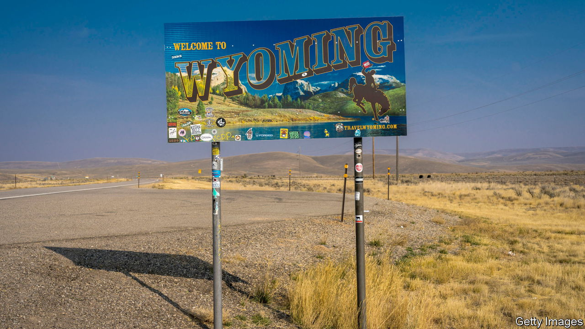

###### Crypto cowboys

# Wyoming wants to become America’s crypto capital 

##### Even FTX’s implosion has not dented the state’s enthusiasm 

 

> Sep 14th 2023 

IN 2021 Gary Gensler, the chairman of the Securities and Exchange Commission, told the Senate Banking Committee that cryptocurrency assets were “like the Wild West”. It perhaps makes sense, then, that one of the places most interested in fostering a crypto industry is Wyoming—the Cowboy State. 

Wyoming has passed more than two dozen laws on digital assets since 2019, according to Bloomberg, more than any other state. Why does America’s least-populous state want to become a crypto capital? “Wyoming is heavily reliant on our mineral extractive industry,” says Chris Rothfuss, one of two Democrats in the state Senate and the chair of a committee on fintech. Crypto, he argues, could help diversify its economy. 

Crypto has bipartisan support: its financial libertarianism appeals to small-government-loving Wyomingites. Digital assets, says Mr Rothfuss, let people “have privacy” and “prevents the government from telling them what to do”. Even the implosion of FTX and crash of crypto markets last year has not dented Wyoming’s dreams. It wants to issue a stablecoin (a class of cryptocurrency) backed by US Treasury bills. 

But it is not clear that Wyoming’s enthusiasm for crypto will pay off. Three-quarters of Americans who have heard of cryptocurrencies do not think they are safe, according to Pew Research Centre, a think-tank. The Federal Reserve seems to agree. In 2019 Wyoming passed a law allowing the establishment of state-chartered banks that cater to firms using digital assets such as cryptocurrencies. Earlier this year the Fed denied one such bank’s application to become a member of its system, arguing that the bank’s risk-management framework was shoddy. 

Wyoming’s quest to issue a stablecoin by the end of the year is also on shaky ground. Mark Gordon, its Republican governor, allowed a bill creating a stablecoin commission to pass into law without his signature. He expressed concern about the lack of proof that a market for such a token exists in Wyoming. “This is really all about signalling that you’re in the crypto game…and that you’re innovative,” says Chris Odinet, a law professor at the University of Iowa. Much like crypto itself, he says, the race to appear crypto-friendly is “largely a lot of smoke and mirrors”.■


