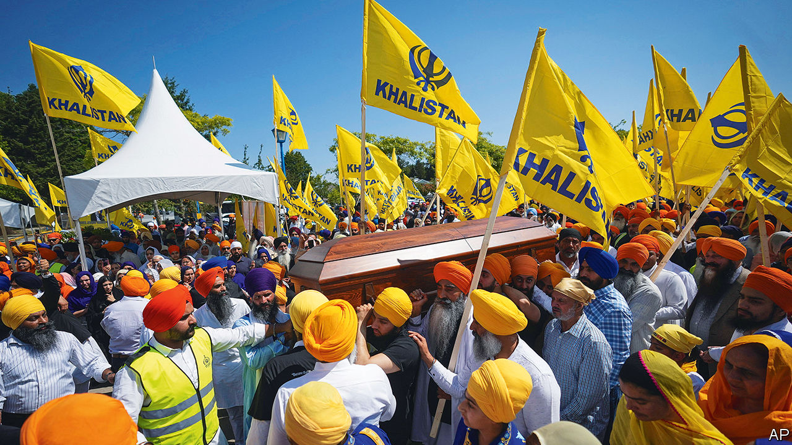

###### Murder in the suburbs

# A devastating accusation by Justin Trudeau against India 

##### The row between Canada and India could draw in America and Britain 

 

> Sep 19th 2023 

ON THE EVENING of June 18th Hardeep Singh Nijjar, a Canadian Sikh leader whom India considered a terrorist, was sitting in his truck in a car park outside a (a Sikh temple) in Surrey, a suburb of Vancouver in British Columbia, when two masked men shot him dead. They fled through a park and disappeared.

On September 18th Justin Trudeau, Canada’s prime minister, told lawmakers in Ottawa that “credible intelligence” from the country’s security services linked India to the killing. It is a highly unusual accusation for the leader of one democracy to make against the government of another. Mr Trudeau said that he had discussed the allegation with Narendra Modi, India’s prime minister, on the sidelines of a  in Delhi on September 10th, and that he would push India to co-operate with an investigation. “Any involvement of a foreign government in the killing of a Canadian citizen on Canadian soil is an unacceptable violation of our sovereignty,” he told Parliament. 

The accusation marks a new low in the already frosty relationship between the two countries. Shortly after Mr Trudeau’s remarks, Canada’s foreign minister announced the expulsion of the head of India’s intelligence agency in Canada.


India’s foreign ministry categorically denied the “absurd” allegation, and said Canada had shared no evidence for the damaging claim with India. It also announced the reciprocal expulsion of a Canadian diplomat and a suspension of visa issuance in Canada. It accused Canada of sheltering “Khalistani terrorists and separatists”, a reference to those who seek an independent homeland for Sikhs in the state of Punjab and other parts of northern India.

In India, the public reaction to Mr Trudeau’s speech broadly echoed the government’s line. A spokesman for the main opposition Congress party declared that India must be “uncompromising” in fighting terrorism. Several editorials highlighted Canada’s alleged failures in tackling Sikh extremism and accused Mr Trudeau of pandering to terrorists. Some supporters of Mr Modi also predicted that the row would help the prime minister. “Justin Trudeau starts campaigning for Modi ahead of the 2024 General Elections by blaming his govt of neutralising a terrorist on Canadian soil,” Nupur J. Sharma, the editor of OpIndia, a right-wing website, wrote on X (formerly Twitter).

A deterioration in India-Canada ties had been apparent for some time. On September 1st Canada said it had paused trade talks with India. In the days leading up to the G20 Canada, while doggedly raising its allegation, apparently tried to reduce tensions by quietly sending the head of its intelligence service and Mr Trudeau’s national security adviser to India. It did not help. At the G20 summit in Delhi, where other Western leaders held long meetings with Mr Modi, Mr Trudeau was fobbed off with a ten-minute huddle on the sidelines. A smiling Mr Modi draped a silk scarf round Mr Trudeau’s neck in what now looks like an ironic welcome. Mr Modi later accused Canada of allowing India’s enemies to promote secession and incite violence against Indians in Canada. (A previous trip by Mr Trudeau to India in 2018 turned into a fiasco after a convicted Sikh extremist was invited to a reception for him at the Canadian High Commissioner’s residence; the invitation was later withdrawn.)

Sikh separatism, the cause behind a bloody insurgency in India in the 1980s and early 1990s, has long been a sore point between India and Canada, which has a large . India accuses Canada of being soft on militant separatists. Former Canadian security officials say India’s government has conducted surveillance on Khalistani groups in Canada for years. Canada itself became the victim of Khalistani terrorism in 1985, when a bomb blew up an Air India aeroplane flying from Montreal to London, killing 329 people, mostly Canadians. It remains the deadliest terrorist attack against Canada in history. Just one suspect was convicted in connection with the bombing; another was shot dead in his car last summer, in the same city where Mr Nijjar was killed.

The plane bombing has in no way soured relations between the 770,000 Sikhs living in Canada and their fellow Canadians. An important political constituency, Sikhs are courted by all Canadian parties. Canada insists it has cracked down on the small minority who have brought their fight for Khalistan to the country. Mr Nijjar had been a vocal advocate for an independent Khalistan, but he denied involvement in violence. 

A deepening estrangement between the two countries would have economic implications, if modest ones. Canadian investors have become more important in India as they seek to profit from its high-growth economy: CPP Investments, a giant Canadian national savings fund, has some $20bn invested in the subcontinent. India is Canada’s tenth-largest trading partner.

All eyes on Modi 

But the ramifications of Mr Trudeau’s accusations go far beyond the relationship between Canada and India. The prime minister said that Canada, a member of the Anglophone “Five Eyes” intelligence alliance, was “closely co-ordinating” with allies on the matter. On September 18th America’s National Security Council duly released a supportive statement, saying it was “deeply concerned about the allegations referenced by Prime Minister Trudeau” and urged India to co-operate with the Canadian investigation. Britain and Australia, which have both had recent run-ins with India over the activities of Sikh separatists on their soil, issued similar statements. All three countries are  as a potential hedge against Chinese domination in Asia, and are painfully reluctant to antagonise it. Yet Mr Trudeau’s public airing of the allegation, based on evidence that they will have seen, gave them little choice.

If Mr Trudeau’s allegation is correct, the assassination points towards an activist turn in the operations of India’s intelligence services in the West, not least the Research and Analysis Wing (RAW), India’s foreign-intelligence arm, the likeliest candidate for such an operation. Carved out of the domestic Intelligence Bureau in 1968, reputedly with help from the CIA, RAW has focused mainly on gathering intelligence on, and conducting operations in, Pakistan, China and other neighbours of India. It has been suspected of conducting black operations to influence India’s neighbours, and to arrest and sometimes to kill its foes. But it is hard to find a precedent for such a seemingly overt attack in the West. It would have been “madness to perpetrate an act like this in a Five Eyes country”, says a European former intelligence official.

India may hope to emulate Israel’s Mossad, whose famously long arm strikes foes far away. But it risks being classed with Russia, whose murders abroad have provoked widespread condemnation and Western sanctions. If the allegations are correct, RAW may have spotted a chance to get rid of a troublesome separatist in Canada and send a message to others like him. But the killing seems more likely to inflame than quell the Khalistanis—while forcing India’s Western allies to ponder how benign a global power it really is. ■


