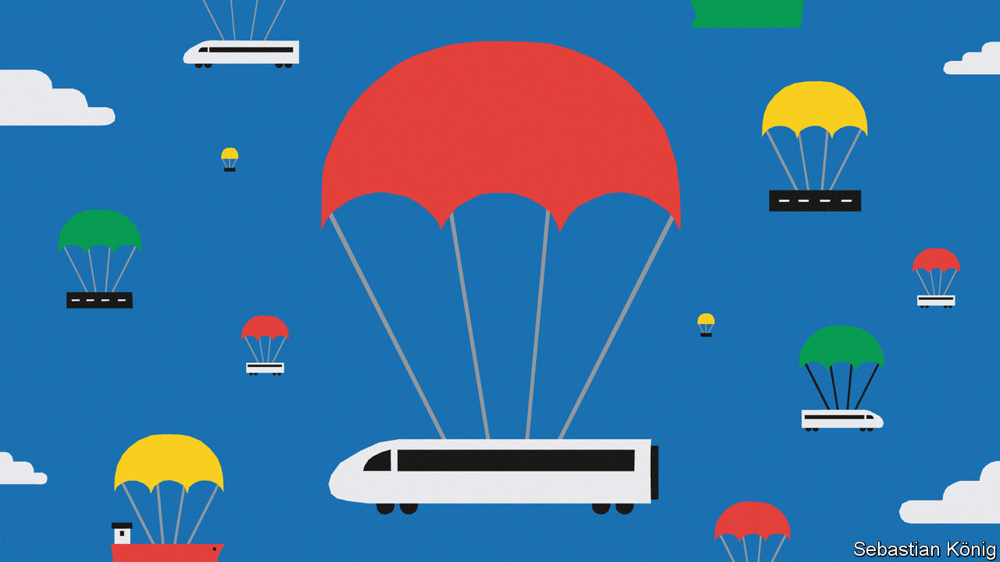

###### Asia’s new aid diplomacy

# China isn’t the only country giving out goodies in Asia 

##### Japan and South Korea are offering development cash too 

 

> Sep 21st 2023 

THE ASIA-PACIFIC region is the world’s most dynamic, and yet its development needs remain vast. The Asian Development Bank (ADB) estimated them to be $1.7trn a year until 2030. Fast growth breeds its own demands, in terms of roads, railways, power stations, ports and digitalisation. But swathes of the region still suffer from poverty, poor access to education and health care, misgovernment, and vulnerability to climate and other natural disasters. And that is before considering the damage caused by the covid-19 pandemic.

The good news is that all these challenges are coming into sharper focus among Asia’s richer countries, as well as regional organisations including the ADB. Japan, South Korea, Australia and Taiwan have all recently shaped new aid and development policies intended to make scarce dollars more effective, with much talk of collaboration. This underlines two realities. The first is that Asia’s appetite for aid and development finance will mostly be met by donors within the region. (For all America’s security presence in Asia, its bilateral aid contribution is tiny, though somewhat redeemed by its large shareholdings in the World Bank and ADB.) A tally by the Lowy Institute, a think-tank in Sydney, noted that four of the top five donors to South-East Asia from 2015 to 2021, accounting for 73% of $200bn of official development spending, were from Asia: China, the ADB, Japan and South Korea. The fifth was the World Bank.

The second reality is that this will have geopolitical consequences. China’s position as Asia’s biggest source of development finance in recent years was being challenged even before recent financial strains at home and souring loans abroad led it to pull back on lending. Development finance and co-operation are emerging as what the Lowy Institute calls “key tools” in Asia’s geopolitics. How Asian donors interact with poorer neighbours may shape the region as much as the defence and security contest between China and America.

China has exerted development influence mainly through President Xi Jinping’s Belt and Road Initiative to improve infrastructure and lower obstacles to trade (while presenting China as a benevolent and rightful global leader). In South-East Asia, for instance, China leads as the single biggest provider of official aid, shelling out about $5.5bn a year, a fifth of the total. Yet it faces significant competition, from Japan and South Korea especially. While China is strong in infrastructure (with nearly 40% of all development finance in that sector), Japan funds transport slightly more than China does. South Korea is level with China in communications. China dominates energy—but in water and sanitation it is nearly absent.

The Chinese approach can breed resentment. It delivers fewer projects than promised. Often using Chinese companies and workers, it puts less emphasis on local hiring and training. And borrowers from China’s two main policy banks typically pay a full, “non-concessional” whack of interest. There is sometimes corruption and shoddy work. In Sri Lanka, the Maldives and Laos, Chinese loans have turned sour as borrowers struggle to repay. The scale of the problems is unclear—a lack of transparency also attends the Chinese approach.

Poor countries therefore relish options—and tend in particular to favour Japan. Its aid engagement is understated but long-standing. Japan began advancing aid in the 1950s, partly in atonement for its wartime aggression. Today it aims to build not only things, but also capacity. Unlike China, Japan often works with local contractors. Complex new subway systems, such as in Jakarta or Manila, come coupled with technical assistance on how to operate them. Hayakawa Yuho, South-East Asia head at the Japan International Co-operation Agency (JICA), says projects that often take a decade to complete require sustained commitment, insulated from interruptions and policy changes. Surveys show Japan as easily the most trusted power in the region. Young Japanese heading overseas as volunteers on Japanese poverty-alleviation projects help reinforce that trust.

Unlike China, Japan makes development-assistance loans mostly at concessional rates, principally through JICA, which also marshals world-class Japanese expertise for advice and training. The Japan Bank for International Co-operation (JBIC) provides project financing for infrastructure development. It is a winning combination. In India and Bangladesh, Japan is easily the biggest bilateral donor. In the Philippines, says one South-East Asian diplomat, Japan “does all the heavy lifting” among donors, competing “very, very aggressively” against China.

South Korea’s aid approach resembles Japan’s. As an exporting powerhouse, it has huge dollar holdings to recycle and a bunch of high-class companies in areas such as infrastructure, mining and communications to back up its aid strategy. (It helps that such companies are active in the region anyway.) President Yoon Suk-yeol wants to pitch his country into the ranks of the world’s ten biggest donors. He has sharply increased aid spending. A recent emphasis has been on health care. The fact that South Korea is a middling rather than a great power (except in its music, films and food, which Asia loves) makes it an uncontroversial benefactor.

Historically poor relations between Japan and South Korea have improved, increasing talk of collaboration over aid. Australia, the key donor to Pacific island states and keen to expand in South-East Asia, also talks of working with “like-minded” partners. In theory, countries can bring complementary strengths—such as financial nous, or expertise in training or renewable energy. But Kei Koga of the Nanyang Technological University in Singapore says the challenges of collaboration will be great—starting with budgeting, since the countries’ fiscal calendars are not aligned. As for drawing in the private sector, which donors aspire to do, the challenge is making the proposition safe and attractive enough for private capital.

These regional partners are like-minded because they believe in the same things: transparency, low corruption, the rule of law, safe sea lanes and so on. Such qualities also define a prominent American-led ambition for a “free and open Indo-Pacific”, formulated with China’s disdain for international rules and grandiose territorial and maritime claims in mind. So it is no wonder that overseas development assistance is increasingly shading into security policy. Japan, for instance, provides the Philippines with patrol boats to police its waters against piracy and smuggling; a greater presence on the water also helps against frequent incursions by Chinese vessels, including warships. Projects to help improve ports, which could be used for both civil and military purposes, are similarly double-edged.

Aid experts often insist that security issues are beyond their remit. Yet the reality is that development assistance and security, butter and guns, are already linked in the Asia-Pacific region. And as China continues striving to assert regional dominance, and its rivals to resist it, they will become ever more tightly enmeshed. ■

