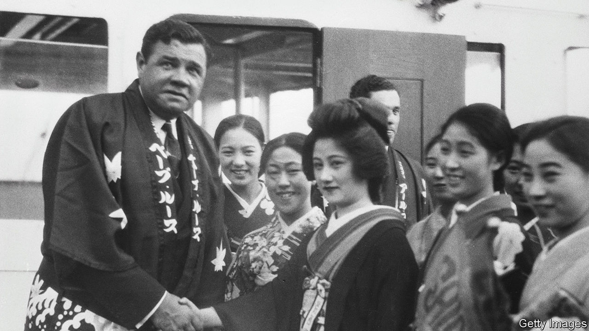

###### Rebuilding Tokyo

# Demolishing one of Babe Ruth’s last stadiums 

##### Baseball fans and environmentalists are opposing a lavish redevelopment project 

 

> Sep 21st 2023 

Jingu Baseball Stadium in Tokyo has seen many iconic moments in its century-old history. Babe Ruth played there in 1934, on a tour of Japan that confirmed baseball’s popularity in the country and led to its first professional team. Over half a million Tokyoites lined the streets to welcome the Bambino and his teammates. In 1959 Nagashima Shigeo, one of Japan’s best-loved sportsmen, hit a walk-off home run at Jingu stadium in the only professional baseball game attended by a Japanese emperor.

A plan to demolish the stadium, as part of a broader redevelopment of the central Jingu Gaien area, is therefore proving controversial. Since the city’s government approved it in February, outraged baseball aficionados have joined in opposition with heritage fans and environmentalists, concerned about hundreds of mature trees that are also slated for the chop. Over 220,000 people have signed an online petition against the redevelopment; thousands have showed up to protest against it.

It is the next phase of a project launched before the Olympic Games that Tokyo hosted in 2020, which included construction of a new national stadium next to the baseball one. In the process the city eased regulations against high-rise buildings in the area. By levelling and replacing the baseball stadium and a nearby rugby one, it aims to turn Jingu Gaien into a “world-class sports cluster”, which would also include two soaring towers, a shopping area and hotels.

To erect skyscrapers at the site, first developed as a recreational area in 1926 to honour the Meiji emperor, would be “sacrilegious”, says Ishikawa Mikiko of ICOMOS, a UNESCO advisory body. Hashimoto Satoko, an architect, says the existing baseball stadium, which was renovated in 2014 to be made earthquake-proof, should be maintained. She accuses the city’s officials of being trapped in the “scrap and build” mentality that defined Tokyo’s urban planning in the 1960s, a time of rapid economic growth and change in the metropolis.

Some baseball fans raise practical concerns, suggesting the planned skyscrapers could cause disruptive winds at the new stadium. Rampant redevelopment of baseball stadiums in America suggests such worries can be exaggerated. Of the dozens that hosted Babe Ruth, two remain, Fenway Park in Boston and Wrigley Field in Chicago. After Jingu Stadium goes, Koshien Stadium in Kobe will be the only other survivor.■

