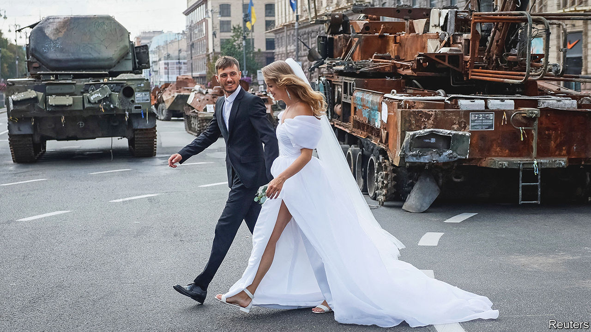
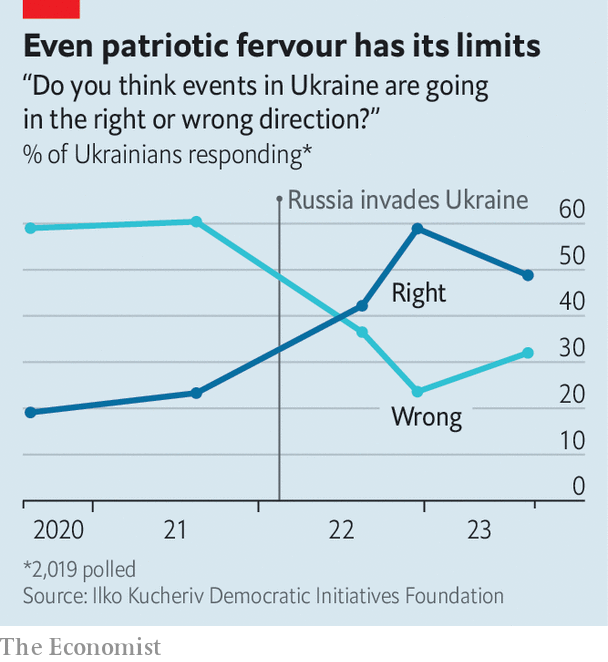

###### The battle within

# To endure a long war, Ukraine is remaking its army, economy and society 

##### The improvisation and decentralisation of the early part of the war will no longer suffice 

 

> Sep 21st 2023 


In the autumn sunshine Kyiv looks glorious. The leafy streets are full of life: café terraces bustle and hipsters throng the bars of Podil, a trendy neighbourhood. The odd air-raid siren aside, the main signs of the 18-month-old war with Russia are rusty tanks turned into makeshift war memorials and the various men in uniform enjoying some leave with their loved ones. 

To Valery Zaluzhny, Ukraine’s top soldier, the scenes of children eating ice cream and men presenting flowers to their sweethearts are satisfying. “This is what we are fighting for. I just want people to have a normal life in the whole of Ukrainian territory,” he says. The critical word is “whole”: Ukraine’s counter-offensive has not yet produced the results he and others had hoped for. Russian lines have not crumbled. Almost a fifth of Ukrainian territory remains in Russia’s hands. In the war of attrition that looms, it is not clear which side has more staying power. In part, of course, that depends on a second uncertainty: in what quantities the  supplied by Ukraine’s allies will keep flowing as the war grinds on. 

A break in the clouds

For all its superficial normality, Kyiv is awash with apprehension. Ukrainians know that Russia has been stockpiling missiles and drones to attack their energy infrastructure when temperatures drop. They know that the supply of volunteers has dried up, and that men are being conscripted to replace casualties at the front. And they know no end is in sight: a year ago 50% of them thought it would be over within a year. Now only 34% believe that. Whereas Vladimir Putin, Russia’s dictator, does not care about the lives of his own troops, Volodymyr Zelensky, Ukraine’s president, presides over a democratic society which does. “It is not just about de-occupation [at any cost]. It’s about de-occupation, but not losing a lot of lives,” he recently told . 

The prospect of an attenuated struggle has started to seep into Mr Zelensky’s speeches. “We need to learn to live with [the conflict],” he told Ukrainians recently. “It depends on what kind of war. We are prepared to keep fighting for a very long period of time…[while] minimising the number of casualties. Like in Israel, for example. We can live like that.”

A war of endurance, however, will require big changes in military planning, the economy and society more broadly. The heroic improvisation and decentralisation of the early part of the war will no longer suffice. On the military side, Mr Zelensky has initiated a clear shift by installing a new minister of defence, Rustem Umerov. Like almost all Ukrainians, he has a personal stake in the war, as a Crimean Tatar, an ethnic group persecuted for Ukrainian sympathies since Russia’s annexation of Crimea in 2014. But, he says, “Ukraine is not about emotions, it is about a system, logistics and industries.”

Mr Umerov, a 41-year-old former entrepreneur and investor, says his mission is to build the capacity of both Ukraine’s defence industry and its soldiers, so that Western allies see Ukraine not as a dependent always begging for aid, but as a partner, capable of shaping its own fortune. His previous job was managing the government’s property portfolio, and he wants to bring an efficient managerial mindset to his new role. Red tape must be eliminated. “Anything that can be digitised, needs to be digitised,” he says. He is not afraid to make waves: after two weeks in the job, he replaced six of his seven deputies.

An explosive legacy

When it was part of the Soviet Union, Ukraine had a vast defence industry. Some 1.5m Ukrainians laboured in 700 military enterprises, including 205 factories and 130 research and development sites. Leonid Kuchma, Ukraine’s second president, ran the world’s biggest rocket plant in the city of Dnipro in Soviet times. A flagship factory in Kharkiv produced 900 tanks a year. But corruption and neglect after the break-up of the Soviet Union in 1991 gradually killed these businesses. 

Now Ukraine is rebuilding its arms industry almost from scratch. “Anything that can be produced locally, must be produced locally,” Mr Umerov insists. In part that involves reforming state enterprises, the job of Oleksandr Kamyshin, a former investment banker who used to run the state railway company and follows Western management fads. “The first hundred days of the war were about bravery. The next 1,000 days are about steeliness,” he declares. In June, three months after his appointment, Ukraine produced as many shells as it had in the entire previous year. In July it reached double that, Mr Kamyshin says. 

Mr Umerov wants to encourage private arms manufacturers, which account for only 20-30% of the local industry. He says he is prepared to pay local firms in advance if they can demonstrate their ability to make useful kit. Many are struggling with a dearth of capable managers: the defence ministry is offering to help bring such people back from the front lines. Within five years, Mr Kamyshin predicts, private firms will produce 80% of local output.

One focus is on drones. Ukraine’s output of them has grown exponentially, albeit from a tiny base. “We will [produce] 120 to 150 times more drones than we did last year,” says Mykhailo Fedorov, the 32-year-old minister for digital transformation, who is co-ordinating the effort. The number of local firms in the business has risen from seven in December to 70 now, the vast majority of them private. To encourage this growth the government has eliminated tariffs on imported components and is buying drones at prices that allow margins of as much as 25%. “We can win in a technological war,” says Mr Fedorov. “We are getting help from countries with large economies and a greater level of freedom. Technologies like freedom and they like mobility. We have both.” 

Mr Kamyshin wants Western military contractors to start localising their production, too. BAE Systems, a British defence firm which makes lots of weapons supplied to Ukraine, has set up a local subsidiary, hoping to produce L119 and M777 howitzers, which are both in wide use at the front. Rheinmetall, Germany’s biggest arms manufacturer, is already repairing Leopard tanks in Ukraine and plans to open an armoured-vehicle factory soon. As Armin Papperger, its CEO, told CNN, “[Ukrainians] have to help themselves. If they always have to wait [for] Europeans or Americans [to] help them over the next ten or 20 years…that is not possible.”

Protecting such factories from Russian attacks will require ingenuity. “We will not have one Soviet-style hypergiant plant but many smaller plants spread across the country,” says Mr Kamyshin. Drones are proof of what is possible: Ukraine’s surging output of reconnaissance devices, Mr Fedorov says, has helped give it parity with Russia’s forces. Production of longer-range ones, which can hit targets in Crimea and deep inside Russia, is also growing. “It is an important historical moment,” he says, “when we are not simply receiving aid and hoping [that it will not run out] but when we are taking responsibility for our own lives in our own hands and starting to form our own capability.”

Ukraine’s growing drone industry also allows its armed forces to adopt new tactics, by taking the war inside Russia. One aim is to hit military factories in an effort to disrupt whole supply chains. Recent examples include an attack on a facility that produces decalin, a fuel additive essential for rockets, and a plant that makes circuitry for Kinzhal and Iskander missiles. 

A second aim is psychological: to shatter the facade of normality the Kremlin tries to preserve, particularly in big cities such as Moscow. Airports there have had to suspend flights for brief spells almost daily in recent weeks owing to drone attacks on the city. (Mr Kamyshin says he would like to set up a shop selling T-shirts with the slogan “Moscow never sleeps”.)

Ukraine also has a third goal in its strikes on Russian infrastructure: to deter Russian attacks on its own infrastructure. Since Russia withdrew in July from a deal allowing exports of grain from Ukraine’s ports on the Black Sea, it has been bombarding those and other export routes and threatening ships calling at Ukrainian ports. Ukraine’s exports have halved as a result, doing yet more damage to an already stricken economy. 

Ukraine is trying to break the Russian blockade. Last month it established a new sea route, hugging the western coast of the Black Sea close to Romania and Bulgaria. If Ukraine can protect it, it could raise its exports to some 70% of pre-war levels. On September 17th, two ships docked at the port of Chornomorsk near Odessa to load almost 20,000 tonnes of wheat. Hours later Russia unleashed a barrage of drones and missiles at other nearby ports. 

A sea change

Ukrainian strategists hope that, if they can threaten Russian ports on the Black Sea and strike at the military bases from which attacks on Ukrainian ports are launched, they may be able to keep Ukraine’s exports afloat. Earlier this month Ukrainian missiles damaged a submarine, a ship and port facilities at a Russian naval base in Crimea. It had decent air defences, but more distant Russian facilities may not be as protected.

The focus on protecting exports reflects a sense among Ukrainian officials that the economy will also need a drastic overhaul to cope with a long war. Ukraine received $31bn in financial aid last year and is on course to receive even more this year. But Serhiy Marchenko, the finance minister, assumes that such largesse will not be forthcoming indefinitely. 

Meanwhile, military spending has leapt from 5% of GDP before the war to 26% this year. Even if the fighting stopped, spending might not drop much. General Zaluzhny says, “I want the Ukrainian army to be so strong that Russia does not even dare to look in our direction.” The shrunken economy is too small to generate sufficient tax revenue to pay for Ukraine’s security, Mr Marchenko notes, so the government will have to help it grow by improving the business climate and fostering industry.

The main concern for investors, says Mr Marchenko, is not physical security but the unreliable legal system, a problem that predates the war. Similarly, it is corruption rather than the damage done by the war to Ukraine’s infrastructure that most Ukrainians see as the main obstacle to recovery. The independent corruption-fighting investigators, prosecutors and courts that Ukraine has put in place are making progress, but the broader judicial system remains inefficient and unpredictable.

Perhaps the worst injury that the war has inflicted on the economy has been to prompt an exodus of 7m Ukrainians—nearly 20% of the pre-war population of 37m people. More than two-thirds are women, since men of fighting age are barred from leaving the country. The working-age population has shrunk from 16.7m in 2021 to 12.4m this year.

The call of the placid

To lure people back, the government is offering startup grants for businesses and subsidised mortgages for those rebuilding homes. But many of the departed have settled in richer, more stable places in the EU, found jobs and put their children in school. They are unlikely to want more upheaval and they may see more opportunity for themselves and their children in their new homes, whatever the security situation in Ukraine. A recent survey found that about half of those who have moved to Germany, at least, intend to stay there for the foreseeable future.

There is not just an economic cost to the exodus, but a social one as well. According to Olena Zelenska, Mr Zelensky’s wife, who heads a government mental-health initiative, there has already been a rise in the number of divorces “because women and children are abroad and men are here”. Mr Zelensky says there is a real risk that a war of attrition could accelerate an outflow of people from Ukraine, creating further economic problems and widening the gap between those who left and those who have stayed.

This is not the only source of social tension. Roman Hasko, a lieutenant from the 80th Airborne Assault Brigade, who volunteered in the first week of the war, says he feels disappointed to see the bustle of night-time Kyiv, having just arrived on leave from the front line near Bakhmut. “I see a lot of potential recruits. I have many free positions in my unit. Not all have been killed—some are wounded or sick…If we are talking about winning this war, these empty lines need to be filled.”

 


In the first weeks of the war men like Mr Hasko queued up to enlist. Now Ukraine is filling the ranks through conscription. Some young men who have not yet been called up are nervous about leaving home or passing checkpoints for fear of being dragooned. Many try to bribe their way out of military service and to leave the country illegally. Last month Mr Zelensky sacked the heads of all the regional military recruitment centres. He replaced them with soldiers with battlefield experience who had been vetted by intelligence services. Earlier this month the Ministry of Defence drastically cut the number of medical exemptions. 

Ukrainians clearly have some concerns about how the country is being run. Approval of the army and the president remain sky high, but confidence in the country’s politicians in general is down from 60% in December to 44% in June. The share of Ukrainians who say the country is on the right track has also slipped (see chart). There is disquiet about corruption in particular.

But 76% tell pollsters they do not want new elections until the war is over. Support for Ukraine’s independence is the highest it has ever been, at 82%. Most do not complain about restrictions on movement or other wartime curtailment of civil liberties. “War has become part of a new horrific normal,” says Darina Solodova, a sociologist with the United Nations Development Programme in Kyiv. 

Resistance to Russia’s aggression remains a unifying principle for the vast majority. “It is not the question of whether to resist or not, but who has done more or less for that resistance,” says Ms Solodova. Across Ukraine 42% say that even if Russia intensifies its bombing of cities Ukraine should keep fighting. Some 21% think that the conflict should be frozen without making any concessions to Russia. Only 23% think it is worth initiating negotiations. Even in the east and south, which have borne the brunt of the war, support for negotiations is relatively low, at 32% and 39% respectively. Only 5% of Ukrainians are willing to cede any territory to Russia and only 18% to forswear joining NATO.

Research by the Centre for Sustainable Peace and Democratic Development, a think-tank in Cyprus, suggests that Ukrainians have become more optimistic about the future despite the war. Most believe that future generations will be better off. Ms Zelenska is not surprised: “People know what they are fighting for, not just what against.” ■

