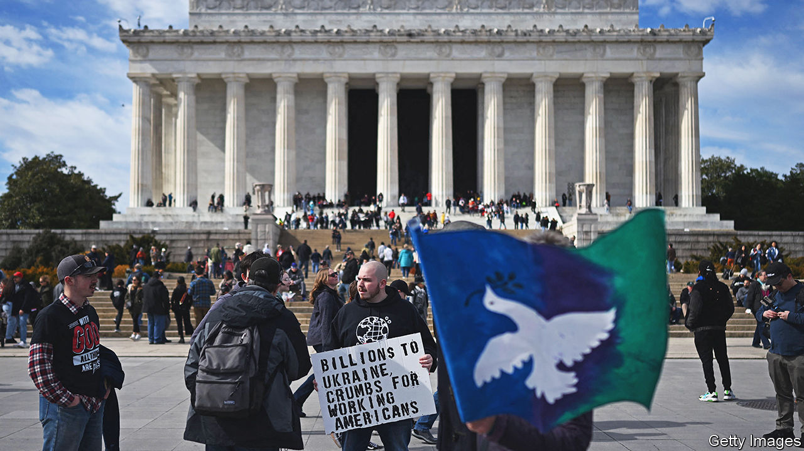
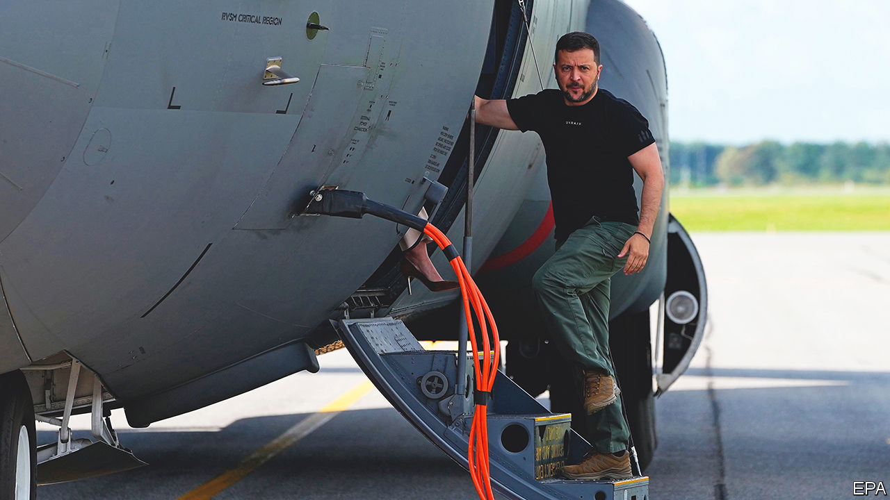
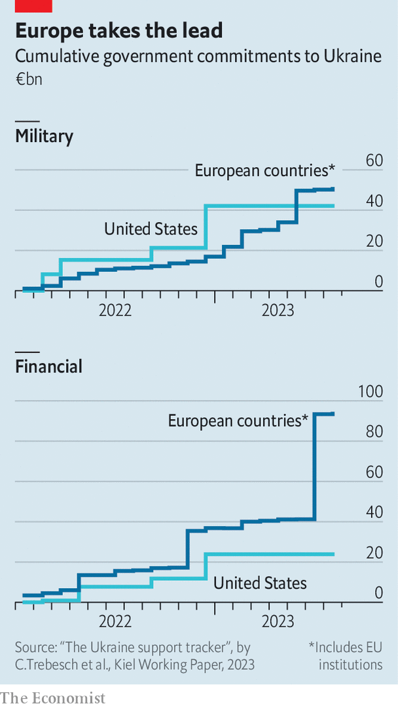

###### A lean patch

# Western help for Ukraine is likely to diminish next year 

##### There is a shortage of weapons and munitions—and, in some quarters, goodwill 

 

> Sep 21st 2023 


The end keeps receding. There was a time when some Ukrainian officials, having halted Russia’s army outside Kyiv, thought it would take only a few more months to bring the war to a conclusion. “Most of the active combat actions will have finished by the end of this year,” predicted Lieutenant-General Kyrylo Budanov, the head of military intelligence, in May 2022. By last November, shortly after a spectacular Ukrainian offensive in Kharkiv, Volodymyr Havrylov, a deputy defence minister at the time, was still expecting a swift victory. “My feeling is that by the end of the spring, this war will be over.” 

In fact, Ukraine’s counter-offensive did not even begin until June. Far from hastening the war’s end, it has demonstrated just how long the fighting could drag on. Ukrainian forces, stymied by Russian minefields and other defences, have inched forward on foot. The deployment of reserves and spiffy Western weapons has not yet yielded any big breakthroughs. Wet weather and a shortage of ammunition will probably bring the Ukrainian advance, such as it is, to a halt by late October, if not earlier. 

Another fighting season beckons. “We must prepare ourselves for a long war in Ukraine,” warned Jens Stoltenberg, NATO’s secretary-general, on September 17th. “It’ll take a considerable length of time to militarily eject all 200,000 or plus Russian troops out of Russian-occupied Ukraine,” agreed Mark Milley, America’s top general, the same day.

America insists it will stay the course for “as long as it takes”, as Joe Biden, the president, has put it several times this year. Britain, France, Germany and other allies have all used the same phrase. As ironclad as these pledges sound, they depend on two uncertain variables. One is the West’s ability to furnish Ukraine’s army with enough weapons and ammunition. The other is the political will to keep handing them over.

Start with the first. Russia’s defence industry moved onto a war footing in the last quarter of 2022, says Richard Connolly, an expert on Russia’s economy, who points to a big jump in steel production. British officials say that Russia can now produce around 200 tanks a year, twice as many as they had previously assumed. Mr Connolly says that, with refurbished tanks included, the true figure is probably 500 to 800. Western sanctions are not crimping output much, he adds, with crucial components such as semiconductors smuggled in via Hong Kong or Central Asia.

In principle, Ukraine’s friends should have no trouble helping it outgun Russia. The combined GDP of nato’s members is 12 times that of Russia, even after accounting for Russia’s lower prices. The difference is that Russia is willing to spend much more heavily on the war: military spending now takes up almost 40% of the national budget, far in excess of Western levels. NATO countries are trying to redress this imbalance by investing in arms production, which has been neglected since the cold war ended. But there are two snags.

One is cost. Estonia spends around $5,000 to $6,000 on every new artillery shell, says Kusti Salm, the senior civil servant in the country’s defence ministry. That is relatively cheap by NATO standards, he notes. Russia, he says, spends 60,000 roubles, or around $620. The vast difference is largely down to cheaper labour and materials, lower quality products and lower profit margins for arms manufacturers, most of which are state-owned. Inflation is exacerbating the problem. “Prices for equipment and ammunition are shooting up,” complained Admiral Rob Bauer, a nato bigwig, on September 16th.

The second issue is timing. “After a slow start,” says Mr Connolly, “Russia has reached race pace and they’re in gear now. They’re now going to start churning stuff out at the rate approximating what they need.” American and European investments in new capacity, having started later, will not yield much extra supply until the second half of 2024 or 2025, giving Russia more time to mobilise, build new defences and pin down Ukrainian forces. 

Take the case of artillery shells. The good news is that American and European production is soaring. American officials say that their own output has risen from an annualised rate of 168,000 shells in the spring to 336,000 today. It will continue to rise, thanks both to new facilities and to more intensive use of existing ones. European production is set to double by the end of this year or the start of next, according to Estonia’s defence minister. Between them, America and Europe should comfortably produce nearly 2m shells next year. 

Shell shock

The trouble is, that is barely enough to keep up. Russia will produce 1m-2m shells next year, according to British estimates. That is on top of a stock of around 5m shells, new and refurbished. That should allow it to fire at least 15,000 rounds a day for a year, says Mr Salm. That is roughly on a par with Ukraine’s heightened consumption during its counter-offensive, according to people familiar with the data. But Ukraine can probably sustain that tempo for only a couple more months.

The gap could be bridged by borrowing from elsewhere. Ukraine’s counter-offensive was enabled by a massive transfusion of South Korean shells. America and its allies have discreetly purchased arms and ammunition from non-aligned countries such as Egypt and Pakistan on Ukraine’s behalf. But such ready sources of weaponry are running out. Western armies’ stockpiles have been depleted, too. 

As the Western arms industry ramps up, this problem should ease. By 2025 there might even be a “glut” of shells, says a Western official. If most of the new output goes to Ukraine, and assuming that neither China nor North Korea bails out Russia, the Ukrainian army might then be able to out-pulverise the Russian army for the first time in the conflict. But 2025 is the military equivalent of a lifetime away. Next year, meanwhile, Ukraine will probably struggle to mount a big offensive. 

The year after next is also a lifetime away in terms of politics. In Europe, the political winds seem favourable to Ukraine. Polls conducted in June and July showed that 64% of Europeans favour military aid to Ukraine, with strong support not just in countries with a long-standing suspicion of Russia, such as Sweden (93%), but also in more distant member states such as Portugal (90%). 

Some hard-right parties, such as France’s National Rally, led by Marine Le Pen, and Germany’s Alternative for Germany (AfD), cast the conflict as a waste of European resources. “The German public is paying three times over for this war,” complains Gunnar Lindemann, an AfD member of Berlin’s regional assembly, “supporting 1m refugees, carrying huge energy bills and sending weapons to Ukraine.” Both parties are rising in the polls, but both remain far from power. 

Olaf Scholz, Germany’s chancellor, has been mindful of anti-war sentiment, notably within his own Social Democratic Party. He dithered for months before agreeing to send Leopard tanks to Ukraine. He still refuses to send long-range Taurus missiles, even though Britain and France have given Ukraine comparable weapons. Yet Mr Scholz has by now realised that public scepticism is mushy: as soon as he sends a new weapon, approval broadly follows. On September 18th his government announced another €400m ($429m) of arms, including ammunition, armoured vehicles and mine-clearing equipment. 

Emmanuel Macron, France’s president, who provoked grumbling in Kyiv last year over his frequent phone calls with Vladimir Putin, his Russian counterpart, and over his hesitation in sending weapons, is now among the most gung-ho of European leaders. France has long resisted expanding the EU, yet Mr Macron has become a fervent supporter of Ukraine’s accession to the bloc. A poll in July showed that 58% of the French backed this approach. 

Ukraine’s bid for eu membership is proceeding at a pace that would have astonished Europe-watchers just a few years ago. It formally became a candidate to join in June, 2022. This December, barring a shock, that status will be upgraded by the opening of detailed negotiations on accession. Ukraine is dazzling EU officials with its swift progress on the necessary reforms. It may still take years for Ukraine to become a fully fledged member, but the war seems to be speeding up the process rather than delaying it. 

 


In America, however, the outlook is much more divided and uncertain. On August 10th the White House asked Congress to authorise another $24bn “supplemental” budget for Ukraine, which would bring total American aid thus far to $135bn. Supporters of such assistance, among both Democrats and Republicans, constitute a clear majority of both chambers of Congress. Were the request put to a simple up-or-down vote, it would be approved relatively easily.

But it is unlikely to be, because of America’s dysfunctional politics. A majority of the members of the House of Representatives may support Ukraine, but a small number of Republicans hold extreme anti-Ukrainian views, including Matt Gaetz, who has proposed inviting Russia to join NATO, and Marjorie Taylor Greene, a conspiracy theorist who has promoted the absurd notion that aid to Ukraine is actually being siphoned off by donors to the Democrats. Since the Republicans have only a slender majority in the House and since the Speaker, Kevin McCarthy, does not want to rely on Democratic votes to push legislation through, the pro-Russia fringe has much more influence than its numbers would imply.

The likeliest course is for Mr McCarthy to attach the supplemental budget to other important legislation, making it harder to derail. Past efforts in the House to deny Ukraine funding have been overcome, although each one attracts more Republican votes. Mr Biden already has congressional approval to send a further $6bn-worth of weapons to Ukraine from existing stockpiles. But after that there is likely to be a delay of several months while Congress contorts itself over the latest request. What emerges may be dribs and drabs of aid, rather than the big packages of last year.

In the longer run, aid for Ukraine is fast becoming a partisan issue, which makes its prospects ever less certain. Republican voters, egged on by the scepticism of Donald Trump, their party’s likeliest nominee for president next year, have begun to question further aid to Ukraine. Democrats remain broadly supportive. The big budget deficit and high interest rates make politicians of all parties reluctant to rack up more debt. And even Democrats support the notion that America’s European allies should be the ones taking the initiative in conflicts on their own borders. 

And then there is the possibility that Mr Trump wins next year’s election. His policy on Ukraine is characteristically incoherent. In March he promised that he would settle the war in “no longer than one day”, before even entering office. “We don’t have ammunition for ourselves,” he complained in May, “We’re giving away so much.” But he denies he would push for a deal allowing Mr Putin to keep Ukrainian territory. “Nobody was tougher on Russia than me,” he said this week, insisting he would strike “a fair deal for everybody”.

 


Nevertheless, Western officials worry that Mr Putin will wait to see whether Mr Trump becomes president again before agreeing to negotiations. That scenario is already provoking frenetic debate in Europe. “If the United States tried to force a negotiated settlement on Ukraine,” argued Liana Fix and Michael Kimmage, a pair of Russia experts, in  recently, “Europeans would have little capacity to resist.” Others say this is unduly fatalistic. French officials argue that, should America end its support for Ukraine, although Europe cannot replace American military aid gun for gun and missile for missile, the prudent and rational thing is for Europe to try to preserve its options by boosting arms manufacturing.

The question is whether Europe alone can drum up enough cash and weapons to keep Ukraine going. Although America provided the lion’s share of aid for much of the war, the latest analysis from the Kiel Institute for the World Economy, a German think-tank, finds this pattern has reversed. Europeans have long dispensed more financial aid. They are now providing more aid of all sorts, thanks in part to the EU’s recent €50bn pledge, a multi-year commitment which stretches to 2027 (see chart).

Money isn’t everything

Yet the figures do not tell the whole story. America has been the fulcrum of the allied effort to support Ukraine, chairing the regular meetings at which donations of weapons are pledged and co-ordinated at Ramstein, an American military base in Germany. It has provided diplomatic cover for other countries’ aid: Mr Scholz, for instance, insisted that he would not allow German-made Leopard tanks to be sent to Ukraine unless Mr Biden first sent some American M1A1 Abrams tanks.

In some cases Europeans have sent arms to Ukraine on the understanding that they will receive new American weapons to replace the donated ones. America’s security guarantees, underwritten by nuclear weapons, have given Europeans the confidence to stand up to Russian threats. Finally, America has provided vital intelligence that has helped Ukraine find and destroy high-value targets, from generals to warships. Substituting for this organisation and assistance would be a Herculean task.

It may be unavoidable. “The assumption of the West was—and I think everyone has been unspoken on this—was that we give them everything we can, then they will go on this one large offensive and whatever happens at the end of this we will settle for that,” says Mr Salm, the Estonian official. “That was the plan.” A new one is required, he suggests, involving not just more arms, but also more technology to offset Russia’s advantages in mass, bolder sanctions, such as expulsion from the Paris Olympics, and new training that learns from the mistakes of the summer. 

Above all, a change in mentality is needed. “This is exactly what a war of attrition is about: convince the West that we can out-suffer you, we can out-fight you, we can out-last you. They know the weak points of democracies,” Mr Salm says. The task, he believes, is to persuade Mr Putin that the opposite is true. “We, as the Ramstein coalition, are 25 times richer, stronger and [more] technologically advanced than Russia…It’s not that we are empty-pocketed here.” ■

