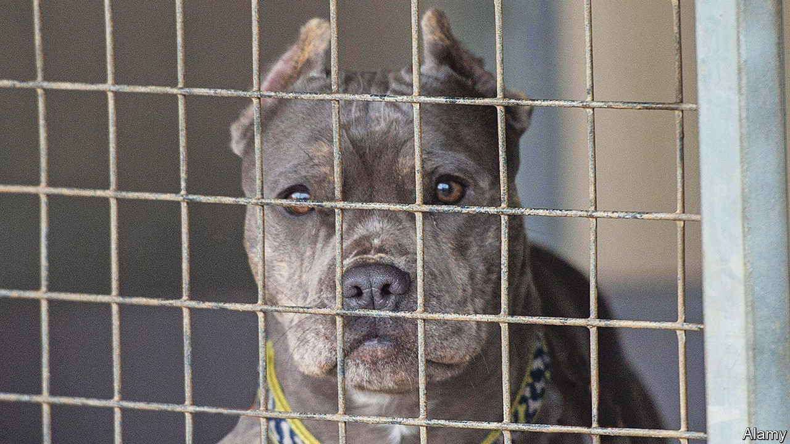

###### Scary mutts

# A fight over dangerous dogs in Britain 

##### The promised ban of the Bully XL shows how policy is made 

 

> Sep 15th 2023 

THE GREAT British public loves two things: dogs and banning things. What happens when the two passions collide? To answer that, consider the plight of the Bully XL, a type of dog. To its fans the Bully XL is a (mostly) gentle giant. The creatures, which can grow to be 60kg, make for “an excellent family dog” according to the United Kennel Club in America. To campaigners, they are a menace responsible for a sharp increase in fatal attacks. 

After a man was killed by a pair of dogs, suspected to have been Bully XLs, in Staffordshire on September 14th, the government sided with the campaigners. Speaking with the solemn manner of a prime minister declaring war, Rishi Sunak announced that the type of dog would be banned by the end of the year. “It is not about a handful of badly trained dogs, it is a pattern of behaviour and it cannot go on,” said Mr Sunak. 

The Bully XL, a mix of pit-bull and Staffordshire terriers, as well as other breeds, was introduced to Britain in 2014. Although pit-bull terriers are illegal in Britain, the Bully XL was deemed to be a distant enough relative that it was not forbidden. Their popularity exploded during the pandemic lockdown, when people rushed to buy or adopt dogs of all kinds. 

Although Bully XLs account for barely 1% of all dogs, they are responsible for almost half of all reported attacks in Britain, according to Bully Watch, a campaign group that has called for the type to be banned. The data are sketchy. Not all dog bites are recorded. But not all dog bites are equal. Being nibbled by a chihuahua is one thing; being mauled by a 60kg mutt is quite another. According to Bully Watch, Bully XLs have killed as many as 14 people in Britain since 2021. 

Before the dog can be banned, the government will first have to come up with a definition of the Bully XL. Then the breed will be added to an existing list of four illegal ones—Dogo Argentino, Fila Brasileiro, pit-bull terrier and Japanese Tosa—with consequences for anyone who owns, sells, breeds or abandons them. 

Lawyers argue that the law being used, the Dangerous Dogs Act of 1991, is a mess, with the forbidden breeds poorly defined. Instead, a dangerous dog is classified like the old joke about pornography: the Home Secretary should know it when they see it. Animal charities have long campaigned against the law, arguing that ownership rather than breed was the deciding factor. Ban one breed and irresponsible people may still opt for other breeds of large, equally menacing dogs. 

The law is, however, relatively effective in practice. Until the emergence of the Bully XL, dog-related deaths were less common in Britain than in America, where there are no limits on pit-bull-types of dog. Likewise, the law is less brutal than it was. Before 1997, forbidden doggies faced an automatic death sentence. Since then, well-behaved dogs of prohibited breeds can live under certain conditions, such as if they are neutered and kept muzzled when out in public. Other methods of control, such as licensing or banning dogs whose jaws are dangerously strong, would be far more intrusive to the vast majority of dog-owners whose pets pose little threat to passers-by. 

The coming ban on Bully xls demonstrates how easy it can sometimes be to influence policy in Britain. The topic came to prominence only after Lawrence Newport, an academic and YouTuber, drew attention to the number of attacks. With the help of a handful of allies, Dr Newport and co whipped up attention on the problem, mostly on social media, and in turn the mainstream media and politicians took notice. Few regular readers hang around on X (as Twitter is now known). But lots of bored politicos and journalists are still there. The result is that a few well-targeted posts can have a big impact, especially when the problem is cheap to fix. The posting-to-policy pipeline is an increasingly short one. A niche campaign can become a national issue. It pays to be dogged. ■


