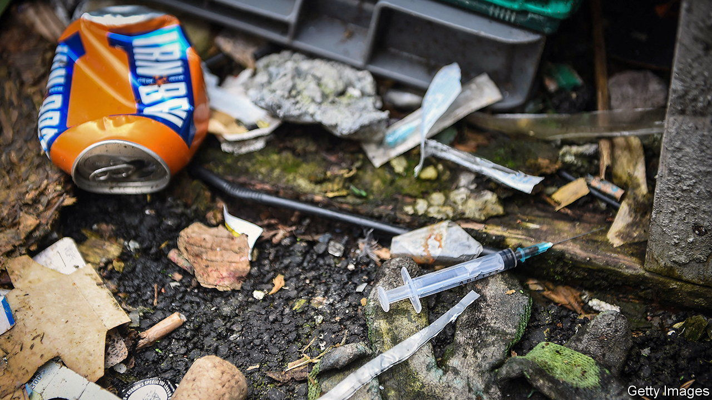
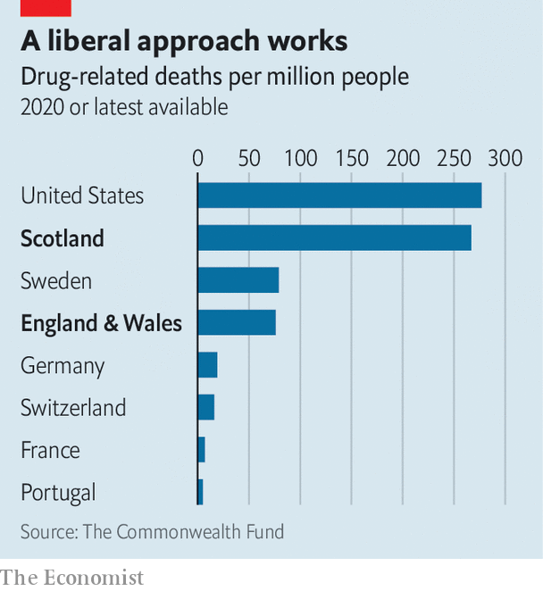

###### A shot in the arm

# Britain’s war on drugs enters a new phase 

##### A new overdose prevention centre in Glasgow will save lives. It could also change drug policy 

 

> Sep 21st 2023 

THE SHOOTING gallery will be behind the car park of a pram shop in the east of Scotland’s biggest city. Inside, drug users who have brought heroin or other illicit drugs may shoot up under medical supervision. On September 27th Glasgow City Integration Joint Board, which makes public-health decisions in the city, is set to approve its opening. Remarkably, no opposition is expected.

Safe drug-consumption rooms, or overdose-prevention centres (OPCs), are already legal in 16 countries, but this will be Britain’s first. Studies suggest they do nothing to increase drug use but do help to get users to enrol in other treatment. The pilot should save many users who would otherwise succumb to overdoses. Potentially, it will spur a much-needed shift in the country’s out-of-date drug policy.

 


The need is urgent. “We are in a public-health emergency,” says Allan Casey, a Glasgow city councillor. Last year 1,051 Scots died of drug misuse. That was a 21% fall from the year before, but still quadruple the annual tally seen two decades ago. Worryingly, drug deaths have risen again in the first half of 2023. In deaths per million people, among rich countries, only America has a worse record (see chart). Death rates are highest in the post-industrial cities of Glasgow and Dundee. 

Scotland’s exceptional problems have multiple causes. Scots in the poorest areas are 16 times more likely to die a drug-related death than those in the richest places. The nation has a high rate of problematic drug users, which puts a larger cohort at risk. Deaths rocketed as physicians cut the prescription of benzodiazepines in the late 2000s, notes Andrew McAuley, at Glasgow Caledonian University. More dangerous street varieties, pressed into pills in home factories, and then taken with heroin and other drugs, took their place. 

The Scottish National Party (SNP), in power for 16 years, blames Westminster for austerity and not devolving drug policy to Holyrood. In fact the party is also to blame for previous cuts to frontline services including on beds for recovering addicts. More recently the SNP has spent more, and named a minister for drugs, but both governments have been woefully slow to act. 

Frustrated at the impasse, in 2020 Peter Krykant, an activist, started an illegal OPC in a minibus in Glasgow, saving lives after nine overdoses. It appears his experiment has focused minds. On September 11th Lord Advocate Dorothy Bain, Scotland’s chief legal officer, said her office would not support prosecutions of those who took drugs in the pilot facility. The Scotland secretary in Westminster Alister Jack confirmed that the British government would also not intervene (although the Home Office continues to oppose OPCs). 

That matters nationally as more cities could feel emboldened to set up OPCs. “We will see them in Wales and also England within the next 12-18 months”, predicts Steve Rolles of Transform Drug Policy Foundation, a charity. Drug deaths are some three times higher in Scotland than in the rest of Britain, but a record 4,859 people died from overdoses in England and Wales in 2021.

Yet the pilot in Scotland does not in itself change the law. The Scottish government now wants to decriminalise the possession of drugs for personal use. It hopes to emulate the progress made in countries such as Portugal and Switzerland, where drug deaths are far lower. Yet Scotland is still beholden to Britain’s punitive Misuse of Drugs Act, passed in 1971. Helen Clark, who chairs the Global Commission on Drug Policy, a lobbying group of former world leaders, says Britain is “behind” many rich countries on harm reduction.

Politicians are reluctant to move ahead of public opinion; seven out of ten Britons think that possessing small quantities of heroin or cocaine should be a criminal offence. On September 12th MPs voted by a majority of 368 to amend the Misuse of Drugs Act. Unfortunately, they did so to toughen it—banning sales or possession of laughing gas. Lawmakers thus look increasingly out of step with their own experts who advised against a ban.

Still, the pilot programme in Glasgow counts as one of various small steps towards decriminalisation, eked out with needle exchanges, heroin prescriptions and drug-safety checks at festivals. “Each time, the War on Drugs rhetoric becomes a little less effective,” says Mr Rolles.■


