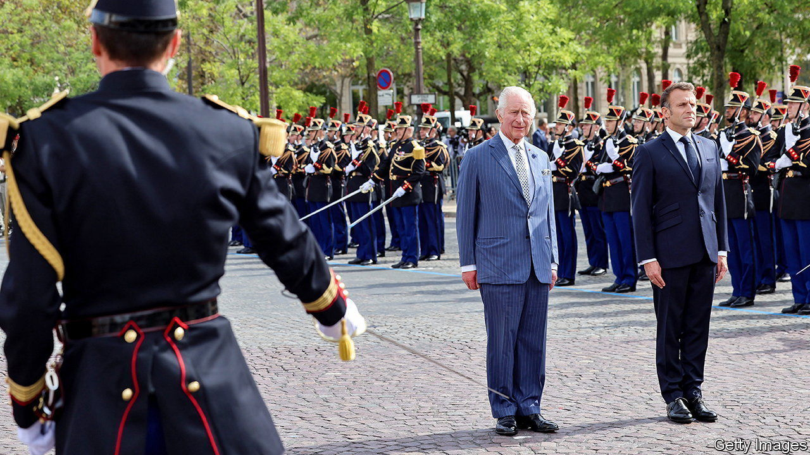

###### Brits in Paris

# France rolls out the red carpet for Britain 

##### Emmanuel Macron plays host to the royals, and Sir Keir Starmer 

 

> Sep 18th 2023 

A YEAR AGO, trust between France and Britain was in free fall. Liz Truss, British prime minister, had won office after claiming not to know whether Emmanuel Macron, the French president, was a “friend or foe”. The two countries were  over fish, migrants, borders and more. So it is a mark of the cross-Channel turnaround since then that France this week rolled out the red carpet for Britain.

Sir Keir Starmer, leader of the Labour Party, was the first beneficiary. On September 19th Mr Macron hosted him at the Elysée Palace, the day before King Charles and Queen Camilla arrived for a three-day state visit. Some in Labour circles presented Sir Keir’s meeting as a coup. In reality Mr Macron periodically receives aspirant leaders, among them Olaf Scholz in 2021 before he became Germany’s chancellor and, in 2019, Volodymyr Zelensky when he was running to be Ukraine’s president.

Nonetheless it was a moment for Mr Macron and Sir Keir, who had never met, to get the measure of each other. Both come from the centre-left: Sir Keir as a Labour moderate, Mr Macron as a former minister in a Socialist government. Both count Sir Tony Blair, a former Labour prime minister, as a regular interlocutor. Both have a professional background outside politics: Sir Keir as a lawyer, Mr Macron as an investment banker. 

After the meeting Sir Keir, who gave Mr Macron an Arsenal shirt, seemed pleased, although it was never going to be a moment for any negotiation. He turned up having restated his ambition that, if he became prime minister, he would try to secure improvements to a Brexit deal agreed in 2020. It is due for a review in 2025-26. Sir Keir would not seek to re-enter the European Union’s single market or customs union, but hopes for better arrangements on a broad swathe of subjects from border checks on animals and food to migration and security. France has always been clear, however, that discussions about Brexit must happen between the British government and the European Commission.

Up to a point, the French have already turned the page on the dismal cross-Channel years under Boris Johnson, and then Ms Truss. Broadly, they work well with Britain’s current prime minister, Rishi Sunak. Last year they agreed to reinforce policing of “small boat” crossings from the French coast, although the results have been limited. The bilateral optics have improved, too. In March the two governments got together at the Elysée for a Franco-British summit, the first for five years.

The French are well aware, though, that they also need to look ahead. There is obvious appeal for them in working with a future British government under a leader who voted against Brexit and is serious about engaging in a more structured way with the EU, especially on defence and security. “The French really miss the strategic dimension that the British bring to the table,” says Mujtaba Rahman, of Eurasia Group, a consulting firm.

After Sir Keir’s audience, the trumpets came out in force. The royal state visit was postponed from March because of rioting over Mr Macron’s pension reform. This time France was gripped by royal mania. Mr Macron treated King Charles to a banquet at Versailles, which the French insist is a nod to a state dinner held there in 1972 for Queen Elizabeth II, not a reminder of the reason their monarchs got into trouble in the past. The king was due to give a speech, at least partly in French, to members of both houses of parliament in the Senate, and to visit Notre Dame, still being repaired after the fire in 2019. Events touching on climate change and biodiversity were also scheduled, as well as, , a trip to a classy organic vineyard near Bordeaux.

The king and Mr Macron are said to have already forged a bond. As for the French at large, fully 71% say that they have a good opinion of the British royal family. Indeed in 2015 a little-known French minister argued that on some level the French “did not want the death” of their own king. The minister in question? Mr Macron. ■


