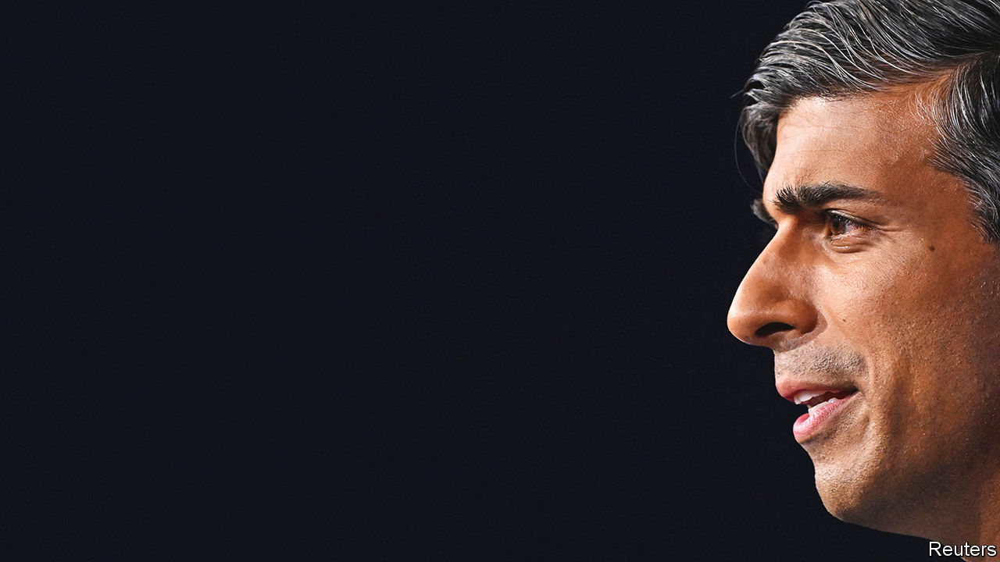
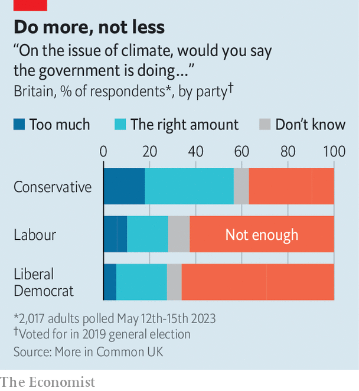

###### Panicky policymaking

# Rishi Sunak’s anti-green turn on Britain’s climate targets 

##### It creates uncertainty, will deter investors and probably won’t win voters 

 

> Sep 20th 2023 

IN A HASTILY arranged speech on September 20th, Rishi Sunak promised a “new approach” to Britain’s . The prime minister snipped at his predecessors for imposing unnecessary costs on people rather than letting them choose when to make changes. He said a target to end the sale of new vehicles with internal-combustion engines by 2030 would be delayed. Another, to phase out new gas boilers by 2035, would be weakened. Regulations on energy efficiency and on oil boilers would be loosened. Bizarrely, he also “scrapped” a non-existent meat tax and reassured voters there would be no “diktat to sort your rubbish into seven different bins”.

He has been weighing such moves since a by-election in Uxbridge in July, where a backlash over a charge for drivers of polluting cars in outer London helped the Conservatives cling to the seat. Labour, which has a stubborn lead of around 20 points in national polls, has promised more ambitious climate action. If Mr Sunak hopes attacking its  is a way to turn around the polling figures, then he is almost certainly wrong.

It is true that reaching net zero will be both costlier and more disruptive than many politicians admit. And Labour’s plans—notably a focus on large public subsidies—do need more scrutiny. But his own hotch-potch of delays is likely to deter investors, making it harder to cut the price of technologies such as heat pumps. That will raise the costs paid by consumers in the long term, not reduce them.

The speech marked a U-turn from the Conservatives’ previous stance. Green action was a big part of the boosterish agenda on which Boris Johnson, Mr Sunak’s predecessor but one, got elected in 2019. Two years ago Mr Johnson published a net-zero strategy, built on long-term targets that would drive market transitions in energy, transport and homes. Mr Sunak has unpicked the latter two. There were already doubts over the first, having a clean power system by 2035, after the government’s latest auction failed to attract any new offshore-wind projects. 

The immediate consequence will be questions over Britain’s commitment to emissions targets and uncertainty for businesses. Mr Sunak emphasised that Britain had cut emissions faster than others. But the country is off course for its legal climate targets beyond 2028. In 2022 a court ordered the government to publish more details to show how it would get back on track. Mr Sunak’s new approach will probably provoke another legal challenge and opposition in Parliament.

It is stable, long-term policies that drive down the costs of new technologies. In March, renewables provided 47% of Britain’s electricity production. But too often, action has been hindered by stop-start schemes. Britain’s market for insulating homes and installing heat pumps remains tiny, partly because firms have been burned by repeated policy changes. More delays will not help. Mr Sunak did promise more subsidies for heat pumps, but without clear regulations the market will take longer to grow, meaning costs will be slower to fall. 

The backtracking on electric vehicles was most surprising. Just two months ago, the government promised a £500m ($643m) subsidy to Tata, an Indian conglomerate, for a new battery plant in Somerset. (And in July Michael Gove, a cabinet minister, had agreed the 2030 deadline was immovable.) Other carmakers immediately reacted angrily. Ford said the industry needed “ambition, commitment and consistency” from government, all of which had been undermined. Sir Simon Clarke, a former Conservative cabinet minister, asked how businesses should plan “if we respond to one by-election…by tearing up key planks of government policy.”

 


Some Conservatives dream that there are electoral gains in all of this. But they risk overinterpreting the Uxbridge result. None of the policies that Mr Sunak dumped imposes immediate and direct costs in the way the London car scheme has. It will be hard to terrify voters with the prospect of not being able to buy a gas boiler in 12 years’ time. Pollsters are also sceptical that greenery is a strong wedge issue for Mr Sunak—rowing back on commitments looks more likely to divide his own voters, not opposition-leaning ones. Across all parties, voters are much likelier to say the government should do more, not less, on climate (see chart). They do want a fair transition, but Mr Sunak “risks putting the Conservatives on the wrong side of Britain’s climate consensus”, says Luke Tryl, of More in Common UK, a think-tank that carried out polling on the issue. 

Mr Sunak may hope to focus attention on Labour’s economic credibility and its plan to spend, eventually, £28bn yearly on climate change measures. But Labour can adjust that stance without much loss of face. Given a crisis over crumbling schools, some in that party had anyway started to ask if limiting extra capital investment to green measures made sense. For all of Mr Sunak’s protestations that his own new position was “not actually about politics”, it evidently was. Whether it will anyway help looks doubtful. ■


