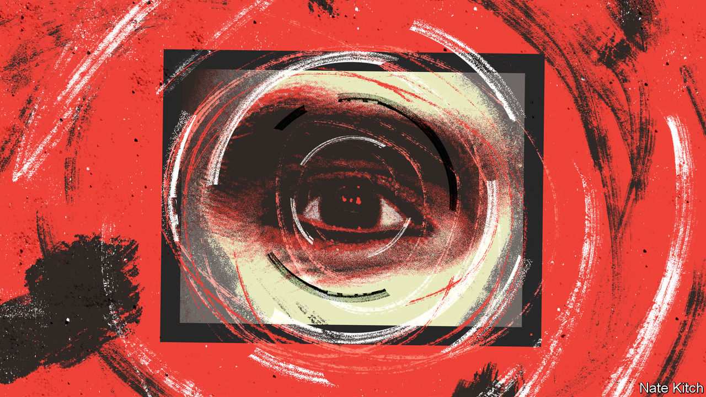

###### Bagehot

# Russell Brand was the norm in the nasty noughties 

##### The disgraced comedian is the symbol of a cruel, misogynistic and politically vacant era 

 

> Sep 19th 2023 

At Six feet two and closer to seven when a hairspray-induced beehive hairdo was added, Russell Brand was hard to miss. From about 2005, the comedian-cum-presenter-cum-wannabe politician bestrode British society like a skinny-jeaned colossus. He evolved from bit-part presenter on Channel 4 to household name, hosting radio shows, writing columns and interviewing politicians. He married a pop star, broke into Hollywood and became a self-styled revolutionary. All the while he boasted of a rampant sexuality, which was applauded by press and punters.

Now several women have accused Mr Brand of crimes including sexual assault and rape. An investigation by the  and Channel 4 revealed two decades of misogynistic behaviour, ranging from criminality to the harassment of junior staff. (Mr Brand has not been charged and rejects all allegations.) Although the most serious allegations are new, the bulk of coverage regurgitates the behaviour Mr Brand once bragged about and which was blithely accepted by media executives, politicians and viewers. Mr Brand is the personification of a cruel, misogynistic and politically vacant age, which Britain would rather forget but should not. 

Enthusiastic cruelty shaped British media in the noughties and into the 2010s. Mr Brand revelled in it. He came to national notoriety in 2008 after he rang Andrew Sachs, who played Manuel in “Fawlty Towers”, a 1970s comedy, and boasted of having sex with the actor’s granddaughter. The recording was then broadcast on BBC Radio 2. Mr Brand was forced to resign by the bbc. He had crossed a line. “There is no line,” he wrote afterwards. “People draw that line in afterwards to fuck you up.”

It is easy to see why he thought that. British television at this point delighted in torture. “Little Britain”, a sketch show with grotesque caricatures, was the dominant comedy of the era. Two decades after it first emerged, audiences now wince at the blackface and incessant cruelty. At the time people loved it. Its characters were household names. Vicky Pollard, a yob, became the face of Britain’s working class: fat, lazy and fecund. Cherie Blair, wife of Sir Tony Blair, said it was the family’s favourite show. Sir Tony discussed appearing on it for charity. 

Newspapers are filled with appalled references to jokes that Mr Brand made on stage to sell-out arenas and on TV to millions. In one, he boasted about his predilection for “them blowjobs where the mascara runs a little bit”. At the time, the jokes were lauded. Britain was, after all, a comfortably misogynistic country. The  awarded Mr Brand the title “Shagger of the Year” for three years running. It long ran topless women on page three. Anyone who offered criticism was hounded. When Clare Short, a former Labour cabinet minister, complained, the newspaper photoshopped her face onto a topless woman. The headline called Ms Short “fat and jealous”. The feature stopped only in 2015. 

Among the most chilling allegations are the claims that Mr Brand sexually assaulted a teenager, with a bbc car picking up the 16-year-old from school. During their relationship, Mr Brand referred to her as “the child”. When it came to women, an attitude of the younger the better permeated the media. When in 2007 another 30-something comedian was linked with a 16-year-old studying for her gcses, it was gaily framed by the press as a problem only because it might upset her father. “Soccer am”, a football show that peaked in the noughties, featured young women in skimpy football kits being interviewed and bombarded with innuendo. When they were asked their age, the audience would shout “Great age!” unless they were 18, at which point the crowd would simply cheer. 

By 2014 Mr Brand had evolved from celebrity into wannabe politico. He published “Revolution”, a deranged manifesto that suggested forbidding any company from having revenue more than the gNp of the smallest country (Tuvalu, with $60m). Political debate was so vacant that Mr Brand was lauded, rather than spurned. Readers of high-minded magazine voted him the fourth-greatest of the world’s leading thinkers of 2015. Mr Brand guest-edited the (joking that he would rename it the); Ed Miliband, then the Labour Party’s leader, appeared on Mr Brand’s YouTube channel. It was not that Mr Brand’s misogyny was unknown. It was that it did not matter.

The nasty noughties

Nostalgia and amnesia combine to isolate Mr Brand from an era he dominated. The folk memory of the noughties is of a kinder, more pleasant time. The economy was growing. Social media mattered less. “Grown up” politicians settled the issues of the day. The result is that the media bosses who coddled Mr Brand, and the politicians who sucked up to him, now dismiss him as a vile exception rather than the norm. 

He was not an aberration. The audio of Mr Brand trying to arrange a meeting with Jimmy Savile, who was later revealed as a serial rapist, by offering the chance to see his assistant nude sounds like a surreal parody. It was a genuine broadcast on Radio 2 in 2007. The decision to share it “beggars belief”, says Lorraine Heggessey, a former bbc executive. Yet it was the spirit of the times. A few years before, Savile had appeared on “Have I Got News For You”, a satirical television show, and declared: “I’m feared in every girls’ school in this country.” The audience laughed. 

Putting Mr Brand in this context is to explain rather than excuse him. Britain has, thankfully, changed a lot in the past decade. The needless cruelty and casual misogyny has dwindled. An obsession with teenage girls is now seen as weird, not natural. Censorious and sometimes puritanical attitudes that are prominent today exist as a reaction to the excesses of a previous era. Mr Brand, relegated to a modest audience on YouTube, which has stripped him of the right to earn money from his videos, now sits on the fringes of society. It is comforting to think that he was always there. But it is wrong. ■


