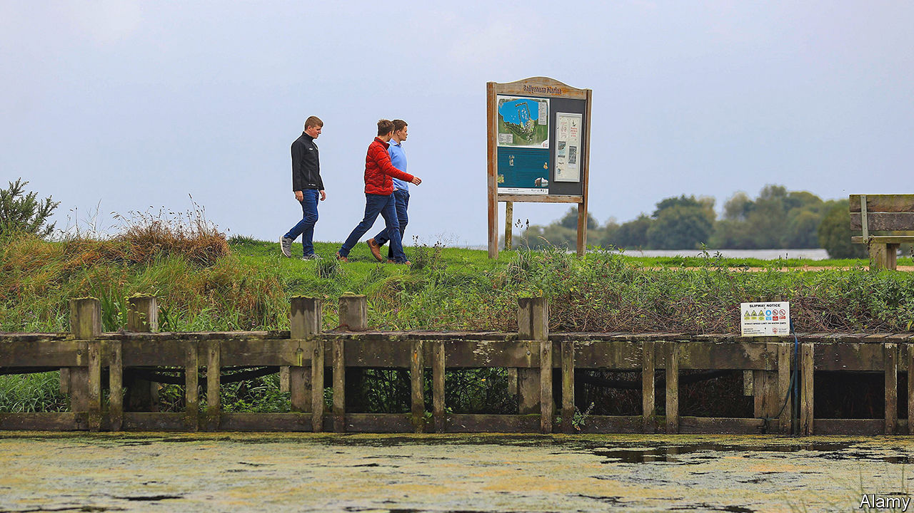

###### Pollution in Northern Ireland

# The largest freshwater lake in the British Isles has been poisoned 

##### Cleaning up Lough Neagh in Northern Ireland will be a challenge 

 

> Sep 21st 2023 

SEEN FROM afar, Lough Neagh should appear as a glittering inland sea. The biggest freshwater lake in the British Isles supplies drinking water to some 750,000 people, 40% of the population in Northern Ireland, and is a much-loved spot for fishing, swimming, and other recreation. Or at least it used to be. These days much of its water is clogged with sludge, its surface a luminescent green.

Stand at Cranfield Point, on the lough’s northern shore, and the stink from congealed slime can be overwhelming. Discarded rubbish fails to sink into the gloop. Signs warn would-be bathers to stay onshore and keep pets close. The danger is from a form of blue-green algae, cyanobacteria, which produces toxins powerful enough to kill cows. Swans, dogs and foxes have died. Populations of migratory birds that stop off at the lough are said to be much reduced.

Various factors explain the massive growth of the bacteria. For decades nutrients have built up, the result of fertiliser run-off from farms and of dumped wastewater, including sewage. As the numbers of pigs and poultry farmed nearby soared in the past decade, the outpouring of slurry on land—and into water—also surged. Heavier rainfall, in more intense bursts, is probably washing more nutrients from fields. The water has also warmed by 1°C since 1995. The arrival of an invasive species, the zebra mussel, is another problem. As a filter feeder it first makes the water clearer, letting sunlight penetrate deeper, which encourages algae.

Solutions exist, at a cost. Boats can scoop up the thickest sludge. Better water-treatment plants would reduce the volume of raw sewage being dumped. Some farmers are being paid to plant “riparian strips”—fencing off fields near to water and letting plants absorb excess nutrients. Most of all, farmers should be encouraged not to over-use fertiliser. Machines could inject slurry into the soil rather than spreading it on the surface. A project to map the soil composition of every field in Northern Ireland is under way. When complete, farmers should understand better the chemistry of their soil, and so judge the right quantity of fertiliser to use.

Lough Neagh’s freshwater has gone stale because for years it has been taken for granted. At least the problem is being discussed in newspapers, on radio talk shows and by politicians. Getting concerted action will take time and leadership. Unfortunately Northern Ireland’s politics is, for now, about as gummed up as the lough. Don’t expect inspiration from the political leaders.■


