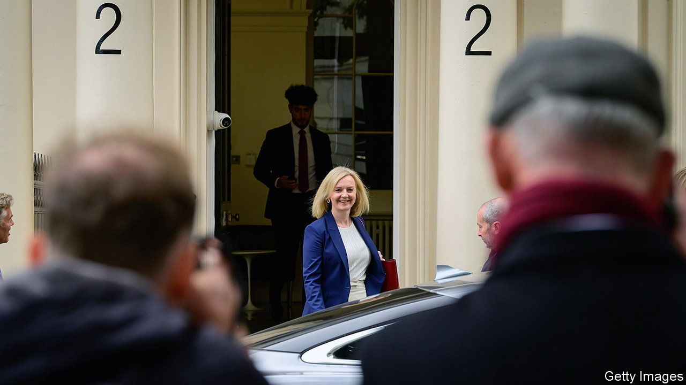
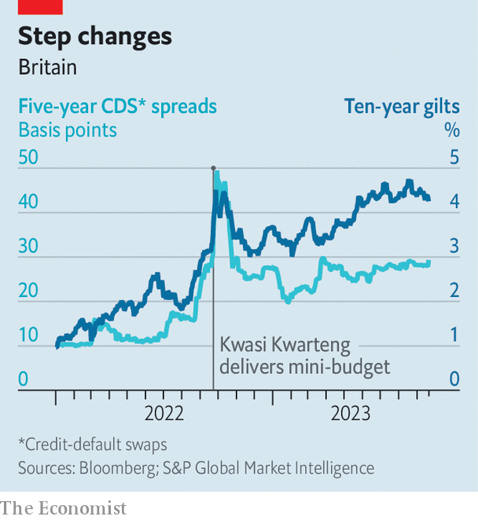

###### A year after the disastrous mini-budget

# The legacy of Liz Truss 

##### Is Britain still paying a moron risk premium? 

 

> Sep 21st 2023 

JAMES CARVILLE, an adviser to Bill Clinton when he was president, once quipped that when he died, “I would like to come back as the bond market. You can intimidate everybody.” A year ago financial markets gave Britain a fright, after Liz Truss’s new government unveiled a “growth plan” on September 23rd that involved £45bn ($56bn) of annual, unfunded tax cuts, equal to 1.8% of GDP . The cavalier approach to public finances sent yields on gilts spiralling and the pound plummeting to its lowest-ever value against the dollar. 

The chaos was short-lived—as was Ms Truss’s hapless government. The Bank of England intervened to steady markets, and Ms Truss sacked her chancellor and closest ally, Kwasi Kwarteng, on October 14th, before resigning herself six days later. Ms Truss’s 49 days in office were the briefest of any prime minister. Although economic orthodoxy has now been restored by Rishi Sunak’s government, is Britain still paying a “moron risk premium”—a term coined by Dario Perkins of TS Lombard, a research firm—for Ms Truss’s misadventure?

 


The bond market has provided mixed signals. After the yield on ten-year gilts peaked at 4.5% last September, it fell to 3.0% by the beginning of 2023. But it now stands at 4.3%. The main reason is that inflation has proved stickier than expected, so the bank’s policy rate has increased faster and will stay higher for longer—exactly as investors feared it would after Ms Truss’s tax cuts. The bank has also been selling bonds, which in combination with continued debt issuance by the government may have further pushed up yields.

So why all the fuss a year ago? The telltale sign of investor panic was the combination of rising rate expectations and a crashing currency. Under normal conditions high rates should entice investors to buy sterling, not shun it. Today that relationship has been restored. The pound is 20% higher against the dollar than at its nadir on September 26th 2022.

For a better sense of whether a risk premium persists, look instead at credit-default swaps. These instruments insure investors in the event that the bond-issuer goes bust, so give a clearer indication of financial competence. Last September the price of insuring British government debt against default for five years rose from 29 basis points to 49 basis points after Ms Truss’s growth plan was unveiled. Today, that instrument trades once more at 29 basis points.

While financial order appears to have been restored, the Conservative Party is still reeling. The Tories’ deficit to Labour is close to 20 points in the polls. The party’s reputation for economic competence has been shattered, too. Ms Truss shows little contrition. On September 18th she told the Institute for Government, a think-tank, that her regret was moving too quickly, not executing the plan itself. ■


