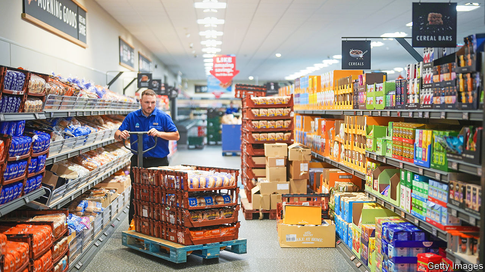
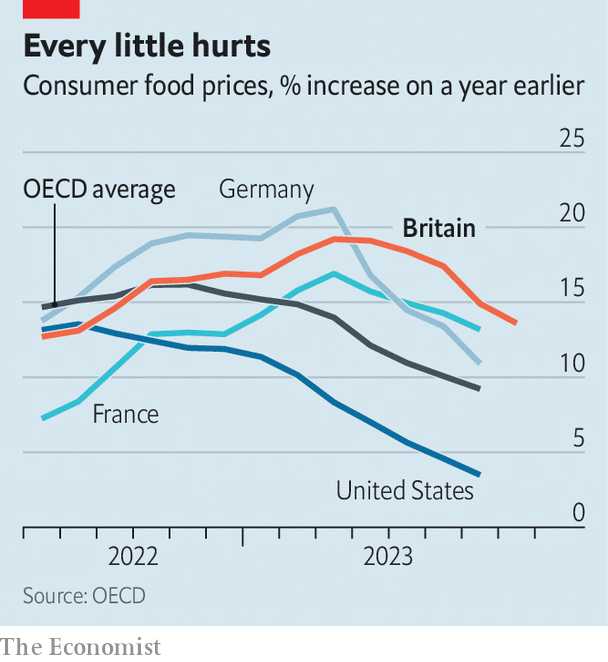

###### Inflation and wages

# What supermarkets reveal about Britain’s economy 

##### It’s an exceptionally good time to work for a big grocer 

 

> Sep 21st 2023 

ON A RAINY afternoon outside a north London branch of Aldi, a German-owned discount supermarket, Ibrahim and two co-workers are enjoying their cigarette break. They most like the fact they are earning as they smoke. For Aldi, unusually among supermarkets, offers paid breaks. Times have been tough for British workers over the past two years with price rises outpacing average wage growth in each month from December 2021 until May this year. But for Ibrahim what politicians dub the cost-of-living crisis has never bitten quite so hard. In July Aldi implemented its fourth pay increase in just over a year. The starting rate for London-based shop workers is now £12.85 ($15.90) an hour, 23% above the minimum wage. 

Workers are doing well from a new front in the battle between supermarket chains. The firms have long competed fiercely on prices to woo customers. (Until recently Britons enjoyed access to the cheapest food in western Europe.) Now they find themselves in a similarly intense contest over wages, terms and conditions in order to recruit and retain staff. Despite a cooling economy, the jobs market remains tight with labour demand still outstripping supply. According to the official numbers, average regular weekly pay rose at an annual pace of 7.8% in the year to July, the joint fastest rate since data were first gathered in 2001.

Running a supermarket takes a lot of labour. In the industry, which employs around 870,000 people, bosses sound almost wistful about wage-growth rates that other sectors have seen. Pay rises of 10-15% have been commonplace for grocers. Recruiters are keen to emphasise that headline hourly pay rates understate the extent of rising labour costs. Sainsbury’s, for example, has offered staff free food during shifts since 2022. Waitrose, an upmarket chain, gave each member of staff £500 last December, as a one-off cost-of-living payment. Tesco allows employees as much as 15% off their weekly shop. Lidl, another German discounter, has increased the hourly premium it pays workers who toil in its freezer rooms to £1.50.

Rapid wage growth is helping to keep inflation uncomfortably high. New data released by the Office for National Statistics on September 20th showed the annual pace of consumer-price inflation falling slightly from 6.8% in July to 6.7% in August. Analysts, who had pencilled in a rise, greeted that with relief. Though prices in Britain are rising faster than in America, France or Germany, the Bank of England decided to leave interest rates at 5.25% on September 21st, after a long run of increases. Still, policymakers believe the jobs market needs to loosen considerably more to return inflation to the 2% target. Few sectors show this more clearly than food retailing.

 


Food and non-alcoholic drinks prices have risen by 13.6% over the past year and inflation in the sector has outpaced that of Britain’s peers (see chart). The primary driver of Britain’s higher rate of food inflation is the battle for staff. Earlier this year, as food-price inflation neared 20%, Sir Edward Davey, leader of the Liberal Democrats, called for a public inquiry into supermarket prices and accused firms of profiteering. Retail analysts were not impressed. “You have to be criminally insane to believe that,” says Clive Black, director of research at Shore Capital, a stockbroking firm. The “sweet spot” for the firms, according to Mr Black, is food-price inflation of 2-4%. Any more and consumers begin to switch to cheaper brands and a worsening product mix hits firms’ bottom line. 

Operating margins in British supermarkets have historically been low at around 3-4% and wage bills typically make up 10-15% of their total operating costs. The Competition and Markets Authority, a regulator, reported this summer that average operating margins fell from 3.2% in 2021-22 to 1.8% in 2022-23. The level of operating profits across the sector, meanwhile, dropped by more than 40%.

All labour-intensive industries employing low-wage workers have faced a margin squeeze and pressure to increase prices in the past year. The legal minimum wage rose by 9.7% last April. But problems have been most acute in food retailing. Bosses point to the German discounters, Aldi and Lidl, as the underlying driver. The two firms somehow offer the lowest prices to consumers and yet also top the league table for pay.

They do so at a cost. Lidl’s British arm reported an annual loss on September 14th despite 19% sales growth and Aldi operates on ultra-thin margins. The two firms, which are both privately owned, have strong balance sheets and can, rivals say, play a long-term game of building market share. Rival supermarket chiefs are not the only ones complaining. Last year a boss in the social-care sector told a parliamentary committee that he dreads hearing that an Aldi is opening nearby, as “I know I will lose staff.”■


