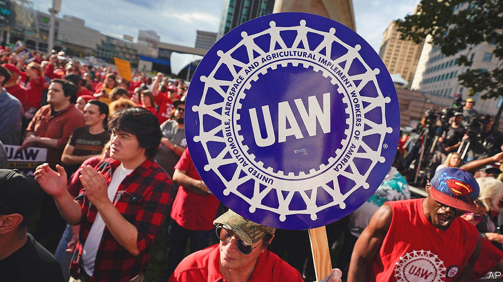

###### Strike while the engine is hot

# America’s big car firms face lengthy strikes 

##### Detroit’s “big three” v the United Auto Workers 

 

> Sep 20th 2023 

The car industry faces unprecedented upheaval as the importance of the internal-combustion engine, which has defined it for more than a century, declines and that of battery power, which will define its future, rises. The latest reverberation of this historic shock is now rippling through the four-yearly contract negotiations between Detroit’s “big three” carmakers and its biggest trade union. On September 15th, for the first time ever, members of the United Auto Workers (uaw) began simultaneous industrial action against Chrysler, General Motors (GM) and Ford. (Chrysler is part of Stellantis, whose biggest shareholder part-owns ’s parent company.) The union’s tactical change foreshadows a protracted stand-off, the stakes of which are high for union and carmakers alike.

In the past the UAW renegotiated its contract with one of the big three, with the other two usually falling into line with any agreements. In 2019 the renegotiation happened at gm, which reached a deal with the union only after a six-week strike by 48,000 workers had cut production by 300,000 vehicles, costing the company $3.6bn in net profit. Even though this time the industrial action is affecting all three companies, it is more targeted. The three factories affected so far together employ only 13,000 of the uaw’s 146,000 members who work at the Detroit trio. As a result, reckons Evercore isi, a bank, only up to 20,000 vehicles might be lost in the first week of the strike. 

That could change if the talks do not move fast enough. The uaw has threatened to tighten the screw considerably if no progress is made by September 22nd. In particular, extending the strikes to factories making engines could result in 150,000 unmade vehicles a week, because other plants that depend on powertrains are also forced to stop production. Hitting the manufacture of lucrative pickups would inflict even more duress on the companies. The union thinks it can afford to dig in, thanks to an $825m strike fund that could pay $500 a week to all the uaw‘s big-three members for 11 weeks. It also has the public on its side; two in three Americans tell pollsters they support unions, almost an all-time high.

The UAW argues that American carmakers’ recent good fortune should be shared out more evenly, pointing to record profits and ballooning bosses’ pay. The self-styled “audacious and ambitious” set of demands from Shawn Fain, the uaw’s newish leader, includes a cumulative pay rise of 36% over the next four years. Also on the wish list are a return of more generous pension provisions and a rapid end to a scheme introduced in 2007 after bail-outs induced by the financial crisis, whereby new workers are paid less than existing employees. 

The car giants have countered by offering a pay increase of around 20% and some other concessions. They contend that meeting all the union’s demands would frustrate their costly efforts to turn themselves from manufacturers of gas-guzzlers into software-powered makers of electric vehicles (EVs). Ford says that doing so would more than double its labour costs. These, the firm adds, are already much higher than at Tesla, a non-unionised EV pioneer, or at foreign-owned factories with similarly unorganised workforces. And far from paying the “poverty wages” as Mr Fain claims, Ford says that its offer would boost average annual pay and benefits from $112,000 to $133,000.

The carmakers are right to worry about rising costs. The uaw, for its part, may well see the current moment as its last chance to stay relevant before more of the industry switches to EVs, which are less mechanically complicated and so less labour-intensive to make. This is signalled by another of its demands—the right to strike over factory closures. Its insistence on that suggests that in four years’ time the negotiations will not be so much about money. Instead, they could be more like a rerun of 2019, when one of the main points of contention was gm’s decision to close four plants—but on a much larger scale. ■


