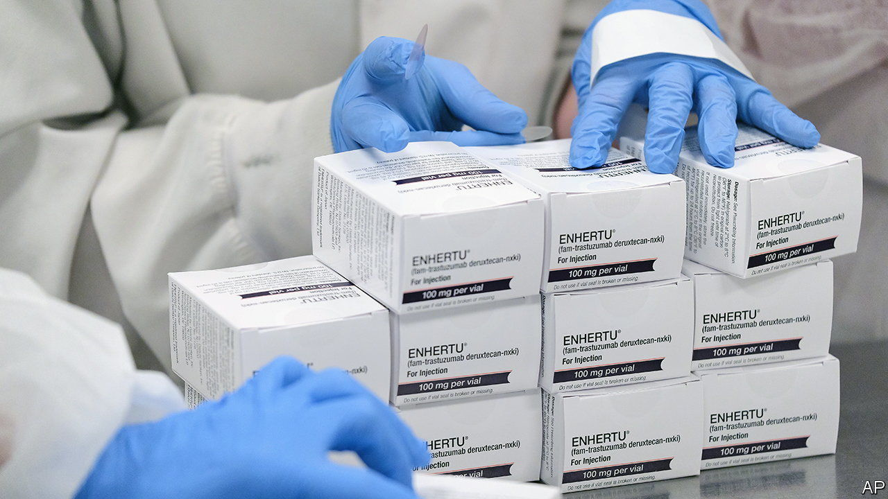
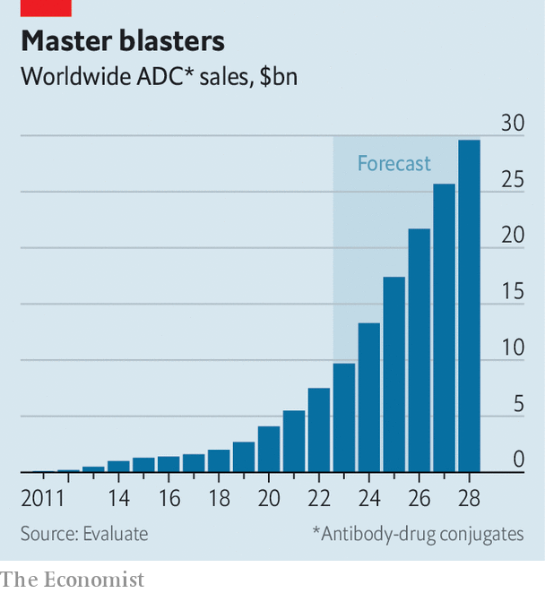

###### Missile stockpiles

# Big pharma can’t get enough of one class of cancer drugs 

##### A spate of dealmaking suggests high expectations for antibody-drug conjugates 

 

> Sep 21st 2023 

AROUND THE world, dealmaking is in a rut. A combination of higher interest rates, geopolitical tensions and economic uncertainty has put a hold on joint ventures, mergers and acquisitions. One exception is targets with AI in their name. Another, less obvious one, involves a less catchy initialism: ADCs. 

Makers of these antibody-drug conjugates, to give them their full name, are all the rage among the world’s biggest drugmakers. Pfizer is paying $43bn for Seagen, which in turn has just teamed up with Nurix Therapeutics, a smaller biotechnology firm, to work on this class of drugs. Amgen, AstraZeneca and Merck have also placed billion-dollar bets on ADCs. In the past five years licensing deals worth $60bn have been signed for such therapies. The number of such deals tripled in that period, to 26. So far this year 18 have been signed, outpacing similar deals involving other emerging cancer drugs.

ADCs aren’t new. The first was approved in 2000 for types of leukaemia. They act like guided biological missiles: a payload of toxic chemotherapy is carried by antibodies able to seek out cancer cells directly. Because they bypass normal tissue and go straight for their targets, they let patients receive higher doses that would otherwise cause too much collateral damage. 

Two developments explain the frenzied stockpiling of these anti-cancer weapons of late. One is increased clinical confidence. Enhertu, an ADC developed by AstraZeneca and Daiichi Sankyo, a Japanese biotechnology company, was first approved in America in 2019. But after another set of trials in 2022 showed that it allowed breast-cancer patients to live almost twice as long without relapse as those treated with standard chemotherapy, its approval was extended to different types of breast and lung cancer. Regulators have cleared a dozen other ADCs, which are now routinely used to treat some of the deadliest cancers, including leukaemia, lymphoma and breast cancer. 

 


More than 140 new ADCs are currently in clinical trials. Bristol Myers Squibb and Sanofi all have therapies in late-stage tests. AstraZeneca and Merck have each formed a joint-venture with biotech firms in China, to take advantage of Chinese regulators’ more relaxed rules for early-stage trials, which helps accelerate the drugs’ development. Susan Galbraith, who oversees oncology research and development at AstraZeneca, says that the timeline for drug testing in China has been significantly reduced in the past decade. 

Clinical success has, in turn, boosted commercial confidence. Sales of Enhertu exceeded $1.2bn in 2022. Revenue from Trodelvy, a similar drug approved for advanced breast cancer and sold by Gilead Sciences, rose by 79% last year, to $680m. Kadcyla brought in $1.1bn for its Swiss developer, Roche, in the first half of this year. Evaluate, a provider of health-care data, forecasts that ADC sales could reach nearly $30bn by 2028, up from around $7.5bn last year (see chart). 

Some of these wagers could misfire. It is unclear just how well the drugs will work in combination with others, such as immunotherapies. They are also complex to make. Any deals involving Chinese partners could unravel if Sino-Western tensions increase. For now, though, ADCs are a global arms race worth cheering. ■


