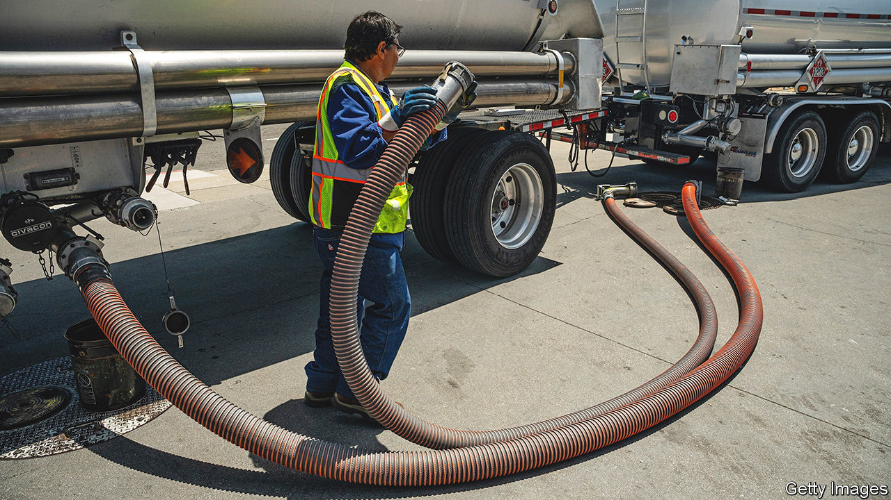

###### Emissionary zeal

# California cracks down on carbon 

##### It is not just attacking big oil. Big everything is in the line of fire 

 

> Sep 21st 2023 

Climate Week NYC got off to an early start in California. In the days running up to the launch of the annual jamboree in New York City, America’s most populous and economically powerful state seized the initiative by hurling two thunderbolts at carbon-intensive businesses. 

The most eye-catching was a lawsuit filed on September 15th by the Democrat-led state government accusing five big oil companies—BP, Chevron, ConocoPhillips, ExxonMobil and Shell—of lying about the dangers of climate change. Two bills passed days earlier by the state legislature may have a bigger impact. They could, for the first time in America, force big business to make climate-related disclosures. Governor Gavin Newsom vowed to sign both, after a few tweaks.

The two approaches—legal and legislative—were hailed by climate campaigners as tipping points in American law. The lawsuit against “big oil” aims to make the defendants pay for the alleged environmental damage suffered in California as a result of the use of their products. The firms reasserted their commitment to decarbonisation and said that the courts were not the right place to tackle such a momentous problem. It is the latest and most significant of dozens of court cases filed by states and cities against fossil-fuel producers in recent years. Those lawsuits proceed slowly and, as yet, no firm has lost. But in April the Supreme Court dealt a blow to oil producers by rejecting their efforts to move such cases from state to federal courts.

The two laws are likely to have bigger, and more immediate, consequences. They require large firms that do business in California to disclose their greenhouse-gas emissions and climate-related vulnerabilities. They are the first of a kind in America—and will, like the state’s vehicle-emissions standards, probably have implications far beyond California’s borders. 

One applies to more than 5,000 companies with global annual revenues of over $1bn, and obliges them to disclose direct and indirect emissions, known as scope 1 and scope 2, beginning in 2026. A year later, they must also reveal their scope 3 emissions, which include those generated by their suppliers and end users. For example, carmakers will have to account for the emissions of those who provide them with parts and those who drive their cars. Scope 3 emissions are hard to calculate and can be many times the direct emissions, making some firms loth to calculate them. 

The second measure applies to 10,000 or so companies with revenues above $500m. Starting in 2026 they must file reports every other year on the financial impact of climate change on their business. Some companies, such as Microsoft, a tech giant, and Patagonia, a clothing brand, threw their support behind the measures. The California Chamber of Commerce, a lobby group, opposed them, arguing that they would push up compliance costs for firms without curbing emissions. Even so, companies will find it hard to resist the lure of California’s giant market. 

The climate-disclosure requirements come shortly before America’s Securities and Exchange Commission (SEC), a regulator, is expected to launch something similar at a federal level. Michael Gerrard of the Sabin Centre for Climate Change Law at Columbia University points out that the SEC’s rule is narrower in scope than California’s, only affects publicly traded companies above a certain size, and may be more legally vulnerable. 

Internationally, California is not alone. Many American multinationals will soon have to comply with even further-reaching climate-disclosure requirements by the European Union. America’s Republican states may growl about extraterritoriality. But when it comes to standard-setting, businesses know they must take California and the EU seriously. ■


