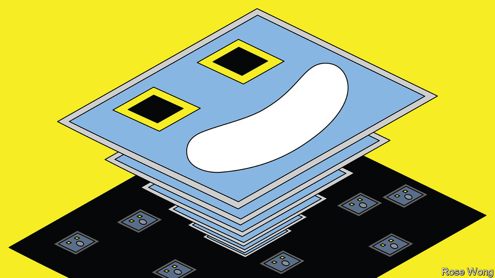
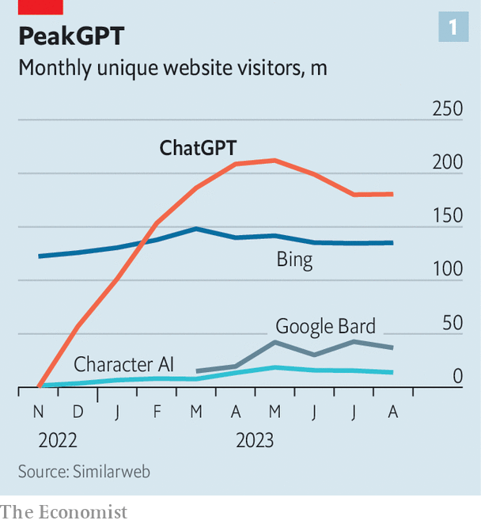
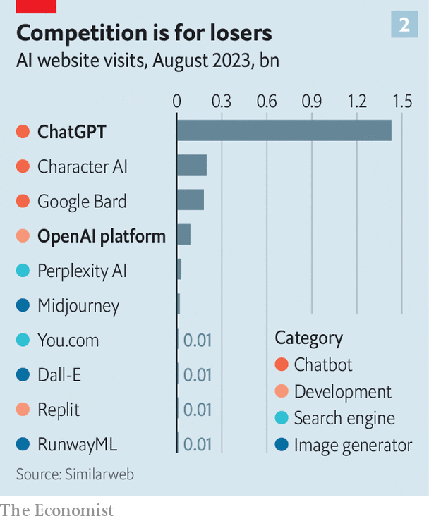

###### Smart money

# Could OpenAI be the next tech giant? 

##### What the business of AI’s leading startup says about the technology’s future 

 

> Sep 18th 2023 

The creation of a new market is like the start of a long race. Competitors jockey for position as spectators excitedly clamour. Then, like races, markets enter a calmer second phase. The field orders itself into leaders and laggards. The crowds thin. 

 


In the contest to dominate the future of artificial intelligence, OpenAI, a company backed by Microsoft, established an early lead by launching ChatGPT last November. The app reached 100m users faster than any before it. Rivals scrambled. Google and its corporate parent, Alphabet, rushed the release of their chatbot, Bard. So did startups like Anthropic. Venture capitalists poured over $40bn into AI firms in the first half of 2023, nearly a quarter of all venture dollars this year. Then the frenzy died down. Public interest in AI peaked a couple of months ago, according to data from Google searches. The number of visitors to ChatGPT’s website fell from 210m in May to 180m now (see chart 1). 

The emerging order still sees OpenAI ahead technologically. Its latest AI model, GPT-4, is beating others on a variety of benchmarks (such as an ability to answer reading and maths questions). In head-to-head comparisons, it ranks roughly as far ahead of the current runner-up, Anthropic’s Claude 2, as the world’s top chess player does against his closest rival—a decent lead, even if not insurmountable. More important, OpenAI is beginning to make real money. According to the, an online technology publication, it is earning revenues at an annualised rate of $1bn, compared with a trifling $28m in the year before ChatGPT’s launch.

Can OpenAI translate its early edge into an enduring advantage, and join the ranks of big tech? To do so it must avoid the fate of erstwhile tech pioneers, from Netscape to Myspace, which were overtaken by rivals that learnt from their early successes and stumbles. And as it is a first mover, the decisions it takes will also say much about the broader direction of a nascent industry.

OpenAI is a curious firm. It was founded in 2015 by a clutch of entrepreneurs including Sam Altman, its current boss, and Elon Musk, Tesla’s technophilic chief executive, as a non-profit venture. Its aim was to build artificial general intelligence (AGI), which would equal or surpass human capacity in all types of intellectual tasks. An intermediate goal was an AI that could master a video game called “Dota”. In working on that problem, OpenAI’s boffins alighted on a simple approach that involved harnessing oodles of computing power, says an early employee who has since left. When in 2017 researchers at Google published a paper describing a revolutionary machine-learning technique they christened the “transformer”, OpenAI’s engineers realised they could scale it up by combining untold quantities of data scraped from the internet with processing oomph. The result was the generative pre-trained transformer, or GPT for short.

Obtaining the necessary resources required OpenAI to employ some engineering of the financial variety. In 2019 it created a “capped-profit company” within its non-profit structure. To begin with, investors in this business could make 100 times their initial investment—but no more. Rather than distribute equity, the firm distributes claims on a share of future profits that come without ownership rights (“profit-participation units”). What is more, OpenAI says it may reinvest all profits until the board decides that OpenAI’s goal of achieving AGI has been reached. OpenAI stresses that it is a “high-risk investment” and should be viewed as more akin to a “donation”. “We’re not for everybody,” says Brad Lightcap, OpenAI’s chief operating officer and its financial guru.

Maybe not. Mr Musk pulled out in 2018. Some potential investors were scared away from OpenAI’s most recent funding round by its complex structure. But Mr Altman and Mr Lightcap were able to win over others. To become more attractive the company has loosened its profit cap to one based on an annual rate of return (though it will not confirm what the maximum rate is). And academic debates about the meaning of AGI aside, the profit units themselves can be sold on the market just like standard equities. The firm has already offered several opportunities for early employees to sell their units. Investors who chose to buy in appear confident that they can achieve venture-scale returns if the firm keeps growing. 

SoftBank, a risk-addled tech-investment house from Japan, is thought to be the latest investor keen to place a big bet on OpenAI. The startup has so far raised a total of around $14bn. Most of it, perhaps $13bn, has come from Microsoft, whose Azure cloud division is also furnishing OpenAI with the computing power it needs. In exchange, the software titan will receive the lion’s share of OpenAI’s profits—if these are ever handed over. In the short term, it gets to license OpenAI’s technology and offer this to its own clients, which include most of the world’s largest companies.

It is just as well that OpenAI is attracting deep-pocketed backers. For the firm needs an awful lot of capital to procure the data and computing power necessary to keep creating ever more intelligent models. Mr Altman has said that OpenAI could well end up being “the most capital-intensive startup in Silicon Valley history”. OpenAI’s most recent model, GPT-4, is estimated to have cost around $100m to train, several times more than GPT-3. 

For the time being, investors appear happy to pour more money into the business. But they eventually expect a return. And for its part Openai has realised that, if it is to achieve its mission, it must become like any other fledgling business and think hard about its costs and its revenues.

GPT-4 already exhibits a degree of cost-consciousness. For example, notes Dylan Patel of SemiAnalysis, a research firm, it was divided into 16 parts that specialise in different types of tasks. That makes it trickier to design than a monolithic model. But it is then cheaper to actually use the model once it has been trained, because not all the specialists are required to answer questions. Cost is also a big reason why OpenAI is not training its next big model, GPT-5. Instead, say sources familiar with the firm, it is building GPT-4.5, which would have “similar quality” to GPT-4 but cost “a lot less to run”. 

A model salesman

But it is on the revenue-generating side of business that OpenAI is most transformed, and where it has been most energetic of late. AI can create a lot of value long before AGI brains are as versatile as human ones, says Mr Lightcap. OpenAI’s models are generalist, trained on a vast amount of data and capable of doing a variety of tasks. The ChatGPT craze has made OpenAI the default option for consumers, developers and businesses keen to embrace the technology. Despite the recent dip, ChatGPT still receives 60% of traffic to the top 50 generative-AI websites, according to a study by Andreessen Horowitz, a venture-capital (VC) firm which has invested in OpenAI (see chart 2). 

 


Yet OpenAI is no longer only—or even primarily—about ChatGPT. It is increasingly becoming a business-to-business platform. It is creating bespoke products of its own for big corporate customers, which include Morgan Stanley, an investment bank. It also offers tools for developers to build products using its models; on November 6th it is expected to unveil new ones at its first developer conference. 

In addition, the firm has a $175m pot to invest in smaller AI startups building applications on top of its platform, which at once promotes its models and allows it to capture value if the application-builders strike gold. To spread its technology further, it is handing out perks to AI firms at Y Combinator, a Silicon Valley startup nursery that Mr Altman used to lead. John Luttig of Founders Fund, a VC firm which also has a stake in OpenAI, thinks that this vast and diverse distribution may be even more important than any technical advantage.

Being the first mover certainly plays in OpenAI’s favour. GPT-like models’ high fixed costs erect big barriers to entry for competitors. That in turn may make it easier for OpenAI to lock in corporate customers. If they are to share internal company data in order to fine-tune the model to their needs, many clients may prefer not to do so more than once—for cyber-security reasons, or simply because it is costly to move data from one AI provider to another, as it already is between computing clouds. Teaching big models to think also requires lots of tacit engineering know-how, from recognising high-quality data to knowing the tricks to quickly debug the source code. Mr Altman has speculated that fewer than 50 people in the world are at the true model-training frontier. A lot work for OpenAI. 

These are all real advantages. But they do not guarantee OpenAI’s dominance. For one thing, the sort of network effects where scale begets more scale, which have helped turn Alphabet, Amazon and Meta into quasi-monopolists in search, e-commerce and social networking respectively, have yet to show up. Despite its vast number of users, GPT-4 is hardly better today than six months ago. Although further tuning with user data has made it less likely to go off the rails, its overall performance has changed in unpredictable ways, in some cases for the worse.

Being a first mover in model-building may also bring some disadvantages. The biggest cost for modellers is not training but experimentation. Plenty of ideas went nowhere before the one that worked got to the training stage. That is why OpenAI is estimated to have lost some $500m last year, even though GPT-4 cost one-fifth as much to train. News of ideas that do not pay off tends to spread quickly throughout AI world. This helps OpenAI’s competitors avoid going down costly blind alleys.

As for customers, many want to reduce their dependence on OpenAI, fearful of being locked into its products and thus at its mercy. Anthropic, which was founded by defectors from OpenAI, has already become a popular second choice for many AI startups. Soon they may have more cutting-edge alternatives. Google is building Gemini, a model believed to be more powerful than GPT-4. Despite its partnership with OpenAI, even Microsoft is something of a rival. It has access to GPT-4’s black box, as well as a vast sales force with deep ties to the world’s biggest corporate IT departments. This array of choices diminishes OpenAI’s pricing power. It is also forcing Mr Altman’s firm to keep training better models if it wants to stay ahead. 

The fact that OpenAI’s models are a black box also reduces its appeal to some potential users, including large businesses concerned about data privacy. They may prefer more transparent “open-source” models like Meta’s LLaMA 2. Sophisticated software firms, meanwhile, may want to build their own model, in order to exercise full control over its behaviour.

Others are moving away from generality—the ability to do many things rather than just one thing—by building cheaper models that are trained on narrower sets of data, or to do a specific task. A startup called Replit has trained one just to write computer programs. It sits atop Databricks, an AI cloud platform which counts Nvidia, a $1trn maker of specialist AI semiconductors, among its investors. Character AI has designed a model that lets people create virtual personalities based on real or imagined characters that can then converse with other users. It is the second-most popular AI app behind ChatGPT. 

The core question, notes Kevin Kwok, a venture capitalist (who is not a backer of OpenAI), in a forthcoming essay, is how much value is derived from a model’s generality. If not much, then the industry may be dominated by many specialist firms, like Replit or Character AI. If a lot, then big models such as those of OpenAI or Google may come out on top. Mr Altman still believes in size. “We will keep scaling for sure,” he says, even if many of the gains “will hopefully come from other things”. 

Mike Speiser of Sutter Hill Ventures (another non-OpenAI backer) suspects that the market will end up containing a handful of large generalist models, with a long tail of task-specific models. Such an oligopoly might limit the chance of an astronomical Google-like outcome, but could still earn OpenAI a pretty penny. And if the company really does achieve its mission of creating a thinking machine that surpasses humans? Then all bets are off. ■


