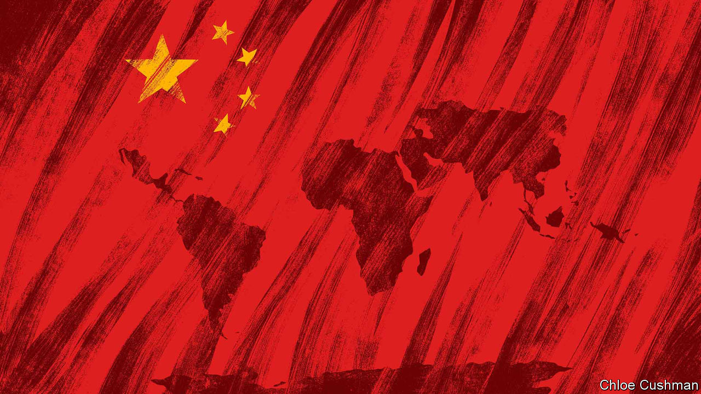

###### Chaguan

# China wants to be the leader of the global south 

##### An unusual speech in Cuba gives hints about its grand plan 

 

> Sep 21st 2023 

It is not every day that someone from Xi Jinping’s inner circle drops a reference to Zhou Enlai, Mao Zedong’s chief diplomat. Yet Zhou’s dapper ghost hung over a recent speech given in Havana to developing-world leaders by Li Xi, boss of the feared Central Commission for Discipline Inspection. Indeed, the whole speech was filled with nods to the past. Mr Li recalled mid-20th-century struggles for “national independence and liberation”. He mentioned the “Bandung Spirit” and “Five Principles of Peaceful Coexistence”. That refers to the Bandung Conference of 1955, at which Zhou committed China to a path of non-aggression and non-interference in the affairs of other Asian and African countries. 

The discipline-enforcement boss was sent to Cuba as Mr Xi’s personal envoy to a summit involving China and emerging economies from the G77 group. He promised that China will “always be part of the developing world and a member of the global south”, no matter how advanced it becomes. By way of explanation, Mr Li reached back into history. China is forever bound to other nations that fought colonial-era “exploitation and oppression”, he said. 

Mr Li, a member of the Politburo Standing Committee, the top leadership body, was not speaking off the cuff. Nor was his cold-war history lesson a one-off, inspired by the sight of shark-finned old Cadillacs chugging through Havana. China has launched a new, concerted campaign to present itself as a natural leader for the developing world, starting with countries that have painful memories of bullying by colonial powers or by America.

On September 13th the foreign ministry published a “Proposal of the People’s Republic of China on the Reform and Development of Global Governance”. This urges sweeping changes to the rules and institutions that oversee international development, security and human rights. It finds many lessons in history. America (referred to as a “certain country”) is told to learn from past wrongdoing, including ignoring Russia’s “legitimate security concerns”, making “wanton use” of sanctions and hampering scientific progress with “hegemonic” controls on technology sales.

In the name of redressing “historical injustices”, China calls for developing countries to be given a much greater say at the United Nations, including seats for Africa on an expanded Security Council (the proposal makes no mention of China’s rival, India, a developing giant that has long sought a seat on the council). Restating long-standing Chinese arguments, the proposal calls the rights to subsistence and development “the basic human rights of paramount importance.” All other rights must bow to “national realities”. To advance that worldview, China proposes that UN human-rights bodies should employ more citizens from developing countries as soon as possible. More clearly than ever before, the document weaves together Mr Xi’s big foreign-policy proposals, from the Belt and Road Initiative to the Global Development Initiative, Global Security Initiative and Global Civilisation Initiative. It presents them as China’s unified plan for tackling everything from climate change to the regulation of cyberspace. The stated goal: to create a “better future for humanity”.

The proposal was followed days later by a joint statement issued by Mr Xi and Zambia’s president, Hakainde Hichilema, who was on a state visit to China. The statement names and endorses Mr Xi’s various global initiatives in turn. China’s preferred foreign policies are presented as in the common interest of developing countries. Rich states are reminded of their “inescapable historical responsibilities over climate change”, and told to take the lead in reducing emissions. Zambia declares China a new model for countries seeking independent paths towards modernisation. Independence is relative, of course. Zambia owes China billions of dollars. After long resistance, Chinese lenders agreed to restructure much of this debt in June, but largely by extending maturities and offering to suspend interest payments for some years, rather than by writing off loans. 

Towards a China-crafted, China-led order

Chinese officials and scholars detect a turning-point in history. Many low- and middle-income countries resent Western arguments about right and wrong. They blame sanctions on Russia, imposed by Western countries over its invasion of Ukraine, for high food and energy prices. In response, China is presenting itself as leader of something resembling a new, non-aligned movement. China calls for “true multilateralism”, delivered by international bodies, from the UN to the World Bank and International Monetary Fund, that are no longer dominated by America and other rich liberal democracies. It talks of respecting the diversity of the world’s civilisations: code for rejecting liberal values as a form of Western-centric racism. 

China’s non-aligned posture does not stand much scrutiny, though. In the original non-aligned movement, Egypt, India, Yugoslavia and others gained clout by forming an ideologically unpredictable and diverse group, says Richard Gowan of the International Crisis Group, a think-tank. This time, for all the “mood music about anti-colonialism”, what China is offering is “a coalition of states that China would lead”.

By declaring that a rich China would still be a developing country, Chinese leaders are manipulating language so that “developing” ceases to be an economic term and means “non-Western”, says a diplomat. The goal is to rally non-Western countries around Mr Xi’s favoured vision for global governance. Some will be wary, adds the diplomat, for they wish “to diversify their strategic, economic and political interests”, not sign up to a China-led bloc. 

Still, foreign leaders can expect pressure to endorse China’s new proposal for global governance. It contains so many Xi-branded initiatives that Chinese diplomats must promote it, or risk seeming disloyal to their supreme leader. Chairman Mao’s long-suffering envoy, Zhou Enlai, would understand. ■


