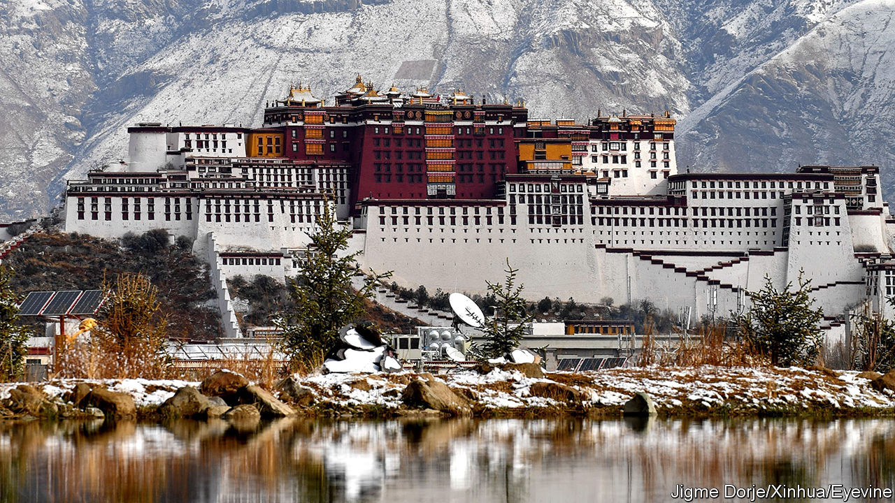

###### Claims on the past

# How China uses UNESCO to rewrite history 

##### The country’s heritage sites often reinforce the Communist Party’s view of the past 

 

> Sep 21st 2023 

PU’ER TEA is an earthy brew beloved of dieters for its digestive qualities. Its leaves come from the forests of Jingmai mountain in south-west China, which was listed as a World Heritage site by UNESCO, the cultural arm of the United Nations, on September 17th. The designation, China hopes, will boost tea sales and lure tourists to the region, which is near the border with Myanmar, Laos and Vietnam. Chinese officials work hard to obtain the UNESCO stamp of approval. Only Italy has more such sites. No country comes close to China in terms of the number of cultural practices recognised by the organisation.

But there is more to China’s efforts than increasing tea sales and tourism. The Communist Party claims that present-day China, which has dozens (perhaps hundreds) of ethnic minorities, is a single nation with a continuous history stretching back thousands of years. National identity is conflated with that of the Han, the ethnic group accounting for more than 90% of the population. China’s heritage laws aim to maintain “the unification of the country” and foster “social harmony”. In practice, this often means distorting history so that it aligns with the party’s view of the past and reinforces its vision of nationhood.

When UNESCO conceived its record of World Heritage sites in the 1970s, China was intent on crushing its cultural relics. Today, though, China donates more money and sends more delegates to the international body than any other country. Many of the sites ratified by UNESCO, such as the Great Wall, are well known. But others, along with certain cultural practices, are put forward in order to legitimise the party’s rule over regions with large ethnic minorities, says Christina Maags of Sheffield University. Areas such as Xinjiang and Tibet have not always been part of China, nor dominated by the Han. Yet the party’s version of history tells a different story. 

In the far-western region of Xinjiang, over 40% of the population are Uyghur, an ethnic minority. Their culture, language and Muslim faith set them apart from much of China. The Uyghur heartland began to fall under formal Chinese control in the mid-18th century—revealingly, the Manchu rulers of the Qing dynasty named it Xinjiang, meaning “new territory”. Over the past decade the party has forced Uyghurs and other ethnic minorities in the region to assimilate. After 2017 perhaps a million of them passed through “re-education camps”. Security remains intense, with the government citing concerns about terrorism and separatism. Activists say it is erasing the Uyghur culture.

None of this is reflected in the government’s nomination of the Tianshan mountains in Xinjiang as a World Heritage site. “Since ancient times, people of all Chinese nationalities have lived on this fertile land and have created a rich material culture and spiritual civilisation,” reads the application. It describes a Xinjiang of Han military towns and transportation centres and cites Han poets who lauded the Tianshan mountains. In nearly 1,000 pages of documentation the Uyghurs are mentioned only a handful of times, often as part of a list of ethnic groups who live in the area. A similar history of Xinjiang was put forward by the Chinese government when a portion of the Silk Road was up for UNESCO recognition. The region was described as a cultural belt that saw the “integration” and “continuous fusion” of Han people with “local residents”.

When Mao Zedong’s guerrillas seized power in 1949, China’s borders were not clearly defined, nor its population entirely submissive. In 1950, when Communist troops invaded Tibet, they were not welcomed by its residents as liberators, as the party claims. Promises of autonomy were broken, leading to an abortive Tibetan uprising against Chinese rule in 1959. The history approved by UNESCO, though, suggests a more harmonious past. In 2013 the organisation accepted the records of Tibet from China’s Yuan dynasty (1279–1368) into its “memory of the world”. These were proof, said the government in Beijing, of an ancient period when imperial rulers were “highly tolerant of the religious, political system and culture of Tibet”—and also evidence that the integration of Tibet into China under the Yuan was lasting.

All for one

To bolster the idea of a Han-centric identity, the party seeks to dilute the contributions of minority groups in UNESCO claims. For example, documents filed with the organisation state that Tibet’s Potala Palace, the winter home of Dalai Lamas from 1649 to 1959 (pictured), exhibits the skills of many ethnic groups, not just Tibetans. The government uses “radical selectivity” in choosing which places, people and practices to emphasise, says Rachel Harris of the School of Oriental and African Studies, part of the University of London. 

The state is also selective about what cultural practices it ascribes to different groups. The Han are typically credited with “civilisation building”, says Juheon Lee of Midwestern State University in Texas. So the group is associated with applications involving high culture, such as the Peking opera, or technical expertise, such as bridges. In contrast, ethnic groups in border regions are nominated for folk practices like medicinal bathing (Tibetans) and throat singing (Mongols).

UNESCO tends not to dispute China’s claims. Nor would it be safe for historians in China to do so. Ms Harris notes that Uyghur scholars are locked up for asserting a different version of history. But the party’s effort to put forward its own interpretation has been slowed, at least. In 2018 UNESCO changed its rules so that a country could nominate just one new site a year. ■


