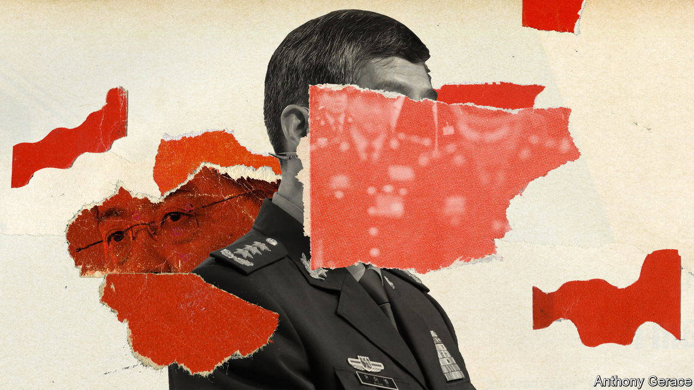

###### Xi’s troubled coterie

# The disappearance of China’s defence minister raises big questions 

##### Officials selected by Xi Jinping are going down. What does that say about his judgment? 

 

> Sep 20th 2023 

An ability to groom talented officials, China’s leader, Xi Jinping, once said, “largely determines the rise and fall, as well as the survival or demise” of political parties and countries. After a sweeping reshuffle of ministerial posts in March, the government’s main news agency, Xinhua, recalled Mr Xi’s words in an article aimed at showing how meticulous the selection process had been. Since late June, however, two of the most senior officials who were promoted in that shake-up have disappeared: first Qin Gang, the former foreign minister, and more recently General Li Shangfu, the defence minister. The swiftness of their apparent downfalls has been striking. The questions they raise about China’s politics are big. 

There is no sign that this is an existential moment for the Communist Party, or Mr Xi’s rule. Adulation of Mr Xi continues unabated in state media. He stayed away from the G20 summit in Delhi on September 9th and 10th—an unprecedented absence. But on September 16th and 17th Wang Yi, who succeeded Mr Qin as foreign minister in late July, met America’s national security adviser, Jake Sullivan, in Malta. According to Bloomberg, they discussed a possible meeting between Mr Xi and President Joe Biden at a gathering of Asia-Pacific leaders scheduled for November in San Francisco. China’s military activities appear unaffected, too. On September 17th and 18th about 100 Chinese fighter jets flew around Taiwan, an unusually high number in such a space of time. 

But the churn at the highest levels of the state and military apparatus has been unusually fast, even by the standards of Mr Xi’s purge-filled tenure. General Li has not been seen in public since August 29th, when he appeared at a China-Africa security forum. He was supposed to attend an annual meeting with Vietnamese defence officials on September 7th and 8th. But that plan was scrapped, with Chinese officials citing the general’s health. Unspecified illnesses seem to be a common problem for those in political trouble. Mr Qin was said to have a health condition, too. But according to the , senior Chinese officials were told in secret last month that he had “lifestyle issues”. They allegedly involved an extramarital affair, resulting in the birth of a child, while Mr Qin was ambassador in Washington before becoming foreign minister. 

On official websites, no change has been indicated in General Li’s duties. But American and other officials have told Western media that they believe he has been relieved of his post. Reuters reported that he was suspected of corruption related to the procurement of military equipment, which he oversaw from 2017 to 2022. The news agency said that eight senior officials from the procurement department were being investigated, too. 

There is also speculation that graft is a reason for the replacement in late July (announced in state media) of General Li Yuchao and General Xu Zhongbo. They were the two most senior commanders of the Rocket Force, which controls China’s nuclear and conventional missiles. General Li Yuchao had been put in charge only last year. A less high-profile but equally unusual personnel change came to light on September 1st with the dismissal of Major General Cheng Dongfang as president of the People’s Liberation Army military court after just eight months in the job. No reason was given. General Cheng had previously served as spokesman of China’s military garrison in Hong Kong. 

On Chinese social media, censors have stifled most discussion. Only one comment is visible on the post of a user with more than 670,000 followers who hinted at the defence minister’s absence. “Aren’t you afraid of having your account closed down?” it says. “Don’t talk about him.” But given Mr Xi’s efforts to portray China’s political system as a more stable and effective alternative to liberal democracy, the purges have provided rich pickings for his foreign critics. On X (formerly Twitter) America’s ambassador to Japan, Rahm Emanuel, compared the turnover to Agatha Christie’s novel, “And Then There Were None”. He later offered another literary analogy: “As Shakespeare wrote in Hamlet, ‘Something is rotten in the state of Denmark’.” 

To be sure, the posts of defence minister and foreign minister are not as critical in China as they often are in other countries. Neither General Li nor Mr Qin are among the 24 members of the Politburo, the apex of political power. But the ministerial jobs involve defending the country’s interests abroad. (In China’s eyes, Mr Qin’s alleged behaviour may have made him a security risk.) And the purges raise questions about Mr Xi’s ability to select the right talent and his capacity to scare officials into avoiding corruption. 

The moves have targeted people who were clearly Mr Xi’s men. Mr Qin’s elevation to the rank of foreign minister was unusually rapid, suggesting he may have impressed Mr Xi during a stint as the chief organiser of his foreign trips. He was promoted last year to the party’s Central Committee and in March got the additional title of state councillor (a senior role in China’s cabinet). Only four others hold that rank, including General Li. The defence minister is also a Central Committee member and one of the six officers who work under Mr Xi in the armed forces’ governing body, the Central Military Commission.

Team of no rivals

General Li and Mr Qin were among many people close to Mr Xi who benefited from the reshuffle in March as well as another one last October involving party jobs. The overhaul produced a ruling team more seemingly in lockstep with the paramount leader than any since the era of Mao Zedong. In China, questions will certainly be asked (in whispers) about how stable it is.

But Mr Xi must be used to muttering. His previous purges have affected hundreds of thousands of officials, high and low, including many in the services most vital to maintaining the party’s grip on power: the armed forces, the police and the spy apparatus. Most of the fallen have been accused of corruption, but some, too, of political wrongdoing. Last September courts imposed lengthy prison sentences on several security chiefs accused of being corrupt, as well as members of a disloyal cabal. They included a former deputy minister of public security and a former justice minister. In 2015 Zhou Yongkang—a retired head of China’s internal security services and former member of the Politburo’s Standing Committee—was sentenced to life in prison for bribery and leaking state secrets. Mr Xi accused him and other jailed associates of attempting to “seize power”. 

If General Li is replaced as defence minister, there could be an upside for America. Last August, in response to a visit to Taiwan by the then speaker of America’s House of Representatives, Nancy Pelosi, China halted regular talks between the two countries’ defence establishments. America is keen to restart them, seeing them as useful for discussing ways of preventing unintended clashes. But while working in procurement, General Li was placed under American sanctions in 2018 for buying fighter jets and missiles from Russia. China wants the sanctions to be lifted before talks resume. Removing the man himself may resolve an impasse. ■


