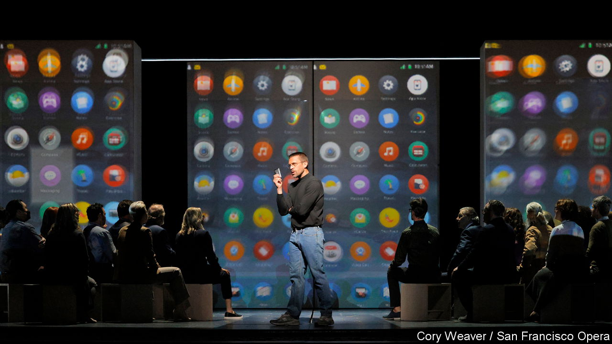

###### Powering up

# An opera about Steve Jobs is opening in San Francisco 

##### Can people be lured back to the opera by one of the most famous businessmen? 

 

> Sep 20th 2023 

STEVE JOBS was heralded as one of history’s  but was also a music man.  (which Apple released in 2001 while Jobs was boss) and the iTunes store (launched in 2003) helped boost the fortunes of the beleaguered music industry by persuading people to pay for songs instead of stealing them. Twenty years later, some are looking to Jobs to help music again—this time, opera. 

On September 22nd “The (R)evolution of Steve Jobs” opens at the San Francisco Opera, in the city where Jobs was born—a 45-minute drive from the garage in Los Altos where the first Apple computer was designed. The opera will later travel to the Kennedy Centre in Washington, DC, one of America’s most prestigious performance spaces, probably in 2025. 

In 20 short scenes that jump back and forth in time, spanning Jobs’s youth in the 1960s to his death in 2011, music helps audiences experience the conflicting facets of the tech titan. “There is an element of Jobs being both a protagonist and an antagonist that only an opera can uniquely explore,” says Mason Bates, the American composer who wrote “The (R)evolution”. 

This is not your average opera, however. It begins, for one thing, with a product launch: a reimagining of Jobs  to introduce the iPhone. Yet this is not a story about devices either—it is the story of a man grappling with mortality. Mr Bates insists that “The (R)evolution” has classic operatic themes: “passion, betrayal and, of course, tragedy”. 

His music is user-friendly; it mixes Californian minimalism with syncopated dance rhythms more often heard at raves and clubs. The opera features Jobs’s quote from the Macintosh launch in 1984: “Never trust a computer you can’t lift.” Mr Bates sets this vocal line to feel both breezy and comic, while his orchestral score chugs along behind it.

First commissioned to debut in Santa Fe in 2017, “The (R)evolution” was a bet that Jobs could attract younger audiences, including tech folk, to a more than 400-year-old art form. That is San Francisco Opera’s hope, too. 

Culture in California is still reeling from the effects of long-running covid lockdowns. In May a study by CVL Economics, a think-tank, revealed that the state’s performing-arts sector lost a decade’s worth of jobs in 2020-21.  particularly hard. The city’s grants for arts—funded by hotel taxes—have been hollowed out, and the performing-arts district and downtown feel beggared. Two of the state’s well-regarded theatres, the California Shakespeare Theatre and Mark Taper Forum, cancelled their 2023-24 seasons due to unexpected budget shortfalls. 

San Francisco Opera is betting on Mr Jobs’s cool factor, but it has successfully incubated new productions before. It hired an unknown composer to adapt a popular book and film, “Dead Man Walking”, about an inmate on death row. The opera had its premiere in 2000 and has since been performed around the world; it will open at the Metropolitan Opera in New York later this month. The Met has also commissioned Mr Bates to write a new opera, based on “The Amazing Adventures of Kavalier and Clay”, a Pulitzer-prizewinning novel by Michael Chabon.

But betting a new opera will be a success is a bit like rooting for a happy ending in “Madam Butterfly”. It represents hope over experience. Of the hundreds of new operas that premiered in the past two decades, only about 10% get a second performance, and fewer still survive beyond that. Techies are not known for their . Whether they can be lured to the opera—even by a character as well-known as Jobs—is uncertain. 

This is no doubt why San Francisco Opera is offering an online viewing option. In addition to attending in person, viewers can purchase a pass to watch the live-stream for $27.50, roughly the cost of a rear-balcony seat in the opera house. If techies refuse to show up, perhaps (just perhaps) they will log on and watch at home on their iPhones. ■


