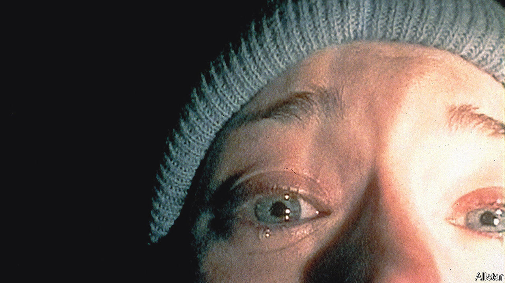

###### Back Story

# Donald Trump and the dramatic power of not turning up 

##### Like Beckett and Chekhov, he knows a character need not be on stage to dominate 

 

> Sep 21st 2023 

Her handwriting, her furs, her ostrich-feather fan and azalea perfume—along with her beauty, cruelty, secrets and lies: traces of Rebecca are everywhere in “”. At Manderley, her husband’s country pile, her evening dresses seem to rustle eternally in the breeze. “Her footsteps sounded in the corridors,” writes Daphne du Maurier, “her scent lingered on the stairs.” Above all she intrudes in the twisted devotion of the housekeeper, Mrs Danvers. Yet Rebecca herself, dead before the novel opens, never directly appears.

His orange skin and blond quiff, the erratically capitalised social-media posts, demeaning nicknames and s: in a similar sort of way, although Donald Trump  in August, his image haunted it. He may well pull off the same trick in the second debate on September 27th. Mr Trump seems to intuit something which du Maurier and other storytellers have grasped—that a character you don’t see can make a bigger impression than those you do. 

In fiction, as in life, absence can be a power play. The leader, don or spymaster asserts his authority over other characters, and impresses it on you, by relying on minions to do his bidding. The titular boss in “Charlie’s Angels” issues orders to his agents while his face stays out of sight. In the British sitcom “Yes, Minister” the prime minister is capricious but invisible. When, in the first debate, Mike Pence referred to Mr Trump as “one that’s probably looking on”, he made the no-show sound almost celestial.

Absence can cultivate fear, since what you cannot see is often scarier than what is revealed. Stirred by creepy music, each imagination fills the void with its own horrors. Viewers do not see the baddie who stalks the film students in “The Blair Witch Project” (pictured), nor the hunter who shoots Bambi’s mother. The driver whose lorry hounds the protagonist of Steven Spielberg’s “Duel” is not identified. (Conversely, the shark in  is much less terrifying after it surfaces on screen.) 

The unseen are a mystery. Sometimes it is ultimately dispelled, as with the Wizard of Oz, Boo Radley in “To Kill a Mockingbird” and Harry Lime in “The Third Man”. Sometimes the mystique endures. So remote is Big Brother that readers of “1984” cannot know if he is, or ever was, a real person. In two James Bond films, 007’s arch-enemy Ernst Blofeld appears as a pair of hands stroking a cat. During the first debate, live shots of Fulton County jail, where Mr Trump was due to turn himself in, had the air of a villain’s lair, the tenebrous place standing in for the elusive man. 

Most subtly, a hidden figure can be a mirror and measure of other people’s vices and virtues. Initially Romeo is moping not for Juliet but for Rosaline, in his view the fairest maiden “since first the world begun”. Audiences never meet her, but she supplies an early sense of his overheated emotions.  was an expert in devising this kind of absentee. In “Three Sisters” the gallantry and philosophising of Vershinin, an army officer, are undercut by his blithe neglect of his suicidal wife—who is always offstage. 

Likewise in the first debate Mr Trump provided a spectral yardstick of the other candidates’ independence. Chris Christie incurred boos for saying that some of his actions were “beneath the office of president”. Vivek Ramaswamy praised Mr Trump to the heavens. Ron DeSantis tried to wriggle between condemnation and defence, a spectacle as agonising as watching him try to smile.

The most famous unseen character in literature combines these effects. In ’s “Waiting for Godot”, Vladimir and Estragon are not sure what Godot looks like, whether he will ever materialise and, if he does, whether salvation or punishment will ensue. Godot gives them a purpose yet is a pretext for inertia. “In this immense confusion”, says Vladimir, “one thing alone is clear. We are waiting for Godot to come.”

Mr Trump is no Godot. Nor is he really offstage, even on debate nights. He holds court online and in friendly interviews, dominating conversations and front pages whether he shows up or not. His absence projects power, and he evokes fear in many Americans, but he is scarcely a riddle. They have seen the Trump movie before. 

Still, like Vladimir and Estragon, the rest of the Republican field will again be plagued and paralysed by Mr Trump’s shadow should he miss more debates. The play’s ending captures their limbo-like predicament. “Let’s go,” says Estragon, before the deadening final stage direction: “”■


