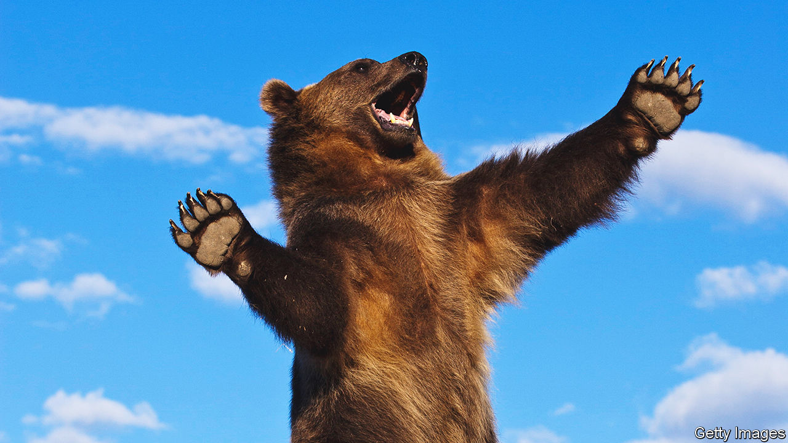

###### Where the wild things are

# From myth to art, bears have long captivated people 

##### A new book tells the story of eight bear species and their travails 

 

> Sep 21st 2023 

By Gloria Dickie. 

When Michael Bond wrote his first draft of “A Bear Called Paddington” in the 1950s, he described his hat-clad protagonist as hailing from “darkest Africa”. Bond’s literary agent, Harvey Unna, liked the story but spotted an error: no bears lived in Africa. “Children either know this or should know this,” Unna wrote, adding that, “There are plenty of bears in Asia, Europe and America, and quite a few on the stock exchange.” Bond changed Paddington’s origins to “darkest Peru”, modelling him on the spectacled bear from there.

Bears occupy a special place in myth and mind. Youngsters are read stories about Paddington,  and the three bears and are presented with stuffed teddies. Perhaps also because bears can stand erect on two legs, resembling humans, people have long felt drawn to them. Bears have featured in ancient paintings, constellation names (, otherwise known as the Big Dipper) and diplomatic negotiations. China’s  to allies has precedent: in 1252 King Haakon IV of Norway gave Henry III a polar bear, which spent its days swimming and fishing in the River Thames. 

“Eight Bears” explores the wonder and friction that characterise the relationship between bruins and people. The author, Gloria Dickie, a journalist for Reuters, travels around the world, bringing readers on a riveting and unique sort of bear hunt. She dresses up like an “imprisoned smurf” to volunteer at a panda-research centre in China, ventures into arctic temperatures to find polar bears in Canada, hikes in Peru in the hope of seeing Paddington’s ilk and wanders through villages of India to meet people mauled by sloth bears, whose name belies their aggression.

There are just eight bear species, compared with 41 types of felines and more than 500 primates. This offers pleasant concision, but Ms Dickie’s tone is sombre. Polar bears are not the only ones on thin ice; most bear species are threatened by habitat destruction and climate change. Pandas, for example, need to eat about 18kg of bamboo a day, but agricultural expansion imperils their food supply. Deforestation has destroyed the habitat of sloth bears (India’s most deadly wild animal). During droughts they roam in search of water, sparking conflict with people, who pursue “revenge kills” after bear attacks.

Ms Dickie concludes that only three bear species are likely to thrive past the end of this century: black bears, American brown bears and pandas. (There are fewer than 2,000 pandas, but China has started to take panda preservation seriously.) 

This book is about bears but also about people, revealing two opposing sides of human nature. One is people’s cruelty. “Bear-baiting”, in which bruins were tied up and forced to fight with dogs, was a popular sport in Britain, made illegal only in 1835. ( so enjoyed bear-baiting that she overruled Parliament’s attempt to ban it in 1585.) Although outlawed in India in 1972, “bear dancing” has persisted. People kill mother sloth bears and kidnap cubs; they then bash out their teeth and sometimes use muzzles with nails, forcing them into a “dance of fear and desperation” that offers “the illusion of merriment”. 

Elsewhere bears are enslaved for . In Vietnam (where bear farming is illegal) and China (where it is not), sun and moon bears are kept in cages. Bile is extracted from their gall bladders in a process akin to torture. The resulting “liquid gold” is sold for its anti-inflammatory properties. Bears’ imprisonment is made all the more disturbing by their intelligence. Researchers have observed that black bears can distinguish between animals and even. 

But people also have a more positive side. They are building systems that allow for co-existence, from bear “jails” (where creatures are sent if they come too close to population centres) to  and lockers. Many people around the world are trying to save and improve bears’ lives, proving there is some beauty in this story of beasts and humans. ■


