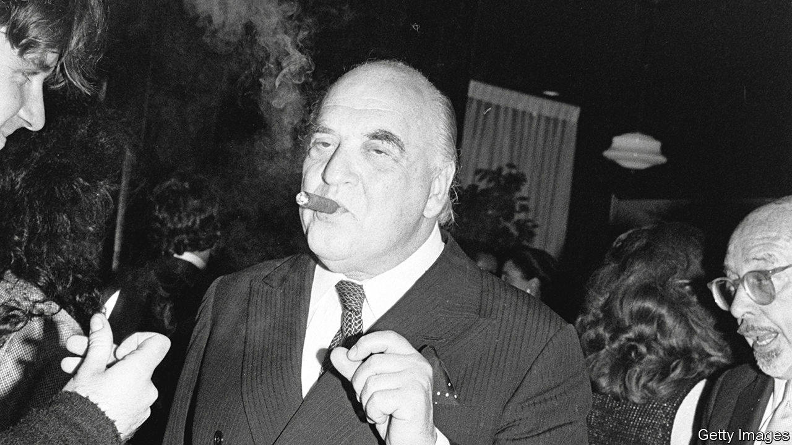

###### Books and bobs

# Publishing used to be packed with parties and punch 

##### A new biography of George Weidenfeld looks at the heyday of book publishing 

 

> Sep 21st 2023 

By Thomas Harding. 

George Orwell’s wife was a nasty snitch. The launch party for  was nearly a flop when censors threatened to spoil the fun.  was a needy fusspot. Mick Jagger could not tell a story. The biologist James Watson could, but he expressed such misogyny that readers, even in the 1960s, were alarmed. The anecdotes pile up in a new biography of  (pictured), the founder of Weidenfeld &amp; Nicolson, a publisher. Isaiah Berlin was tricky;  was a loyal friend; the historian Antonia Fraser was succulently beautiful. The Mitford sisters, naturally, were ghastly. 

Most editors fall broadly into two types: those who love the printing press and those who love pressing the flesh. The former are inky-fingered introverts for whom high drama is a fight over fonts. Weidenfeld was firmly in the latter camp. He was an impresario rather than an artisan; writing bored him. He lunched with Orwell, befriended Berlin and advised ’s son, Nigel Nicolson, on how to seduce a woman: foreplay helped, he advised, as did the right amount of booze. Yet, throughout this book, which is less a biography than an anthology of encounters with the famous, Weidenfeld remains something of an enigma.

Today, like Ben &amp; Jerry’s or Marks &amp; Spencer, Weidenfeld is better remembered as the name on one side of an ampersand than as a man. This is a pity, as he was fascinating in many ways. He lived in a time when the giants of publishing—Allen Lane, Max Schuster, André Deutsch—were not merely names on spines but people with them. Weidenfeld had more backbone than most, publishing everything from Vladimir Nabokov’s “Lolita”, to the eccentric “Hitler’s Table Talk” (a collection of the Führer’s monologues), to Harold Wilson’s analysis of the coal industry, “New Deal for Coal” (a brave literary decision if ever there was one). 

His life was courageous, too. Weidenfeld, who was Jewish, fled Germany in 1938, arriving in Britain vaguely determined to “be a success”. He swiftly became one. After a short spell working for the BBC, he wrote a book about Nazi propaganda. Then, having decided (rightly) that writing books was not much fun, he chose to publish them instead. He teamed up with Nicolson, founded a publishing house and was soon meeting—and, in some cases, making—many of the most famous names of 20th-century literature. Not that they were always grateful. Berlin likened talking to Weidenfeld to going to a brothel (fun but grubby) and wondered if he had a “total absence of a moral centre”. 

Did he? The reader struggles to know. For all the detail in this book, and there is a lot, Weidenfeld himself remains elusive. Readers learn what he drank (milk); what he wore to bed (pyjamas); the texture of his hands (“podgy”); how many times he was married (four). They also learn about parties where the air was heavy with cigar smoke, tainted with a pungent whiff of sexism and anti-Semitism. What readers do not learn, despite the detail, is the texture of Weidenfeld’s mind. Or perhaps it is because of the detail, for there is too much: the reader does not need to know, for example, that someone called Cyril “was beset by fibroids”.

However, this book has two subjects: Weidenfeld and his world. If, as the biography of a man, it does not quite work, as the biography of an era—the smoky, scurrilous world of post-war publishing—it does. ■


