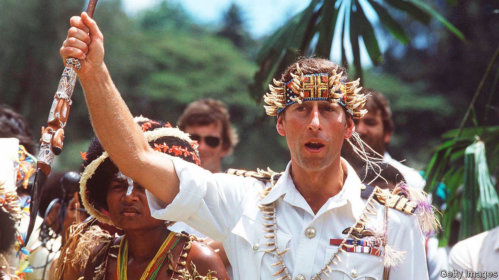

###### Here, there and almost everywhere

# The British Empire peaked 100 years ago this month 

##### Two new books examine the history and consequences of colonialism 

 

> Sep 16th 2023 

By Matthew Parker. 

 By Charlotte Lydia Riley.

The British Empire was and is many things to many people: a civilising endeavour, a bringer of peace, an exploitative force or a project based on white supremacy. Arguments exist for each characterisation. But there is one thing that  is not: completely over. 

It lives on in court cases, including one brought in 2019 by indigenous people of the , whom the British colonial government forcibly relocated in 1965-73 (with American support). It exists in the loyalties of the 15 commonwealth “realms”, including Australia and Canada, for which their monarch and head of state is King Charles III (pictured in 1984). And it lives on in the demographic make-up of Britain, where one in five people is Asian, black or mixed race. A similar share of cabinet ministers, including the , are children of immigrants from the former empire. As the old saying goes, “We are here because you were there.”

Two new books consider the “here” and “there”. “One Fine Day” is a sprawling account of the British Empire by Matthew Parker, a historian. It travels like the never-setting imperial sun across Asia, Africa and outposts of the “new world” in the Caribbean. The book’s organising principle is a day—September 29th 1923—when the British Empire reached its maximum territorial extent. The portrait is achieved with a wide-angle lens, but the choice of a single day also brings focus. 

Mr Parker’s approach is to find the most interesting currents in the empire’s various corners in September 1923 and to tell them through little-remembered colonial administrators and prominent locals. For example, in what was then Malaya (modern-day Malaysia and its surrounds) readers meet Hugh Clifford, who learned Malay and fell in love with the country and its people. He was self-aware enough to wonder whether “the boot of the white man” had stamped out the best parts of local culture. Yet Clifford was also responsible, at the age of just 22, for adding 15,000 square miles of territory to the empire and described Malays as “the cattle of mankind”.

In colonies across continents, elites were disillusioned with the obvious hypocrisy of foreign rulers, while foot-soldiers such as  found themselves uneasy with the violence of colonial rule. What emerges is a picture of an empire straining under the weight of its own contradictions. The British  as an enlightened one: stopping tribal warfare and introducing modern health care and education. Yet they brought forced labour and colonial massacres, racist rules, and substandard health care and education. Rather than simply stating so baldly, Mr Parker points this out through copious examples and meticulous research. He appears to have read the front page of every newspaper published in the empire on that day.

Such thoroughness can go too far. At a chunky 600 pages, crammed full of unfamiliar names and places even for those acquainted with imperial history, “One Fine Day” offers little by way of obvious structure. A closer edit and more hand-holding could have helped make a rewarding and fascinating read an easier one, too.

“Imperial Island” by Charlotte Lydia Riley, a historian at the University of Southampton, is half the length and better organised. Starting with the contributions of the empire’s troops in the second world war and the meagre thanks (or even acknowledgment) given to them afterwards, she runs through headline events of post-war British history.

Yet to call this an imperial history is misleading. The book reads more like a history of race relations in modern Britain, and the links to empire often feel forced. Fundraising for a famine in Ethiopia reveals, in Ms Riley’s telling, a guilt-ridden imperial hangover, as do children’s books about India and cookbooks with dishes from around the world. A map of countries where an overseas volunteer organisation operates is—what else?—a throwback to the British Empire’s pink map. 

This is a shame, because a book that lived up to the promise made by Ms Riley’s would have been revealing and important. The legacy of colonialism, like the empire itself, is riddled with contradictions. It is impossible to attempt to understand Britain today without wrestling with ambiguities. Yes, children of immigrants in Britain carried out the Tube bombings in 2005, sparking a national reckoning over homegrown extremism, as Ms Riley describes over several pages; but another child of immigrants, Rishi Sunak, ascended to the highest echelons of government and is not mentioned by her. The  campaign to leave the European Union was based on the paradoxical promises of keeping foreigners out while opening up to the former foreign empire. It deserves more careful examination than the meagre four pages Ms Riley devotes to it. 

A century after it controlled a vaster empire than the world has ever seen, today Britain is less influential than it has been in memory. It has a diminished military force and has separated from its biggest market, Europe (which Mr Parker reminds readers “had almost always been far more important than the empire”). Marking the centenary of Britain’s largest territorial footprint, many are still asking what the future holds for “little England”. These books, alas, do not hold the answer. ■


