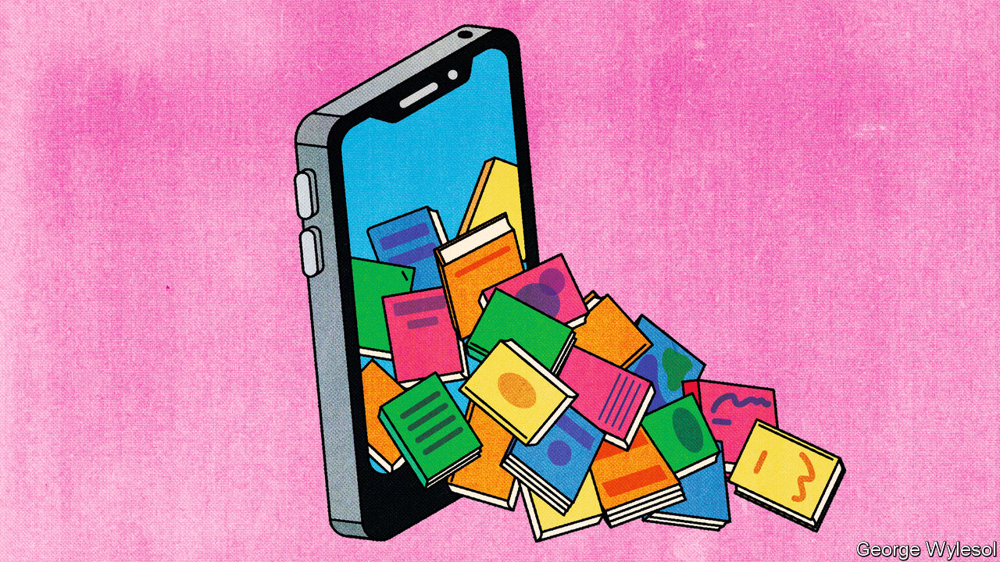

###### Tok of the town

# TikTok is changing the way books are recommended and sold 

##### This represents a profound shift for readers, authors and publishers 

 

> Sep 21st 2023 

First the camera pans across eight books arrayed with hundreds of sticky tabs, flaunting that they have been closely read and meticulously annotated. Next a description runs across the screen: “Books I would sell my soul to read again for the first time”. The music crescendoes, and a manicured hand reveals the books’ covers in time with the beat, featuring authors including ,  and . 

The user, who is called “buryme.withmybooks”, does not say why she likes them, but that does not matter. On TikTok hyperbole is the name of the social-media game. Around 9.3m people have watched the video and almost 400,000 people have saved it for future reference. 

TikTok, which has more than 1bn regular users, is making a mark on the world of publishing. Much of this is done through BookTok, the app’s community of users who comment on books. It is among the largest communities on the app; videos with this tag have been viewed 179bn times, more than twice as many as BeautyTok (beauty enthusiasts splinter into various groups). Adding #reading, #books and #literature pushes views to more than 240bn. Whoever said books are dead has not spent much time on TikTok, nor in bookstores, which now have whole displays touting titles “as seen on TikTok”.

Last year in Britain one in four book buyers used TikTok. The slice of sales directly attributable to the app is still small. Video platforms like TikTok and YouTube drove only around 3% of sales in 2022 in Britain, according to Nielsen, a research firm. But TikTok’s influence is significant and growing. The largest group of book buyers—women aged 54 and younger—are more likely to use the app than their male peers. TikTok recommendations influence their purchases, creating new literary stars and unearthing unlikely past ones, too.

TikTok is not the first online platform to alter the publishing landscape. Wattpad, a self-publishing firm founded in 2006, helped writers publish stories and reach readers online. For years Facebook, Instagram and Twitter (now X) have allowed authors to connect with readers—and sometimes score a book deal in the first place. 

However, TikTok functions slightly differently. One way to think about BookTok is as a book club for the internet age. Just as stars like Oprah Winfrey and Barack Obama can cause copies to fly off bookstore shelves by updating their lists of recommended reads, BookTok does something similar. However, the tastemakers are not usually celebrities but attractive #bookgirlies doing #readingchallenges, often in artfully lit bedrooms. (Although Ms Winfrey’s book club is now on TikTok, too.) 

In many ways BookTok has become a new artistic genre, where emoting about characters and plots is glorified, even required. (Unlike those buttoned-up professional literary critics, who do not tend to write about how books make them cry.)

Some old-fashioned bibliophiles may suspect that BookTok is less about books than about people seeking attention by promoting them. But BookTokers are already swaying bestseller lists. Novels categorised as “romance” have enjoyed , as happened with previous technological shifts, including the rise of e-books. Colleen Hoover’s “It Ends With Us” went viral on TikTok in early 2022 and has sold over 1m paperback copies in Britain. Six of the ten  titles in America last year were written by her, too. They pick up similar themes, such as women lusting after hard-to-get men and “trauma bonding”, subjects that fare well on the video-sharing app.

But BookTok favourites are often older releases, with some, including Ms Hoover’s most popular, written before the app was invented. For example, an aesthetic known as “dark academia”, which glamorises gothic-style universities, tweed and classic literature, has brought attention to a 544-page novel published in 1992 called “The Secret History” by Donna Tartt. 

The popular Netflix show “Bridgerton”—big on colourful costumes, light on substance—created new fans of period romance and, in turn, inspired young readers to rediscover classic books such as “Pride and Prejudice”. In August  won “Best BookTok Revival” at TikTok’s inaugural book awards. (How Austen would have felt about this honour is another question.) 

Because TikTok is so visual, the app has an outsize impact on sales of physical books in particular. E-books do not make such attractive visual props. According to a survey by Nielsen, 80% of Brits aged 14-25 prefer print. BookTokers show off annotations and flick through pages. Filming themselves finishing a book in a single day against a backdrop of hundreds of them on shelves is all part of the performance, and viewers will be extra impressed if the book looks thick.

Many authors remain puzzled by the app. Ms Hoover does not have a TikTok account, and neither do many of her other bestselling peers. Publishers, happy for new sales, are also a bit perplexed; their official TikTok accounts are unpopular by comparison. The challenge is how to keep up. It is not as simple as commissioning more books that make people cry, squirm or shudder and then hoping that people film themselves doing so. Although some editors are doing that anyway. 

Some enterprising publishers keep an eye out for gushing videos about forthcoming books and then snap up the rights in other territories. Others are making the most of momentum on BookTok. When Sarah Benton, a former executive at Orion, heard that “The Silent Patient”, a two-year-old thriller that the firm had published, was unexpectedly gaining traction, Orion tweaked its marketing and told booksellers to emphasise success on BookTok. Such tricks are rapidly becoming the norm. 

Publishers may find that TikTok means not only new readers but also more competition. ByteDance, the Chinese company that owns the app, has plans to launch its own book publisher and is said to be in discussions to sign romance writers. The fact that a Chinese company owns one of the most important platforms for young people’s free expression in the West—and a critical route for recommendations of books, paginated symbols of free thinking—is a plot twist fit for fiction. Publishing its own books will bring ByteDance’s relationship with literature (if its books can be called that) to a new level. ■ 


